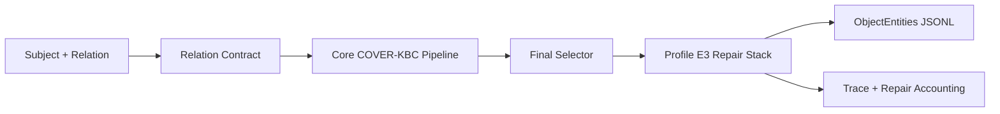

# FactElicit-AKBC

FactElicit-AKBC is the COVER-KBC system for the AKBC Shared Task 2026: given a
`SubjectEntity` and one of six relations, predict the complete string-valued
`ObjectEntities` set, including empty sets and numeric answers.

## Current Best System

**CURRENT BEST PROFILE**

- Profile: **Profile E3 - Mistral Area Multi-View**
- Config: [`configs/experiments/cover_kbc_v3_7_profile_e3_mistral_area_multiview_test.yaml`](configs/experiments/cover_kbc_v3_7_profile_e3_mistral_area_multiview_test.yaml)
- Hidden TEST Macro-F1: **0.5857**
- Model: `mistralai/Mistral-Small-3.2-24B-Instruct-2506`
- Revision: `95a6d26c4bfb886c58daf9d3f7332c857cb27b43`
- Unique neural parameters: **24,011,361,280 / 32,000,000,000**

Profile E3 is Profile E2 plus `MistralAreaMultiView` for `hasArea`. Qwen is not
active in the current best pipeline. The same physical Mistral checkpoint is
reused for every logical role.

## Task

The repository wraps the local challenge snapshot in [`benchmark/`](benchmark/).
Rows contain `SubjectEntity`, `Relation`, and an object list. Relations can have
zero, one, or many valid objects. `hasArea` and `hasCapacity` are numeric
relations evaluated with 5% tolerance by the local evaluator.

## Architecture

```text
Input row
  -> relation contract/router
  -> Mistral closed-book elicitation views
  -> parsers and evidence graph
  -> verifier/gates/controller/final selector
  -> Profile E3 final relation layer
  -> official JSONL row
```



Profile E3 final layer:

- `AwardMetadataNormalizer` for `awardWonBy`
- `MistralCityEmptyRescue` for empty `personHasCityOfDeath` rows
- `MistralAreaMultiView` for all `hasArea` rows
- `MistralCapacityMultiView` for all `hasCapacity` rows
- no post-pipeline Stock repair
- no post-pipeline Border repair

## Relation-Specific Inference

| Relation | Current strategy | Calls / logic | Hidden F1 |
|---|---|---|---:|
| `countryLandBordersCountry` | Core small-set border elicitation and precision-aware selection | direct, compass/structural, maritime contrast, verifier/controller; no E3 repair | 0.9291 |
| `personHasCityOfDeath` | Core null-single city path plus empty-only Mistral rescue | rescue calls life/death gate, then strict `CITY:` parse only if deceased | 0.5700 |
| `hasCapacity` | Capacity Multi-View | 4 deterministic views, strict `CAPACITY:` parser, 5% clustering, one source-blind judge if ambiguous | 0.1633 |
| `awardWonBy` | Large-set award enumeration plus metadata cleanup | multi-facet core enumeration, deterministic wrapper removal and dedupe | 0.3105 |
| `companyTradesAtStockExchange` | Core stock listing path | listing gate, parent/subsidiary contrast, verifier/controller, precision-first selector; no E3 repair | 0.7285 |
| `hasArea` | Area Multi-View | 4 deterministic views, strict `AREA:` parser, 5% clustering, one source-blind judge if ambiguous | 0.6700 |

## Results

User-provided hidden TEST evidence for the current Profile E3 baseline:

| Relation | P | R | F1 |
|---|---:|---:|---:|
| `awardWonBy` | 0.3255 | 0.3707 | 0.3105 |
| `companyTradesAtStockExchange` | 0.9092 | 0.7863 | 0.7285 |
| `countryLandBordersCountry` | 0.9712 | 0.9295 | 0.9291 |
| `hasArea` | 0.6700 | 0.6700 | 0.6700 |
| `hasCapacity` | 0.2449 | 0.1633 | 0.1633 |
| `personHasCityOfDeath` | 0.9600 | 0.5900 | 0.5700 |
| **All Relations** | **0.7289** | **0.6034** | **0.5857** |

Zero-object reference: P = 0.5963, R = 0.9412, F1 = 0.7300.

## Ablation History

| Profile | Main change | Overall hidden F1 |
|---|---|---:|
| Profile D | Mistral-only core / verifier-role consolidation | 0.4952 |
| Integrated Profile E1 | Profile D + AwardMetadataNormalizer + MistralCityEmptyRescue + MistralDirectArea | 0.5752 |
| Profile E2 | E1 + MistralCapacityMultiView | 0.5836 |
| Profile E3 | E2 + MistralAreaMultiView | 0.5857 |

Negative probes such as C2, CHIV, NSMV/Neighborhood capacity, broad numeric
repair, and direct border experiments are retained only as historical
provenance in configs/docs/audits when useful. They are not current runtime
components.

## Reproduction

Install:

```bash
pip install -e '.[dev]'
pip install -e '.[hf]'  # only on the neural runtime machine
```

Zero-model checks:

```bash
python scripts/audit_model_budget.py configs/experiments/cover_kbc_v3_7_profile_e3_mistral_area_multiview_test.yaml
python scripts/run_area_multiview.py --config configs/experiments/cover_kbc_v3_7_profile_e3_mistral_area_multiview_test.yaml --split test --output-dir outputs/e3_area_multiview_dry_run --dry-run
python -m pytest tests/test_profile_e3_area_multiview.py -q
```

Current Profile E3 run:

```bash
python scripts/run_cover.py \
  --config configs/experiments/cover_kbc_v3_7_profile_e3_mistral_area_multiview_test.yaml \
  --split test \
  --no-eval
```

Targeted relation utilities:

```bash
python scripts/run_area_multiview.py \
  --config configs/experiments/cover_kbc_v3_7_profile_e3_mistral_area_multiview_test.yaml \
  --split test \
  --output-dir outputs/e3_area_multiview

python scripts/run_capacity_multiview.py \
  --config configs/experiments/cover_kbc_v3_7_profile_e3_mistral_area_multiview_test.yaml \
  --split test \
  --output-dir outputs/e3_capacity_multiview

python scripts/merge_targeted_relation_results.py \
  --baseline-predictions outputs/<baseline>/predictions.jsonl \
  --targeted-results outputs/e3_area_multiview/area_multiview_results.jsonl \
  --relation hasArea \
  --expected-targeted-rows 100 \
  --output outputs/<merged>/predictions.jsonl
```

Local validation:

```bash
python scripts/evaluate_local.py -p outputs/<run>/predictions.jsonl -s val --cli
python -m pyflakes src/ tests/ scripts/
python -m pytest tests/ -q -p no:randomly
python -m pytest tests/ -q
git diff --check
```

## Repository Layout

```text
benchmark/                 local official snapshot, treated as read-only
configs/experiments/       current and archival profile configs
configs/calibration/       calibration artifacts used by core V3 modules
docs/                      implementation status, audits, paper summary
notebooks/                 Colab/runtime driver notebooks
scripts/run_cover.py       canonical Profile E3 runner
scripts/run_area_multiview.py
scripts/run_capacity_multiview.py
scripts/merge_targeted_relation_results.py
scripts/audit_model_budget.py
src/cover_kbc/             production package
src/cover_kbc/leaderboard_repair/
tests/                     non-neural regression and integrity tests
outputs/                   generated artifacts, gitignored
```

## Model Budget / Rules

The active model portfolio is one open-weight checkpoint with 24,011,361,280
published parameters. Quantization is a runtime memory choice and does not
reduce parameter accounting. Profile E3 uses closed-book inference: no web, no
RAG, no external factual corpora or KB lookup, no training, no fine-tuning, and
no subject-answer lookup table.

## Historical Audits

[`docs/audits/`](docs/audits/) contains the provenance trail for prior profiles,
promotions, diagnostics, and rejected probes. The paper-ready consolidated
summary is [`docs/PAPER_SYSTEM_SUMMARY.md`](docs/PAPER_SYSTEM_SUMMARY.md).
