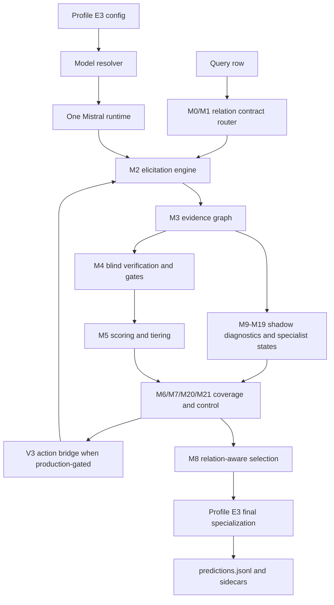

# COVER-KBC Full Architecture Review

Review metadata:

- HEAD: `b94f0089b261ff98027bcdaa7d2dd9027191e10d`
- Review date: 2026-08-13
- Initial `git status --short`:

```text
 M README.md
 M configs/experiments/cover_kbc_v3_3_profile_d_mistral_only_role_swap_test.yaml
 M configs/experiments/cover_kbc_v3_5_profile_e1_mistral_city_direct_area_baseline_test.yaml
 M docs/IMPLEMENTATION_STATUS.md
 M notebooks/COVER_KBC_Colab.ipynb
 M notebooks/COVER_KBC_PostArchitecture_RealModel_Smoke.ipynb
 M pyproject.toml
 M scripts/audit_model_budget.py
 M scripts/real_model_smoke.py
 M scripts/run_capacity_multiview.py
 M scripts/run_cover.py
 M src/cover_kbc/leaderboard_repair/__init__.py
 M src/cover_kbc/leaderboard_repair/config.py
 M src/cover_kbc/leaderboard_repair/relations.py
 M src/cover_kbc/leaderboard_repair/runtime.py
 M src/cover_kbc/leaderboard_repair/stack.py
 M src/cover_kbc/leaderboard_repair/types.py
 M src/cover_kbc/models/preflight.py
 M tests/test_profile_d_mistral_role_swap.py
 M tests/test_runtime_preflight.py
?? docs/PAPER_SYSTEM_SUMMARY.md
?? docs/audits/0092-final-profile-e3-repository-cleanup-and-paper-summary.md
```

Repository scale reviewed:

- 426 tracked files by `git ls-files`
- 146 Python source files under `src/cover_kbc`
- 84 Python test files under `tests`
- 46 config files under `configs`
- 93 audit files under `docs/audits`
- README, runbooks, notebooks, scripts, package metadata, and relevant git history were also inspected.

The repository was already modified before this review. This review adds only this Markdown file and does not intentionally alter predictive source, configs, tests, scripts, notebooks, or existing documentation.

## 1. Review Scope and Source-of-Truth Policy

This document answers the forensic question: what exactly is COVER-KBC at research-methodology level?

The review uses the following source precedence:

1. Executable source code under `src/cover_kbc`, `scripts/run_cover.py`, and active configs.
2. Tests, because many architectural invariants are encoded more explicitly in tests than in prose.
3. Current and historical configs, including Profile D, E1, E2, and E3.
4. Audits and implementation-status documents for design rationale and hidden leaderboard provenance.
5. Git history for lineage only, especially commits around the M0-M21 architecture, V3/V3.1, Profile D, E1, E2, and E3.

This document distinguishes four statuses:

- CURRENT ACTIVE: the component is reachable from the current Profile E3 run and can affect final predictions, directly or through a production-gated controller path.
- CURRENT SHADOW / DIAGNOSTIC: the component is constructed or logged in current runs but is not supposed to mutate final predictions unless explicitly bridged through production configuration.
- GENERIC INFRASTRUCTURE: reusable runtime, schema, parsing, writing, validation, or accounting code used by current or supported runs.
- HISTORICAL / RETIRED: code, configs, or documented methods retained for provenance, negative results, tests, or parser compatibility but not active in Profile E3.

The current best system is Profile E3, configured by:

`configs/experiments/cover_kbc_v3_7_profile_e3_mistral_area_multiview_test.yaml`

The hidden TEST numbers in this document are user-provided leaderboard evidence recorded in repository context, not recomputed during this review. No hidden TEST neural inference was run.

## 2. Repository and Runtime Entry Points

The canonical executable entry point is:

`scripts/run_cover.py`

The script performs these steps:

1. Parse CLI arguments.
2. Load a YAML config.
3. Resolve model blocks for enumerator and verifier roles.
4. Enforce production-readiness guards.
5. Construct a physical model runtime.
6. Build `CoverPipeline`.
7. Load query rows.
8. Run the core pipeline.
9. Apply the leaderboard repair stack.
10. Write `predictions.jsonl` and sidecars.
11. Write accounting and manifest metadata.

Important runtime files:

| File | Role | Current status |
| --- | --- | --- |
| `scripts/run_cover.py` | Main production runner and final output writer orchestration | CURRENT ACTIVE |
| `src/cover_kbc/config.py` | Config loading and resolution helpers | GENERIC INFRASTRUCTURE |
| `src/cover_kbc/models/base.py` | Runtime abstractions, model specs, generation/label-score request types | GENERIC INFRASTRUCTURE |
| `src/cover_kbc/models/registry.py` | Runtime construction and model registry | CURRENT ACTIVE |
| `src/cover_kbc/models/preflight.py` | HF/runtime compatibility and safety checks | CURRENT ACTIVE |
| `src/cover_kbc/pipeline.py` | Core M0-M21 pipeline execution | CURRENT ACTIVE |
| `src/cover_kbc/leaderboard_repair/stack.py` | Final relation-specific Profile E3 repair layer | CURRENT ACTIVE |
| `src/cover_kbc/output.py` | Prediction serialization and output schema | CURRENT ACTIVE |
| `src/cover_kbc/accounting.py` | Call/token/model accounting | CURRENT ACTIVE |

The relevant git lineage is:

| Commit | Meaning |
| --- | --- |
| `b94f008` | Profile E3 Area Multi-View baseline promotion |
| `5426571` | Profile E2 Capacity Multi-View |
| `34810e7` | Profile E1 Direct Area baseline |
| `5767356` | Mistral city rescue |
| `170c487` | Profile D Mistral-only role swap |
| `814812f` | M0-M21 architecture freeze |

The current model contract is one unique checkpoint:

- Model id: `mistralai/Mistral-Small-3.2-24B-Instruct-2506`
- Revision: `95a6d26c4bfb886c58daf9d3f7332c857cb27b43`
- Published parameter count used for challenge accounting: `24,011,361,280`
- Challenge limit: `32,000,000,000`
- Quantization: NF4/4-bit runtime configuration; quantization does not reduce challenge parameter accounting.
- Physical runtime count in E3: one reused Mistral runtime for all logical roles.
- Qwen: historical only; not active in current Profile E3.

## 3. Complete System Architecture

COVER-KBC is a closed-book, relation-typed, evidence-centric inference system for LM-KBC. It treats a query as a subject-relation pair `q = (s, r)`, compiles the relation into a typed program, elicits parametric evidence from a single LLM through structured views, stores observations in a provenance-aware evidence graph, scores and verifies candidates, estimates whether the answer space is sufficiently covered, adaptively chooses further actions under budget, finalizes the answer with relation-aware selectors, and finally applies a small Profile E3 relation-specialization layer.

The central architectural idea is not a flat prompt ensemble. The system separates:

- typed relation contracts,
- prompt/view generation,
- evidence representation,
- candidate identity and support,
- blind verification,
- scoring,
- residual coverage,
- controller actions,
- stopping,
- final relation-specific selection,
- post-hoc but mutation-bounded Profile E3 leaderboard specialization.

### Active high-level runtime flow

```text
YAML config
  -> model block resolution
  -> one physical Mistral runtime
  -> query rows
  -> relation router and contract compiler
  -> elicitation engine
  -> evidence graph
  -> calibrated gates and blind verifier
  -> scoring, coverage, adaptive controller
  -> V3 production-gated action bridge when enabled
  -> relation-aware selector
  -> Profile E3 leaderboard repair stack
  -> predictions.jsonl, trace.jsonl, sidecars, manifest
```

### ASCII architecture

```text
                       +----------------------+
                       | Profile E3 YAML      |
                       +----------+-----------+
                                  |
                                  v
                       +----------------------+
                       | Model resolver       |
                       | 1 Mistral runtime    |
                       +----------+-----------+
                                  |
Query row (subject,r)             v
  +-------------------> +----------------------+
                        | M0/M1 contract/router|
                        +----------+-----------+
                                   |
                                   v
                        +----------------------+
                        | M2 elicitation views |
                        | prompts + parsers    |
                        +----------+-----------+
                                   |
                                   v
                        +----------------------+
                        | M3 evidence graph    |
                        | candidates + edges   |
                        +----------+-----------+
                                   |
              +--------------------+--------------------+
              |                                         |
              v                                         v
   +----------------------+                 +----------------------+
   | M4 blind verifier    |                 | M9-M19 diagnostics   |
   | gates/logit labels   |                 | specialists/coverage |
   +----------+-----------+                 +----------+-----------+
              |                                         |
              +--------------------+--------------------+
                                   |
                                   v
                        +----------------------+
                        | M5-M8 score/control  |
                        | select/finalize      |
                        +----------+-----------+
                                   |
                                   v
                        +----------------------+
                        | Profile E3 final     |
                        | repair specialization|
                        +----------+-----------+
                                   |
                                   v
                        +----------------------+
                        | predictions.jsonl    |
                        | trace + sidecars     |
                        +----------------------+
```

### Mermaid architecture



### Call graph from `scripts/run_cover.py`

```text
main()
  parse_args()
  load_yaml_config()
  model_blocks(config)
    -> enumerator_cfg
    -> verifier_cfg
  check_router_consistency()
  check_library_covers_contracts()
  resolve_execution_mode()
  preflight_model_requirements()
  build_runtime(enumerator_cfg)
  build_runtime(verifier_cfg) only if distinct; E3 reuses enumerator runtime
  audit_parameter_budget()
  build_calibration()
  CoverPipeline(...)
    __init__()
      ElicitationEngine(...)
      QueryProfiler/M10/M11/M12-M15/M16/M17/M18/L4/M19/M20/M21/L6 as configured
  load_queries()
  pipeline.run(queries)
    run_query()
      enumerate_query()
      verify_graph()
      decide_graph()
  build_repair_stack(config["leaderboard_repair"])
  repair_stack.apply(predictions, traces)
  write_predictions_jsonl()
  write_trace_jsonl()
  write_sidecars()
  write_manifest_and_accounting()
```

### Data-flow graph

```text
Query(subject, relation, row_index)
  -> RelationContract + Query object
  -> ViewSpec-rendered prompts
  -> GenerationRecord objects
  -> parsed entity/numeric/gate observations
  -> EvidenceGraph
  -> Candidate objects with EvidenceGroup support/contradiction/unknown edges
  -> VerificationResult objects and calibrated label probabilities
  -> CandidateScore, CandidateStatus, VerificationTier
  -> RCSEState and controller Action decisions
  -> Prediction(output objects, empty reason, calls/tokens)
  -> Repair artifacts and final Prediction
  -> JSONL row
```

## 4. Original Layer / Module Map

The repository preserves an M0-M21 architecture plus V3/V3.1 post-architecture modules. The table below reconstructs the canonical map from source, tests, configs, and audits.

| Layer/module | Current implementation | Purpose | Status in Profile E3 | Paper relevance |
| --- | --- | --- | --- | --- |
| M0 Relation contracts | `contracts/base.py`, `contracts/registry.py`, `contracts/programs.py` | Encode relation semantics, output type, cardinality, allowed views, verification/stopping/selection policies | CURRENT ACTIVE | High |
| M1 Router/compiler | `contracts/router.py` | Convert `(subject, relation)` into typed `Query` + `RelationContract` | CURRENT ACTIVE | High |
| M2 Elicitation engine | `elicitation/engine.py`, `elicitation/library.py`, `elicitation/views.py` | Render typed views, call model, parse observations, produce `GenerationRecord`s | CURRENT ACTIVE | High |
| M3 Evidence graph | `evidence/graph.py`, `types.py` | Store candidates, records, provenance, support, contradiction, verification edges | CURRENT ACTIVE | High |
| M4 Blind verifier/gates | `verification/blind.py` | Candidate/gate label scoring, calibration, disagreement, log-odds evidence | CURRENT ACTIVE | High |
| M5 Scoring/tiering | `scoring.py` | Compute candidate support/confidence/contradiction/disagreement score and verification tier | CURRENT ACTIVE | High |
| M6 Residual coverage estimator | `coverage.py` | Estimate remaining search need by program type | CURRENT ACTIVE | High |
| M7 Controller | `controller.py` | Choose next action or stop under budget | CURRENT ACTIVE | High |
| M8 Final selector | `selection.py` | Relation-program-specific output finalization | CURRENT ACTIVE | High |
| M9 Query intelligence | `query_intelligence/` | Deterministic risk profile and specialist hints | CURRENT SHADOW / DIAGNOSTIC with planning consumers | Medium |
| M10 Prompt program compiler | `query_intelligence/prompt_compiler.py` | Structured prompt-program representation separate from surface prompts | CURRENT SHADOW / DIAGNOSTIC with planning consumers | Medium |
| M11 Parametric retrieval | `retrieval/parametric_retrieval.py` | Closed-book pseudo-memory/self-ask/query-rewrite records; no external corpus | CURRENT SHADOW / DIAGNOSTIC | Medium |
| M12 Numeric specialist | `specialists/numeric_specialist.py` | Numeric observations, cross-unit checks, cluster diagnostics | CURRENT SHADOW / DIAGNOSTIC | Medium |
| M13 Large-set specialist | `specialists/large_set_specialist.py` | Award facets, expansion, missingness diagnostics | CURRENT SHADOW / DIAGNOSTIC | Medium |
| M14 Null/temporal specialist | `specialists/null_temporal_specialist.py` | City death-status and locality diagnostics | CURRENT SHADOW / DIAGNOSTIC | Medium |
| M15 Small-set specialist | `specialists/small_set_specialist.py` | Stock/border listing, closure, parent/subsidiary, structural diagnostics | CURRENT SHADOW / DIAGNOSTIC | Medium |
| M16 Atomic consensus | `evidence/consensus.py` | Normalize heterogeneous evidence into per-candidate consensus features | CURRENT SHADOW plus V3 input | High |
| M17 Specialist verifier | `verification/specialist_verifier.py` | Specialist verifier targets/templates/label orders | CURRENT SHADOW unless selected by V3 | Medium |
| M18 Bidirectional verifier | `verification/bidirectional_verifier.py` | Reverse/key-condition/counterfactual/candidate-free recall checks | CURRENT SHADOW unless selected by V3 | Medium |
| Layer 4 integration | `evidence/layer4.py` | Merge M16-M18 diagnostic states for control | CURRENT SHADOW plus V3 input | Medium |
| M19 Coverage-gap estimator | `coverage_gap/missingness.py` | Upgraded novelty/facet/disagreement/unresolved residual diagnostic | CURRENT SHADOW plus M21 input | High |
| M20 Relation budget scheduler | `control/relation_budget.py` | Relation/risk-specific qualitative and calibrated budget envelopes | CURRENT ACTIVE as production-gated V3 prerequisite | High |
| M21 Micro-planner | `control/micro_planner.py` | Expected-value action selection over Layer4/M19/M20 state | CURRENT ACTIVE when V3 production bridge is enabled | High |
| Layer 6 integration | `control/layer6.py` | Integrate M20/M21 and diagnostics into sidecar/control state | CURRENT SHADOW / DIAGNOSTIC | Medium |
| V3 relation programs | `v3_core/relation_programs.py` | Failure-state action families, relation-adaptive action space | CURRENT ACTIVE if production-gated | High |
| V3 hypothesis graph | `v3_core/hypothesis.py` | Candidate/hypothesis status graph and contradictions | CURRENT ACTIVE for diagnostics and V3 bridge | High |
| V3 prompt families | `v3_core/prompt_families.py` | Prompt-family independence accounting | CURRENT ACTIVE for diagnostics and V3 bridge | Medium |
| V3 execution bridge | `v3_core/execution.py` | Execute selected V3 actions through existing graph APIs | CURRENT ACTIVE if production-gated | High |
| V3.1 safe finalization | `v3_1/` | Calibration-preserving output canonicalization and safe selectors | CURRENT ACTIVE where config flags enable | Medium |
| Leaderboard repair stack | `leaderboard_repair/` | Mutation-bounded relation-specific Profile E3 final specialization | CURRENT ACTIVE | High |

The original architecture therefore survives in two forms. M0-M8 are the active core. M9-M19 are largely diagnostic or shadow but are not mere logging: they encode typed risk, specialist state, consensus, novelty, and coverage ideas that can support paper methodology and future work. M20-M21 and V3 are configured as production-gated in the current profile and can affect action selection through an explicit bridge. The leaderboard repair stack is a final specialization layer, not the whole system.

## 5. Relation Contract Architecture

The relation contract system is architectural because it maps each relation to a typed inference program. It determines not only prompt wording, but also output type, cardinality, hard negatives, mandatory and optional views, verification policy, stopping policy, and selection policy.

Source-derived abstraction:

```text
relation r
  -> RelationContract C_r
  -> ProgramType and output schema
  -> eligible view/action families
  -> evidence support groups
  -> verifier/stopping/selection policy
```

Paper notation proposed for presentation:

- Query: `q = (s, r)`, subject `s`, relation `r`.
- Contract: `C_r = (T_r, O_r, K_r, V_r, H_r, Pi_r)`.
- `T_r`: typed program, one of SMALL_SET, NULL_SINGLE, NUMERIC, LARGE_OPEN_SET.
- `O_r`: output object type and cardinality.
- `K_r`: positive and hard-negative semantic constraints.
- `V_r`: mandatory and optional elicitation views.
- `H_r`: verifier/stopping thresholds.
- `Pi_r`: relation-specific selector.

This notation is proposed for the paper; the source implementation uses dataclasses and enums rather than this exact tuple.

### Program types

| ProgramType | Output type | Cardinality | Core assumption | Current relations |
| --- | --- | --- | --- | --- |
| SMALL_SET | Entity strings | Zero or many, usually small | Completeness matters but set size is bounded or moderate | `countryLandBordersCountry`, `companyTradesAtStockExchange` |
| NULL_SINGLE | Entity string | Zero or one | Missingness and null evidence are central | `personHasCityOfDeath` |
| NUMERIC | Number string | Exactly one target value, but may be unknown | Numeric units and near-duplicate values must be normalized | `hasArea`, `hasCapacity` |
| LARGE_OPEN_SET | Entity strings | Zero or many, open-ended | Recall incompleteness dominates | `awardWonBy` |

### Relation contracts

| Relation | ProgramType | Target semantics | Primary failure mode | Mandatory views | Selector family |
| --- | --- | --- | --- | --- | --- |
| `countryLandBordersCountry` | SMALL_SET | Countries sharing land borders with the subject country | Set completeness and maritime/territory confusions | direct border, compass border | Small-set accepted-candidate selector |
| `personHasCityOfDeath` | NULL_SINGLE | City where a deceased person died | Living/null vs city recall ambiguity | death status gate, direct death city | Null-single selector |
| `companyTradesAtStockExchange` | SMALL_SET | Exchanges where the company itself trades | Parent/subsidiary/historical/listing ambiguity | listing gate, direct exchange | Small-set selector with stock structural validation |
| `hasArea` | NUMERIC | Exact area in square kilometers | Wrong geographic entity, wrong area type, unit confusion | direct km2, total-vs-land | Numeric robust cluster selector, then E3 Area Multi-View final layer |
| `hasCapacity` | NUMERIC | Highest published maximum spectator capacity | Venue configuration ambiguity and attendance/capacity confusion | direct capacity, contrast | Numeric highest-valid selector, then E2/E3 Capacity Multi-View final layer |
| `awardWonBy` | LARGE_OPEN_SET | People/organizations that won the award | High-cardinality recall and metadata noise | direct, temporal facet, recipient type facet, missingness | Large-open-set selector, then deterministic award normalization |

Hard negatives are part of the contract. For example, the stock contract rejects parent/subsidiary listings, historical exchanges, ticker symbols, and indexes; the area contract rejects containing-country/admin-region/land-only values when total area is requested; the capacity contract rejects attendance, area, cost, dates, dimensions, and non-spectator figures. These negatives are consumed by prompts, parsers, verifiers, and selectors.

## 6. Elicitation Architecture

The elicitation layer is M2. It consists of:

- `ViewSpec` definitions in `elicitation/views.py`
- relation-specific view library in `elicitation/library.py`
- parser dispatch in `elicitation/parsing.py`
- runtime execution in `elicitation/engine.py`

Each view has:

- a `view_id`
- a relation
- a `ViewFamily`
- a prompt template
- optional facet id
- decode parameters
- whether it is a gate
- whether it needs an accepted set
- whether it is reverse/candidate-conditioned

The engine renders the view with:

- subject
- relation definition
- positive rules
- hard-negative rules
- current accepted set or candidate context if needed
- required output format

It then calls the runtime and records a `GenerationRecord` with:

- `record_id`
- `query_id`
- `relation`
- `view_id`
- `view_family`
- `independence_group`
- `model_role`
- `model_family`
- `stage`
- `source`
- `prompt_hash`
- parsed entities, numeric values, or gate result
- token counts
- error state

View families include:

| View family | Purpose | Examples |
| --- | --- | --- |
| Direct | Ask for the relation directly | death city direct, exchange direct, area direct |
| Structural/decomposition | Ask through relation structure | compass borders, capacity configuration |
| Contrast | Disambiguate hard negatives | stock parent contrast, capacity contrast, area total-vs-land |
| Reverse | Candidate-conditioned reverse check | border reverse, stock reverse, award reverse |
| Missingness/gate | Decide whether the object should be empty | death status gate, stock listing gate, award missing |
| Facet | Partition large open-set recall | award temporal facet, award recipient-type facet |
| Description extraction | Two-step prose then extraction | border/stock/death description views |

Elicitation differs from simple prompt ensembling in three ways:

1. Views are tied to typed relation contracts and independence groups.
2. Outputs are converted into evidence objects with provenance and cost.
3. The controller can condition future actions on graph state, not simply average independent prompts.

The current Profile E3 final numeric Multi-View prompts for Area and Capacity are implemented downstream in `leaderboard_repair`, not in the core M2 library, but they follow the same philosophy of semantically independent elicitation views.

## 7. Parsing and Normalization

Parsing is split by output type.

### Entity parsing

`parse_entities` consumes semicolon- or line-separated outputs and normalizes obvious output artifacts. It recognizes empty/null tokens such as `NONE` where the contract permits missingness. Parsed entity strings are later normalized into candidate keys through canonical string normalization and relation-specific output repair.

Methodological role: entity parsing enforces the distinction between generated text and candidate identity. It also prevents prompt-format tokens from becoming answers.

### Gate parsing

`parse_gate` expects `YES`, `NO`, or `UNKNOWN` style labels. Gate views are used for death status and listing existence. Gate outputs can close the graph when negative and sufficiently confident, but a malformed gate is represented as invalid/unknown rather than silently accepted.

### Numeric parsing

`normalization/numeric.py` and `elicitation/parsing.py` handle numeric extraction and unit conversion. The architecture uses a `NumericValue` representation with:

- original magnitude,
- original unit,
- canonical value,
- canonical unit,
- integer-only flag where the relation requires it.

Area units are converted to square kilometers using `AREA_UNITS_TO_KM2`. Recognized unit families include square kilometers, square meters, hectares, square miles, and acres. Capacity rejects area units and negative numbers. Magnitude words and common numeric separators are normalized.

Methodological role: numeric parsing is not just sanitation. It defines numeric identity, unit compatibility, and which observations can enter numeric clustering.

### Verifier-label parsing

`verification/blind.py` uses label-scoring rather than free-form generation for verifier decisions. It maps label tokens to:

- `VALID`
- `INVALID`
- `UNKNOWN`

The verifier computes calibrated probabilities, margins, entropy, and prompt disagreement.

### Output normalization

`v3_1/output_repair.py`, `v3_1/numeric_recovery.py`, and `leaderboard_repair/relations.py` perform final canonicalization. Award metadata normalization is active in E3 and deterministically strips temporal/category prefixes and duplicate parentheticals before deduplication.

## 8. Evidence Representation

The evidence model is centered in `src/cover_kbc/types.py` and `src/cover_kbc/evidence/graph.py`.

Important dataclasses and fields:

### `GenerationRecord`

Represents one model interaction or generated observation. Key fields include:

- `record_id`
- `query_id`
- `relation`
- `view_id`
- `view_family`
- `independence_group`
- `model_role`
- `model_family`
- `stage`
- `source`
- `prompt_hash`
- parsed entity/numeric/gate values
- prompt and generation token counts
- error field

### `Evidence`

Represents one support, contradiction, unknown, or verifier edge about a candidate. Key fields include:

- `candidate_key`
- `edge_type`
- `independence_group`
- `view_id`
- `model_id`
- `run_id`
- `record_id`
- `edge_id`
- `model_family`
- `mode`
- `valid_prob`
- `invalid_prob`
- `unknown_prob`
- `token_cost`

### `EvidenceGroup`

Groups evidence by candidate and edge type. It records:

- support edges,
- contradiction edges,
- unknown edges,
- support counts,
- contradiction counts,
- raw support count.

### `VerificationResult`

Stores verifier output:

- `label`
- `valid_prob`
- `invalid_prob`
- `unknown_prob`
- raw logits
- `margin`
- `entropy`
- `prompt_disagreement`
- template id
- model metadata
- `log_odds = log(valid_prob / (invalid_prob + unknown_prob))`

### `Candidate`

Represents a semantic answer hypothesis:

- `key`
- `display`
- `relation`
- `output_type`
- numeric value/unit when applicable
- evidence groups
- verification results
- surface forms
- record ids
- score
- status
- verification tier
- strict key
- facets

This representation preserves information that a list of strings loses:

- which prompt/view produced an answer,
- whether support comes from independent mechanisms,
- whether a candidate is supported and contradicted,
- whether the verifier saw the candidate blindly,
- whether a candidate was derived from a gate, direct view, reverse view, cross-model recall, or final repair,
- how much budget was spent,
- whether a candidate is unresolved, rejected, accepted, or merely proposed.

## 9. Evidence Graph

`EvidenceGraph` is the persistent state object for one query. It contains:

- the `Query`,
- the `RelationContract`,
- a dictionary of `Candidate` objects,
- all `GenerationRecord`s,
- gate state,
- controller log,
- pending action,
- RCSE state,
- budget,
- verification call count.

Paper notation proposed for presentation:

```text
G_t = (V_t, E_t)
```

where:

- `V_t` contains candidate nodes, prompt-call records, verifier records, and relation-state nodes.
- `E_t` contains support, contradiction, unknown, provenance, and verification edges.

The code does not expose a single generic graph library object with typed node classes. Instead, it implements the graph as a structured dataclass with candidate dictionaries, evidence groups, record lists, and edge ids. The graph notation is therefore presentation notation, not an exact API.

Key graph operations:

- `build_graph(query, contract)`: initializes graph state.
- `add_entity_mentions(record)`: converts parsed entity observations into candidate support evidence.
- `add_numeric_mentions(record)`: converts numeric observations into numeric candidates keyed by canonical formatted value.
- `add_verification(candidate, result)`: adds blind verifier evidence and attaches `VerificationResult`.
- `add_semantic_contradiction(candidate, ...)`: attaches contradiction evidence to an existing candidate.
- `reject(candidate, reason)`: sets deterministic rejection state.
- `close_gate(...)`: records confident negative gate/missingness state.
- `apply_hard_contract_rules(...)`: rejects outputs violating contract hard negatives.

The graph explicitly avoids treating repeated surfaces from the same operation as independent evidence. It uses independence groups and edge ids to avoid support inflation.

## 10. Candidate Representation and Identity

Candidates are relation-local answer hypotheses. They have two levels of identity:

1. Surface form: the literal string or number emitted by a model view.
2. Candidate key / strict key: normalized identity used for deduplication and support aggregation.

For entities, normalization lowers superficial variation and output markers while preserving relation-relevant distinctions. For awards, final E3 metadata normalization additionally strips temporal/category metadata and duplicate parenthetical variants.

For numeric relations, the core graph keys numeric candidates by formatted canonical value. Tolerance-aware equivalence is not the graph key; it is applied later in numeric clustering and selection. This distinction matters:

- graph identity preserves the exact observed numeric values and provenance,
- cluster identity determines which near-equal values can support a final numeric answer.

Numeric candidates include canonical values in canonical units:

- Area: square kilometers.
- Capacity: people/spectators, integer.

Candidate states include:

- proposed/unresolved,
- verification target,
- adversarial verification target,
- auto-accepted,
- accepted,
- rejected/hard rejected.

V3 adds a separate `Hypothesis` representation with statuses:

- `PROPOSED`
- `SUPPORTED`
- `SEMANTICALLY_ALIGNED`
- `CHALLENGED`
- `VERIFIED`
- `OUTPUT`
- `CONTRADICTED`
- `DROPPED`

The V3 hypothesis graph is diagnostic and production-bridged only where explicitly enabled.

## 11. Verification Architecture

The verifier is implemented in `verification/blind.py`. It is blind in the sense that it sees the subject, relation definition, and candidate, but not the generator's reasoning or full candidate list.

Verifier inputs:

- subject,
- relation definition,
- candidate display,
- candidate type,
- contract rules,
- verifier template id,
- optional calibration controls.

Verifier outputs:

- label: `VALID`, `INVALID`, `UNKNOWN`,
- calibrated label probabilities,
- logits,
- margin,
- entropy,
- prompt disagreement,
- log-odds.

The label space is intentionally small. This avoids having a free-form verifier generate new answers during validation.

Verifier functions:

- `inspect_label_encoding`: ensures labels are scored as intended.
- `score_labels`: gets per-label model likelihoods.
- `read_labels`: converts logits to probabilities and label.
- `verify_candidate`: one verifier template.
- `verify_multi_template`: multiple templates for disagreement.
- `aggregate_verifications`: combines template outputs.
- `score_gate`: applies the same label-scoring machinery to gate decisions.

The verifier contributes in several ways:

- as evidence edges in the graph,
- as candidate score features,
- as hard invalidation when invalid probability dominates,
- as uncertainty/disagreement input to the controller,
- as pending-action pressure that can block premature stopping.

Current Profile E3 uses the same physical Mistral runtime for enumerator and verifier roles. Logical role reuse does not multiply the parameter budget.

## 12. Scoring Functions

Candidate scoring is implemented in `scoring.py`. The source formula is:

```text
S(o) = alpha * F(o) + beta * L(o) + gamma * X(o)
       - delta * C(o) - eta * U(o)
```

Default weights:

- `alpha = 1.0`
- `beta = 0.6`
- `gamma = 0.5`
- `delta = 1.5`
- `eta = 1.0`

Terms:

- `F(o)`: independent acquisition support coverage.
- `L(o)`: verifier log-odds term.
- `X(o)`: cross-model recall support term.
- `C(o)`: contradiction term.
- `U(o)`: prompt-disagreement term.

Detailed formulas:

```text
m_r = number of eligible acquisition groups for relation r
g(o) = number of eligible acquisition groups supporting candidate o
q(o) = g(o) / m_r
```

`q(o)` is candidate support coverage, not answer-space completeness.

```text
H_inc(o) = -q(o) log q(o) - (1 - q(o)) log(1 - q(o))
```

`H_inc` is candidate inclusion uncertainty.

```text
L(o) = clip(log_odds(o), -logit_clip, logit_clip) / logit_clip
```

where `logit_clip = 3.0` by default.

```text
C(o) = distinct_contradicting_groups(o) / (eligible_acquisition_groups + blind_verifier_group)
```

bounded by 1.

```text
U(o) = max prompt_disagreement over candidate verifications
```

```text
X(o) = 1 if CROSS_MODEL_RECALL independently supports o else 0
```

In current E3, cross-model recall is not available because the verifier model id is the same as the enumerator model id. The feature is present but heterogeneous cross-model evidence is inactive.

Candidate tiers are assigned from support, contradictions, verifier state, and relation-specific policy. Status decisions then use support thresholds, invalid labels, unknown handling, valid probability floor, and score thresholds.

## 13. Coverage Modeling

COVER-KBC distinguishes candidate confidence from answer-space coverage.

Candidate confidence asks: "Is candidate `o` likely valid?"

Coverage asks: "Have we searched enough of the answer space for query `q` under contract `C_r`?"

The active coverage model is `coverage.py`, the Residual Coverage and Saturation Estimator (RCSE). It estimates a residual search need `q_res` from several axes:

- mandatory view gap,
- mechanism gap,
- facet gap,
- marginal yield,
- saturation,
- set stability,
- unresolved candidate mass,
- verifier disagreement,
- inclusion uncertainty,
- numeric dispersion,
- numeric cluster competition,
- locality/null competition,
- gate state.

Important formulas:

```text
marginal_yield = new_trusted_candidates / (generated_tokens / 1000 + epsilon)
```

```text
saturation = 1 - productive_recent_actions / recent_action_count
```

```text
set_stability = Jaccard(trusted_set_t, trusted_set_{t-1})
```

Two empty trusted sets are not treated as stable.

```text
mandatory_view_gap = missing_mandatory_views / total_mandatory_views
```

```text
mechanism_gap = unexecuted_available_acquisition_mechanisms / available_acquisition_mechanisms
```

```text
facet_gap = uncovered_declared_facets / declared_facets
```

```text
unresolved_mass = weighted_unresolved_candidates / active_candidates
```

For numeric relations:

```text
numeric_dispersion = median(|v_i - median(v)|) / (abs(median(v)) + epsilon)
```

For local competition:

```text
competition = rival_score / best_score
```

bounded to a valid range.

RCSE combines terms differently by program type:

- LARGE_OPEN_SET emphasizes marginal yield, facet gap, mechanism gap, and unresolved mass.
- NUMERIC emphasizes dispersion, cluster competition, mechanism gap, and verifier disagreement.
- NULL_SINGLE emphasizes gate state, locality competition, unresolved mass, mechanism gap, and verifier disagreement.
- SMALL_SET emphasizes mechanism gap, unresolved mass, set instability, marginal yield, and inclusion uncertainty.

Residual is a weighted mean with floors from blocking components:

```text
q_res = clip(max(weighted_mean, mandatory_gap, blocking_components), 0, 1)
```

The residual stop threshold is defined by the relation stopping policy.

## 14. Novelty and Discovery Estimation

The upgraded novelty/discovery model is M19, implemented in `coverage_gap/missingness.py`. It is current shadow/diagnostic and also feeds M21 where production-gated planning is enabled.

M19 defines residual coverage-gap state as:

```text
R_t = w1 * noveltyRate_t
    + w2 * singletonRatio_t
    + w3 * facetGap_t
    + w4 * disagreement_t
    + w5 * unresolvedMass_t
```

Only available components are included in the denominator. Missing diagnostics are unavailable, not zero.

Novelty is computed over discovery origins in execution order:

```text
novelty(origin) = strict_new_identities(origin) / usable_identities(origin)
```

```text
noveltyRate_t = latest measurable novelty(origin)
```

```text
saturation_t = 1 - noveltyRate_t
```

Duplicate evidence is prevented from inflating novelty by using strict identities and origin groups. Numeric near-duplicates are handled through numeric-cluster diagnostics rather than pretending every formatted number is a new discovery.

Singleton ratio is:

```text
singletonRatio = candidates_with_exactly_one_discovery_group
                 / candidates_with_at_least_one_discovery_group
```

Disagreement aggregates several channels:

- M16 semantic disagreement,
- M17 template and label-order disagreement,
- M18 structural disagreement,
- M12 competing numeric clusters,
- M14 null/temporal conflicts.

Unresolved mass counts applicable represented units that still lack a resolved state. Reasons include verifier not requested, verifier unavailable, unknown label, contradiction, pending action, competing hypotheses, and failed recall.

M19 is paper-worthy because it formalizes missingness and residual search pressure separately from per-candidate confidence. It should not be described as a hidden gold-estimator or cardinality estimator; the code does not justify that claim.

## 15. Gates and Calibration

Gates are relation-specific mechanisms that decide whether further answer acquisition is useful or whether an empty answer is justified.

### Active gates

| Gate | Relation | Source | Type | Effect |
| --- | --- | --- | --- | --- |
| Death status gate | `personHasCityOfDeath` | M2 view + M4 gate scoring | Neural label/generation gate | Can close null state or trigger city recall |
| Listing gate | `companyTradesAtStockExchange` | M2 view + M4 gate scoring | Neural label/generation gate | Can close stock output when company is not listed |
| Award missingness view | `awardWonBy` | M2 view | Generation/missingness signal | Helps large-open-set recall and coverage |
| Numeric unknown handling | `hasArea`, `hasCapacity` | parsers/selectors/final repair | Parser/fallback gate | Prevents malformed numbers from entering final output |

### Calibration

`verification/blind.py` supports contextual calibration with content-free controls. The calibrator stores a bias vector `b` for labels and applies:

```text
z'_j = z_j - b_j
```

then:

```text
p_j = softmax(z'_j / T)
```

Softmax is:

```text
softmax(z)_j = exp(z_j - max(z)) / sum_k exp(z_k - max(z))
```

Entropy is:

```text
H(p) = - sum_j p_j log p_j
```

The configured production calibration is training-free in the model-weight sense. It calibrates inference thresholds/logit controls and budget envelopes; it does not update neural model parameters and does not use external factual retrieval.

### Gate pass/fail behavior

A confident negative gate can close a graph only when it passes margin/probability requirements. Unknown or malformed gates are represented as uncertainty rather than converted into empty output automatically.

## 16. Adaptive Controller

The active controller is implemented in `controller.py`. It formalizes inference as a budgeted action loop over graph state.

Controller state:

- evidence graph,
- relation contract,
- budget,
- executed actions,
- executed views/facets/groups,
- trusted candidate history,
- RCSE residual,
- candidate tiers and statuses,
- pending verification/action state.

Available action types:

- `RUN_VIEW`
- `RUN_FACET`
- `VERIFY`
- `ADVERSARIAL_VERIFY`
- `REVERSE_CHECK`
- `CROSS_MODEL_CHECK`
- `RESAMPLE`
- `STOP`

Action scoring formula:

```text
A_t(a) = alpha * Yhat_t(a)
       + beta * G_t(a)
       + gamma * U_t(a)
       - lambda * C(a)
       - rho * D_t(a)
```

where:

- `Yhat_t(a)`: expected yield from historical outcome of the action mechanism,
- `G_t(a)`: gap relevance,
- `U_t(a)`: uncertainty impact,
- `C(a)`: predicted cost,
- `D_t(a)`: redundancy,
- default `alpha=1`, `beta=1`, `gamma=0.8`, `lambda=0.15`, `rho=1`.

Controller pseudocode:

```text
initialize graph G_0 and budget B
run mandatory initial elicitation as required by contract
while not stopped:
    score candidates in G_t
    estimate residual coverage q_res(G_t)
    enumerate legal actions A_t(C_r, G_t, B_t)
    remove STOP if hard stopping preconditions are not satisfied
    choose highest-scoring affordable action
    if action is STOP:
        break
    execute action through elicitation, verifier, or V3 bridge
    insert observations/evidence into graph
    charge actual calls/tokens
    record action outcome in RCSE state
finalize with relation-aware selector
```

The system decides whether to ask the LLM another question by combining hard constraints and soft residual estimates:

- budget exhaustion always stops,
- incomplete mandatory views block stopping,
- pending verification can block stopping,
- relation-specific conditions can stop early,
- residual below threshold permits stopping,
- otherwise the highest-value legal action is selected.

This is an agentic loop in the minimal technical sense: it has state, actions, observations, a policy, transitions, and termination. The current implementation is rule/scoring based, not reinforcement learning.

## 17. Action Library

The action library is defined primarily in `controller.py` and extended by V3 action families in `v3_core/relation_programs.py`.

| Action | Trigger | Relation eligibility | Cost model | State mutation |
| --- | --- | --- | --- | --- |
| `RUN_VIEW` | Mandatory/optional view not executed | Contract-defined | One or more generation calls; description view costs two | Adds generation record and support/unknown candidates |
| `RUN_FACET` | Facet gap for large-open-set relation | Mostly awards | Generation call | Adds facet-specific evidence |
| `VERIFY` | Candidate in verification tier | All except situations where verifier disabled | Label-score calls, possibly calibration controls | Adds verifier edge and verification result |
| `ADVERSARIAL_VERIFY` | Candidate has contradiction/disagreement/near-miss risk | Relation policy | Label-score calls | Adds adversarial verification evidence |
| `REVERSE_CHECK` | Candidate lacks reverse support and relation supports reverse view | Border, stock, award as configured | Candidate-conditioned generation | Adds reverse acquisition evidence |
| `CROSS_MODEL_CHECK` | Heterogeneous verifier/enumerator model available | Historical/profile-dependent | Generation or label calls to second model | Adds cross-family recall evidence; inactive in E3 |
| `RESAMPLE` | Structural frontier exhausted and stochastic repeat allowed | Relation/view dependent | Generation call | Adds repeated observation with reduced independence/redundancy |
| `STOP` | Residual/stability/budget conditions satisfied | All | No model calls | Ends controller loop |

V3 action families include multi-view recall, independent recall, definition recall, alternative recall, attribute decomposition, set expansion, listing elimination, semantic verify, contrast verify, unary verify, and stop. They are screened by relation profile, failure search state, budget, and production-mode guards.

## 18. Stopping and Exhaustion

Stopping is not just "after N prompts." It uses:

- hard budget exhaustion,
- required mandatory views,
- pending-action checks,
- RCSE residual threshold,
- relation-specific completion logic,
- stability/saturation evidence,
- null/gate state.

Source-derived stopping behavior:

- SMALL_SET can stop when the trusted set is stable and unresolved mass is zero.
- NULL_SINGLE can stop when one candidate is accepted and unresolved mass is zero, or when no candidates remain and the gate is resolved/no-gain.
- NUMERIC can stop when numeric competition, dispersion, instability, and unresolved mass are zero.
- LARGE_OPEN_SET can stop after saturation patience is reached and facet gap is zero.
- Mandatory views incomplete block stop.
- Pending verification/action blocks stop.
- Budget exhaustion stops regardless of residual.

This architecture models exhaustion as a relation-specific condition. For large open sets, exhaustion is about marginal yield and facet coverage. For numeric relations, exhaustion is about convergence of numeric clusters. For null-single relations, exhaustion is about missingness and locality competition. For small sets, exhaustion is about stable accepted set and unresolved mass.

## 19. Final Selection

Final selection is implemented in `selection.py` and is relation-program-specific.

### SMALL_SET selector

Used by:

- `countryLandBordersCountry`
- `companyTradesAtStockExchange`

Behavior:

- gate-negative graphs output empty,
- only accepted candidates are emitted,
- cardinality constraints are checked,
- stock may apply V3.1 structural invalid listing checks,
- output repair strips labels and invalid markers.

### NULL_SINGLE selector

Used by:

- `personHasCityOfDeath`

Behavior:

- confident negative gate outputs empty,
- accepted candidates are sorted by score,
- at most one candidate is emitted,
- unresolved candidates do not become final answers.

### LARGE_OPEN_SET selector

Used by:

- `awardWonBy`

Behavior:

- accepted candidates are sorted,
- no fixed small cardinality cap unless configured,
- output repair and E3 award metadata cleanup deduplicate metadata variants.

### NUMERIC robust selector

Used by:

- `hasArea`

Behavior:

- numeric candidates are clustered by relative tolerance from the contract,
- the dominant accepted cluster is selected,
- representative is a median-like robust value,
- V3.1 numeric canonicalization applies where configured.

### NUMERIC highest-valid selector

Used by:

- `hasCapacity`

Behavior:

- clusters are built from numeric candidates,
- invalid clusters are excluded,
- qualifying clusters must be strong enough relative to the dominant cluster or verified valid,
- the highest qualifying representative is emitted.

The area/capacity final Profile E3 leaderboard repair layer can replace the core numeric output, but the core numeric architecture remains part of the pipeline and sidecar evidence.

## 20. Numeric Architecture

The numeric architecture predates Profile E2/E3 Multi-View and is broader than the final repair layer.

Source files:

- `normalization/numeric.py`
- `elicitation/parsing.py`
- `selection.py`
- `coverage.py`
- `specialists/numeric_specialist.py`
- `leaderboard_repair/area_multiview.py`
- `leaderboard_repair/capacity.py`

### Numeric value representation

`NumericValue` stores observed and canonical numeric values. The canonical units are:

- `km2` for area,
- people/persons for capacity.

Area unit conversion:

```text
canonical_km2 = observed_value * AREA_UNITS_TO_KM2[observed_unit]
```

Relative distance:

```text
d(a, b) = |a - b| / max(|a|, |b|)
```

with a zero-special case in the utility function.

Core numeric clustering in `normalization/numeric.py` sorts finite values and forms diameter-bounded clusters:

```text
max_{a,b in C} d(a,b) <= threshold
```

The core contract threshold is `0.025` by default for numeric selectors. Profile E2/E3 final Multi-View uses a broader `0.05` tolerance.

Cluster representative:

```text
rep(C) = median(C)
```

or the observation closest to the median in the final repair modules.

Area and Capacity differ in selection objective:

- Area wants the robust exact value for a geographic entity.
- Capacity wants the highest published maximum spectator capacity, so the selector and final repair favor highest valid values under ambiguity.

## 21. Shadow / Diagnostic Modules

Shadow modules are not dead code. They compute architectural signals without necessarily mutating final predictions.

### M9 Query intelligence

Computes deterministic risk features from contract/program/subject string:

- open-set risk,
- missingness risk,
- numeric ambiguity,
- temporal sensitivity,
- nullability risk,
- identity ambiguity,
- near-miss risk,
- format sensitivity,
- verification priority,
- search breadth,
- novelty risk refinement after early graph state.

It also emits specialist hints.

### M10 Prompt program compiler

Creates structured `PromptProgram` objects with:

- task semantics,
- answer schema,
- positive/negative constraints,
- semantic cues,
- negative anchors,
- risk directives,
- subject directives,
- query specification,
- specialist hints.

It is not merely a prompt template; it separates semantic program structure from surface prompt rendering.

### M11 Parametric retrieval

Implements closed-book pseudo-memory, self-ask, and query-rewrite operations against the same model. It has no external index, corpus, RAG retriever, or web path. It records `ParametricMemoryRecord`s with provenance and parse status but does not automatically add graph evidence.

### M12 Numeric specialist

Computes numeric observations, cross-unit checks, cluster diagnostics, dispersion, and informativeness. It is important for numeric methodology even when final E3 numeric repair supersedes output mutation.

### M13 Large-set specialist

Tracks award facets, expansion opportunities, and missingness signals for open-set recall.

### M14 Null/temporal specialist

Separates living/deceased status, no-known-locality evidence, failed recall, and competing locality candidates for City.

### M15 Small-set specialist

Tracks listing status, temporal listing ambiguity, parent/subsidiary signals, closure/freshness, and structural evidence for Stock and Border.

### M16 Atomic consensus

Converts heterogeneous records into per-candidate consensus features. It does not rank final answers but is methodologically important because it preserves the plane and role of evidence:

- acquisition,
- blind verifier,
- cross-family recall,
- specialist gate,
- parametric origin.

### M17/M18 and Layer 4

M17 specialist verifier and M18 bidirectional verifier provide deeper structural checks. Layer 4 integrates M16-M18 into a state consumed by M19/M21.

### M19/M20/M21

M19 estimates residual missingness/coverage gap. M20 plans budget envelopes. M21 computes expected-value action decisions. These modules express the post-architecture control idea even when their full predictive effect is constrained by production gates.

## 22. V3 / Post-Architecture Modules

V3 turns the core graph into a relation-adaptive hypothesis/action system.

### V3 relation programs

`v3_core/relation_programs.py` defines:

- relation families,
- set behavior,
- failure search state,
- legal action regions,
- action families,
- novelty-change vectors.

Action families:

- `MULTI_VIEW_RECALL`
- `INDEPENDENT_RECALL`
- `DEFINITION_RECALL`
- `ALTERNATIVE_RECALL`
- `ATTRIBUTE_DECOMPOSITION`
- `SET_EXPANSION`
- `LISTING_ELIMINATION`
- `SEMANTIC_VERIFY`
- `CONTRAST_VERIFY`
- `UNARY_VERIFY`
- `STOP`

### V3 hypothesis graph

`v3_core/hypothesis.py` builds a hypothesis graph from consensus state and emitted prediction. It tracks:

- semantic type,
- independent prompt support,
- prompt-family support,
- failure state,
- legal action families,
- contradiction edges.

For non-set-valued relations it creates pairwise conflict edges among competing hypotheses.

### V3 prompt families

`v3_core/prompt_families.py` defines independence at the prompt-family level:

```text
independence_key = (prompt_family, independence_group, model_role)
```

This prevents repeated prompt variants from being counted as independent support.

### V3 execution bridge

`v3_core/execution.py` executes selected V3 actions through existing elicitation and verifier APIs. It does not introduce an external factual source. It is important that V3 reuses existing graph mutation functions, so V3 actions enter the same evidence accounting system as M2/M4 actions.

### V3.1

V3.1 separates calibration-preserving output finalization from calibration-shifting prompt/action changes.

Safe Class A features include:

- final candidate retention,
- enumeration label repair,
- stock structural validation,
- numeric output canonicalization.

Aggressive Class B features can affect prompt/action distribution and are treated separately in config.

## 23. Profile E3 Final Specialization

Profile E3 is the current hidden-TEST-winning profile. It should be described as:

```text
Profile D Mistral-only foundation
  + AwardMetadataNormalizer
  + MistralCityEmptyRescue
  + MistralDirectArea
  + MistralCapacityMultiView
  + MistralAreaMultiView
```

In the actual current config, E3 enables:

- award metadata cleanup,
- Mistral city empty rescue,
- Mistral direct area,
- Mistral area Multi-View,
- Mistral capacity Multi-View.

Stock and Border do not have active final repair modules in E3.

The repair stack is mutation-bounded. It receives core predictions and applies relation-local changes with row-level caps and accounting. It records repair calls and artifacts.

### Award final specialization

`AwardMetadataNormalizer` is deterministic. It:

- removes metadata prefixes and category/time fragments,
- strips duplicate parenthetical variants,
- deduplicates by strict normalized key,
- drops empty/control artifacts.

No model-backed award repair remains active in E3.

### City final specialization

`MistralCityEmptyRescue` triggers only when the core City output is empty. It:

1. asks a life/death status prompt,
2. accepts only a strict `DECEASED` label to proceed,
3. asks for a strict `CITY: <city>` answer,
4. rejects unknowns and multi-answer/list artifacts,
5. mutates only empty City rows.

### Area final specialization

E3 Area Multi-View uses four deterministic Mistral views and ignores the upstream Area answer as a vote.

Views:

1. V1 Direct Area.
2. V2 Entity-Type Specialist.
3. V3 Encyclopedic/Infobox Recall.
4. V4 Attribute-Contrast/Step-Back.

Parser:

```text
AREA: <positive finite decimal>
```

or:

```text
UNKNOWN
```

Compatibility:

```text
d(a,b) = |a-b| / max(|a|, |b|) <= 0.05
```

Decision:

```text
if top_cluster.support >= 3:
    output representative(top_cluster)
else:
    run one source-blind numeric judge
    if judge selects a valid candidate:
        output judge value
    elif V1 is valid:
        output V1
    elif any cluster exists:
        output top cluster representative
    else:
        output empty
```

### Capacity final specialization

E2/E3 Capacity Multi-View uses:

1. V1 Direct.
2. V2 Encyclopedic.
3. V3 Configuration-Aware.
4. V4 Step-Back.

Target:

```text
highest published maximum spectator capacity
```

Parser:

```text
CAPACITY: <positive integer>
```

or:

```text
UNKNOWN
```

It uses the same 5% pairwise compatibility, support threshold 3, one source-blind judge if ambiguous, and fallback order:

```text
judge -> V1 -> top cluster -> empty
```

The upstream capacity answer is ignored as a vote.

## 24. Complete Relation-by-Relation Pipelines

### `awardWonBy`

Target semantics: people or organizations that won the named award.

Structural challenge: large open set with incomplete recall and metadata noise.

Active path:

```text
query -> LARGE_OPEN_SET contract
  -> direct/facet/missingness elicitation
  -> entity parser
  -> evidence graph
  -> scoring/verification/control
  -> large-open-set selector
  -> deterministic award metadata cleanup
  -> final JSONL list
```

Mandatory model calls: direct, temporal facet, recipient-type facet, missingness, subject to controller/budget.

Optional/adaptive calls: category facet, exact-identity contrast, reverse checks, verification.

Parser: entity parser with empty-token handling.

Aggregation: independent support groups and facets; accepted candidates sorted by score.

Fallback: empty if no accepted candidates.

Final mutation: deterministic normalization/dedupe only.

Current hidden TEST: P = 0.3255, R = 0.3707, F1 = 0.3105.

Known weakness: high-cardinality recall remains difficult.

### `companyTradesAtStockExchange`

Target semantics: stock exchanges where the company itself trades.

Structural challenge: public/private listing gate, parent/subsidiary ambiguity, ticker/index confusion, historical exchange names.

Active path:

```text
query -> SMALL_SET contract
  -> listing gate + direct exchange views
  -> optional parent contrast/description/reverse
  -> entity parser
  -> evidence graph
  -> blind verifier and scoring
  -> small-set selector with stock structural validation
  -> no E3 final repair
```

Mandatory calls: listing gate and exchange direct, subject to controller.

Optional/adaptive calls: parent contrast, description extraction, reverse check, verification.

Parser: entity parser; contract rejects ticker-only/index/private/historical artifacts.

Fallback: empty when gate-negative or no accepted candidates.

Current hidden TEST: P = 0.9092, R = 0.7863, F1 = 0.7285.

Known weakness: null/listing ambiguity and parent/subsidiary exchange confusion.

### `countryLandBordersCountry`

Target semantics: countries that share a land border with the subject country.

Structural challenge: set completeness, maritime-only neighbors, territories, enclaves, and compass completeness.

Active path:

```text
query -> SMALL_SET contract
  -> direct border + compass border views
  -> optional land-vs-maritime, missingness, description, reverse
  -> entity parser
  -> evidence graph
  -> verification/scoring/control
  -> small-set selector
  -> no E3 final repair
```

Mandatory calls: direct border and compass border.

Optional/adaptive calls: land-vs-maritime, missingness, description, reverse checks, verification.

Parser: entity parser; hard negatives reject maritime-only and non-country artifacts.

Aggregation: accepted candidate set.

Current hidden TEST: P = 0.9712, R = 0.9295, F1 = 0.9291.

Known weakness: edge cases around territories and border definitions.

### `personHasCityOfDeath`

Target semantics: city where a deceased person died.

Structural challenge: many rows are empty because the person is living or the city is unknown; related locations such as birth, burial, residence, state, or country are hard negatives.

Active path:

```text
query -> NULL_SINGLE contract
  -> death-status gate + direct death-city view
  -> optional locality granularity/description
  -> entity parser + gate parser
  -> evidence graph
  -> null-single selector
  -> E3 empty-only Mistral city rescue
```

Mandatory calls: death status gate and death city direct.

Optional/adaptive calls: locality granularity, description, verification.

Final rescue calls: only for rows empty after core selection; max two repair calls by config.

Parser: strict city parser in repair; rejects list/control outputs.

Current hidden TEST: P = 0.9600, R = 0.5900, F1 = 0.5700.

Known weakness: parametric uncertainty about life/death status and city availability.

### `hasArea`

Target semantics: exact area of the subject in square kilometers, with semantics depending on entity type:

- country: total area including land and inland water,
- island: own exact island land area,
- lake: exact lake surface area,
- other geographic feature: exact feature area.

Structural challenge: wrong geographic entity, containing country/admin region, archipelago instead of island, basin/catchment instead of lake surface, unit conversion.

Active path:

```text
query -> NUMERIC contract
  -> core direct km2 and total-vs-land views
  -> numeric parser and graph
  -> numeric robust selector
  -> E3 four-view Area Multi-View final layer
```

E3 final calls: four deterministic generation calls; one additional source-blind judge call only if no support-3 cluster.

Parser: strict `AREA: <positive finite decimal>` or `UNKNOWN`.

Aggregation: 5% pairwise clustering; support threshold 3.

Fallback: judge -> V1 -> top cluster -> empty.

Current hidden TEST: P = 0.6700, R = 0.6700, F1 = 0.6700.

Known weakness: fine-grained geographic entity and area-type ambiguity.

### `hasCapacity`

Target semantics: highest published maximum spectator capacity of a venue.

Structural challenge: seated vs total vs standing vs concert/sport/historical/temporary configurations; attendance vs capacity; venue-renovation states.

Active path:

```text
query -> NUMERIC contract
  -> core capacity direct and contrast views
  -> numeric parser and graph
  -> numeric highest-valid selector
  -> E2/E3 four-view Capacity Multi-View final layer
```

E3 final calls: four deterministic generation calls; one judge only if no support-3 cluster.

Parser: strict `CAPACITY: <positive integer>` or `UNKNOWN`.

Aggregation: 5% pairwise clustering; support threshold 3.

Fallback: judge -> V1 -> top cluster -> empty.

Current hidden TEST: P = 0.2449, R = 0.1633, F1 = 0.1633.

Known weakness: parametric memory gaps and capacity configuration ambiguity.

## 25. Formula Catalogue

| ID | Name | Source | Formula | Status | Paper relevance |
| --- | --- | --- | --- | --- | --- |
| F01 | Softmax | `models/base.py`, `verification/blind.py` | `p_j = exp(z_j - max(z)) / sum_k exp(z_k - max(z))` | ACTIVE | Medium |
| F02 | Entropy | `models/base.py`, `verification/blind.py` | `H(p) = -sum_j p_j log p_j` | ACTIVE | Medium |
| F03 | Contextual calibration | `verification/blind.py` | `z'_j = z_j - b_j`; `p = softmax(z'/T)` | ACTIVE | High |
| F04 | Verifier log odds | `types.py` | `log(valid_prob / (invalid_prob + unknown_prob))` | ACTIVE | High |
| F05 | KL divergence | `verification/blind.py` | `KL(p||q) = sum_j p_j log((p_j+eps)/(q_j+eps))` | ACTIVE | Medium |
| F06 | Normalized JSD disagreement | `verification/blind.py` | `JSD = mean_i KL(p_i || mean(p)); U = JSD/log(m)` | ACTIVE | High |
| F07 | Acquisition coverage support | `scoring.py` | `q(o) = g(o) / m_r` | ACTIVE | High |
| F08 | Inclusion uncertainty | `scoring.py` | `H_inc = -q log q - (1-q)log(1-q)` | ACTIVE | High |
| F09 | Logit score term | `scoring.py` | `L = clip(log_odds, -k, k) / k` | ACTIVE | High |
| F10 | Contradiction term | `scoring.py` | `C = contradicting_groups / total_relevant_groups` | ACTIVE | High |
| F11 | Cross-model recall term | `scoring.py` | `X = 1[CrossModelRecall supports o]` | INACTIVE IN E3 | Medium |
| F12 | Candidate score | `scoring.py` | `S = alpha F + beta L + gamma X - delta C - eta U` | ACTIVE | High |
| F13 | Marginal yield | `coverage.py` | `new_trusted / (tokens/1000 + eps)` | ACTIVE | High |
| F14 | Saturation | `coverage.py` | `1 - productive_recent / recent_count` | ACTIVE | High |
| F15 | Set stability | `coverage.py` | `Jaccard(T_t, T_{t-1})` | ACTIVE | High |
| F16 | Mandatory gap | `coverage.py` | `missing_mandatory / total_mandatory` | ACTIVE | High |
| F17 | Mechanism gap | `coverage.py` | `unexecuted_mechanisms / available_mechanisms` | ACTIVE | High |
| F18 | Facet gap | `coverage.py`, `coverage_gap/missingness.py` | `uncovered_facets / declared_facets` | ACTIVE/SHADOW | High |
| F19 | Unresolved mass | `coverage.py` | `weighted_unresolved / active_candidates` | ACTIVE | High |
| F20 | Relative numeric distance | `normalization/numeric.py` | `d(a,b)=|a-b|/max(|a|,|b|)` | ACTIVE | High |
| F21 | Relative MAD | `normalization/numeric.py`, `coverage.py` | `median(|v_i-med(v)|)/(abs(med(v))+eps)` | ACTIVE | High |
| F22 | Locality competition | `coverage.py` | `rival_score / best_score` | ACTIVE | Medium |
| F23 | RCSE residual | `coverage.py` | `q_res = clip(max(weighted_mean, floors),0,1)` | ACTIVE | High |
| F24 | Controller action score | `controller.py` | `A_t = alpha Yhat + beta G + gamma U - lambda C - rho D` | ACTIVE | High |
| F25 | M19 novelty | `coverage_gap/missingness.py` | `new_strict_identities / usable_identities` | SHADOW/PLANNER INPUT | High |
| F26 | M19 singleton ratio | `coverage_gap/missingness.py` | `singletons / candidates_with_discovery` | SHADOW/PLANNER INPUT | High |
| F27 | M19 residual gap | `coverage_gap/missingness.py` | `R_t = sum w_i x_i / sum available w_i` | SHADOW/PLANNER INPUT | High |
| F28 | M20 budget decomposition | `control/relation_budget.py` | `B_r = B_seed + B_facet + B_verify + B_reverse + B_reserve` | ACTIVE PLANNING | High |
| F29 | M21 utility | `control/micro_planner.py` | `U = alpha Ghat + beta DeltaR + gamma DeltaH - delta Cost - eta Redundancy - kappa FP` | ACTIVE PLANNING | High |
| F30 | M21 depth-2 value | `control/micro_planner.py` | `V(a1)=U(a1)+sum_i p_i max_a2 U(a2|i)` | CONFIG/PLANNING | Medium |
| F31 | Multi-View compatibility | `leaderboard_repair/area_multiview.py`, `capacity.py` | `|a-b|/max(|a|,|b|) <= 0.05` | ACTIVE FINAL | High |
| F32 | Macro metrics | local evaluation materials/config evidence | macro P/R/F1 over relations | EVALUATION | Medium |

## 26. Algorithm Catalogue

### A01 Relation routing

```text
lookup relation in registry
validate subject/relation row
return Query and RelationContract
```

### A02 Contract-driven elicitation

```text
for selected ViewSpec:
    render prompt from contract, subject, candidate/context
    call runtime
    parse according to output type
    create GenerationRecord
    insert observations into EvidenceGraph
```

### A03 Description extraction

```text
generate short description
feed description into extraction prompt
parse extracted answer
charge both calls
store both provenance records
```

### A04 Entity candidate insertion

```text
normalize surface
compute candidate key
deduplicate within record
add support edge by independence group
```

### A05 Numeric candidate insertion

```text
parse value and unit
convert to canonical unit
format canonical value as graph key
add support edge
```

### A06 Hard contract rejection

```text
for candidate:
    if deterministic hard-negative rule matches:
        mark rejected
```

### A07 Blind verification

```text
score labels VALID/INVALID/UNKNOWN
calibrate logits if controls available
compute probabilities, margin, entropy
add verifier edge
```

### A08 Prompt-disagreement verification

```text
run multiple verifier templates
compute normalized JSD
aggregate label probabilities
store disagreement
```

### A09 Candidate scoring and tiering

```text
compute F,L,X,C,U
S = weighted support/logit/cross-model minus penalties
assign verification tier
decide accepted/rejected/unresolved status
```

### A10 Active RCSE residual

```text
compute program-specific residual terms
combine by program weights
apply mandatory/blocking floors
clip to [0,1]
```

### A11 Controller action selection

```text
enumerate legal actions
filter by budget and role
score action utility
choose highest-scoring action or STOP
```

### A12 Controller stopping

```text
if budget exhausted: stop
if mandatory views incomplete: continue
if pending verification/action: continue
if relation-specific completion true: stop
if residual below threshold: stop
else continue
```

### A13 Small-set finalization

```text
if gate negative: []
emit accepted candidates after structural repair
```

### A14 Null-single finalization

```text
if gate negative: []
sort accepted candidates
emit top one or []
```

### A15 Large-open-set finalization

```text
sort accepted candidates
emit all accepted under output constraints
```

### A16 Core numeric clustering

```text
sort finite values
form clusters whose diameter satisfies relation tolerance
choose median representative
```

### A17 Numeric robust selection

```text
choose dominant accepted area cluster
emit representative if valid
```

### A18 Numeric highest-valid selection

```text
filter invalid clusters
retain clusters with enough support or valid verification
emit highest representative
```

### A19 M9 risk profiling

```text
combine relation priors and subject surface features
derive risk axes and specialist hints
```

### A20 M16 atomic consensus

```text
collect graph, retrieval, specialist, verifier events
group by candidate and evidence plane
compute consensus feature vector phi(o)
```

### A21 M19 missingness residual

```text
compute novelty, singleton, facet, disagreement, unresolved diagnostics
renormalize over available components
produce residual gap state
```

### A22 M20 relation budget schedule

```text
select relation/risk plan
compute conservative action costs
reserve/track qualitative budget envelope
```

### A23 M21 micro-planner

```text
score legal actions by expected verified gain, residual reduction, uncertainty reduction, cost, redundancy, false-positive risk
stop if best utility <= threshold
```

### A24 V3 hypothesis graph

```text
convert consensus and prediction to hypotheses
assign status/failure state
derive legal action families
add contradiction edges
```

### A25 V3 execution bridge

```text
translate selected V3 action to existing elicitation/verifier call
mutate graph only through standard graph APIs
```

### A26 Profile E3 repair finalization

```text
for each prediction:
    if relation has E3 repair and row cap permits:
        apply relation-local repair
    otherwise preserve core output
    record repair calls and artifacts
```

## 27. Calibration and Budgeting

Calibration appears in two places:

1. verifier/gate label calibration,
2. budget/action planning calibration.

Verifier calibration uses content-free controls and label-logit adjustment. It does not train the model. It changes inference-time probabilities and therefore candidate scoring and gate behavior.

Budgeting appears at multiple layers:

- `Budget` in `types.py` tracks per-query calls and tokens.
- `PipelineConfig.budget(contract)` sets max calls/tokens from contract and config.
- `_planned_neural_cost` in `pipeline.py` estimates action costs, including two-call description views and verifier calibration controls.
- M20 defines relation budget envelopes and conservative action descriptors.
- Leaderboard repair has row-local caps by relation.

Current Profile E3 relation repair caps:

- Border: 0
- Stock: 0
- Area: 5
- Capacity: 5
- City: 2
- Award: 1

The budget architecture is challenge-compliant because it limits inference calls and does not introduce training, web access, RAG, or external factual corpora.

## 28. Tests as Architectural Specifications

Important tests define invariants that are easy to miss in source prose.

| Test family | Invariant recovered |
| --- | --- |
| `test_contracts.py`, `test_programs.py` | Every relation compiles to a typed program with valid views and policies |
| `test_evidence.py`, `test_graph.py`, `test_evidence_state_conformance.py` | Evidence support is provenance-aware; duplicate records do not inflate support |
| `test_verification.py`, `test_verifier_conformance.py` | Verifier is blind, calibrated, and label-scored; disagreement is explicit |
| `test_rcse_conformance.py` | Residual coverage is distinct from candidate confidence; mandatory gaps and program-specific floors matter |
| `test_controller.py`, `test_controller_conformance.py` | Controller legal actions, utility, budget filtering, and stopping are deterministic |
| `test_final_selector_conformance.py` | Selectors are relation-program-specific and cardinality-safe |
| `test_parametric_retrieval.py` | M11 is closed-book parametric recall, not RAG or external retrieval |
| `test_atomic_consensus.py`, `test_layer4_integration.py` | Consensus preserves evidence planes and roles |
| `test_coverage_gap.py` | M19 novelty/singleton/facet/unresolved diagnostics are available-only weighted |
| `test_relation_budget.py`, `test_micro_planner.py`, `test_layer6_integration.py` | M20/M21 action budgets and utility decisions are separated from evidence mutation |
| `test_system_e2e_conformance.py` | End-to-end stubs preserve budgets, staged/interleaved semantics, no external retrieval, numeric cluster bounds |
| `test_profile_e3_area_multiview.py` | E3 Area Multi-View parser, clustering, judge fallback, config, score metadata |
| `test_profile_e2_capacity_multiview.py` | Capacity Multi-View parser, clustering, judge fallback, historical deltas |
| `test_profile_e1_mistral_city_rescue.py` | Empty-only City rescue mutation boundary |
| `test_profile_d_mistral_role_swap.py`, `test_runtime_preflight.py` | One Mistral runtime, no active Qwen, parameter-budget invariants |

Tests confirm that Profile E3 behavior is intended to preserve a one-model closed-book system and that final repairs have strict relation mutation boundaries.

## 29. Historical Design Lineage

The design lineage has two tracks:

1. the deep COVER-KBC architecture, developed as M0-M21 and V3/V3.1;
2. the leaderboard repair specialization that produced the current E3 hidden score.

### Core architecture lineage

The M0-M21 architecture introduced typed contracts, evidence graphs, blind verification, scoring, coverage, adaptive control, query intelligence, specialist diagnostics, consensus, missingness estimation, relation budgets, and micro-planning. Many modules became shadow or diagnostic because leaderboard constraints favored conservative mutation. Their ideas remain paper-relevant, especially for methodology and future work.

### Profile lineage

| Profile | Main change | Hidden overall F1 |
| --- | --- | --- |
| Profile D | Mistral-only foundation / verifier-role consolidation | 0.4952 |
| Integrated Profile E1 | Profile D + award metadata cleanup + city empty rescue + direct area | 0.5752 |
| Profile E2 | E1 + Capacity Multi-View | 0.5836 |
| Profile E3 | E2 + Area Multi-View | 0.5857 |

Profile D showed that one larger Mistral-only runtime beat the earlier multi-model arrangement for this system. E1 showed that targeted deterministic cleanup plus empty-only rescue plus Direct Area produced a large improvement. E2 showed that semantically independent Capacity views improved a difficult numeric relation. E3 showed that Area Multi-View produced a smaller but controlled positive gain.

### Negative lineage

Several retired experiments are scientifically useful:

- C2 aggressive non-Stock repair: overall 0.4012; taught that broad aggressive repair can destroy precision.
- Capacity Direct probe: hasCapacity 0.1429, overall 0.5794; better than old capacity but worse than Multi-View.
- CHIV Capacity: hasCapacity 0.1327, overall 0.5773; showed candidate-harvesting/verification was less effective than independent semantic elicitation.
- Old capacity baseline: hasCapacity 0.1224.
- Old area before Direct Area: hasArea 0.3600; direct semantic elicitation was a major gain.

These methods should be documented as history, not described as current active runtime.

## 30. Empirical / Ablation History

Current Profile E3 hidden TEST result:

| Relation | P | R | F1 |
| --- | ---: | ---: | ---: |
| `awardWonBy` | 0.3255 | 0.3707 | 0.3105 |
| `companyTradesAtStockExchange` | 0.9092 | 0.7863 | 0.7285 |
| `countryLandBordersCountry` | 0.9712 | 0.9295 | 0.9291 |
| `hasArea` | 0.6700 | 0.6700 | 0.6700 |
| `hasCapacity` | 0.2449 | 0.1633 | 0.1633 |
| `personHasCityOfDeath` | 0.9600 | 0.5900 | 0.5700 |
| All relations | 0.7289 | 0.6034 | 0.5857 |

Zero-object reference:

| Split/reference | P | R | F1 |
| --- | ---: | ---: | ---: |
| Zero-object | 0.5963 | 0.9412 | 0.7300 |

Controlled positive milestones:

| Milestone | Overall F1 | Responsible relation change |
| --- | ---: | --- |
| Profile D | 0.4952 | Mistral-only foundation |
| Integrated E1 | 0.5752 | Award cleanup, city rescue, Direct Area |
| Profile E2 | 0.5836 | Capacity Multi-View; hasCapacity 0.1633 |
| Profile E3 | 0.5857 | Area Multi-View; hasArea 0.6600 -> 0.6700 |

Negative probes:

| Probe | Result | Lesson |
| --- | --- | --- |
| C2 aggressive non-Stock | overall 0.4012 | High-recall broad repair damaged precision |
| Capacity Direct | hasCapacity 0.1429; overall 0.5794 | Single direct capacity prompt helped but did not resolve ambiguity |
| CHIV Capacity | hasCapacity 0.1327; overall 0.5773 | Candidate-harvest/self-verification underperformed semantic independent views |
| Old Capacity | hasCapacity 0.1224 | Baseline numeric memory weak |
| Old Area | hasArea 0.3600 | Direct relation-specific area semantics produced large gain |

No hidden leaderboard artifact SHA is asserted here unless separately proven. The current winning score is treated as user-provided hidden leaderboard evidence.

## 31. Candidate Paper Contributions

Ranked candidate contributions based on source evidence:

1. Relation-typed inference programs.
   - Implemented in M0/M1 contracts/router.
   - Active.
   - More than prompt engineering because it controls views, verification, stopping, and selectors.
   - Strong methodology contribution.

2. Evidence-centric state representation.
   - Implemented in M3 evidence graph and M16 consensus.
   - Active in core; M16 partly shadow/planner input.
   - More than prompt engineering because it preserves provenance, support, contradictions, verification, and cost.
   - Strong methodology contribution.

3. Coverage-guided adaptive elicitation.
   - Implemented in M6/M7 and extended in M19/M20/M21.
   - Active in core; M19/M20/M21 mixed production-gated/shadow.
   - Mathematical formulas exist for residual, novelty, action utility, and budgets.
   - Strong methodology contribution, but claims should be calibrated to actual Profile E3 effect.

4. Relation-aware finalization.
   - Implemented in M8 selection and V3.1 output repair.
   - Active.
   - Important because different relation structures require different selectors.
   - Strong methodology contribution.

5. Mutation-bounded final specialization.
   - Implemented in Profile E3 leaderboard repair stack.
   - Active.
   - Empirically strongest for final leaderboard improvement.
   - Should be positioned as final specialization, not the entire system.

6. Semantic numeric Multi-View.
   - Implemented in E2/E3 Area/Capacity repair modules.
   - Active.
   - Relation-specific adaptation of multi-view elicitation with strict parsers and clustering.
   - Strong ablation evidence for Capacity and small positive E3 gain for Area.

7. Null-aware selective rescue.
   - Implemented in City rescue.
   - Active.
   - Paper-relevant as precision-preserving missingness repair.

8. Parametric retrieval without external retrieval.
   - Implemented in M11.
   - Shadow/diagnostic.
   - Useful for future-work or appendix, but should not be oversold as final result driver.

9. V3 hypothesis graph and action families.
   - Production-gated with diagnostics.
   - Strong conceptual material, but paper claims should distinguish implemented/planned/diagnostic behavior.

## 32. Why COVER-KBC Is More Than Prompt Ensembling

A reviewer might say: "This is just several prompts to the same LLM."

That is partially true for the final E3 numeric repair layer: Area and Capacity Multi-View are multiple deterministic prompts plus strict parsing, clustering, and fallback. However, it is not accurate for COVER-KBC as a whole.

The system has:

- persistent per-query state (`EvidenceGraph`),
- typed relation contracts,
- relation-specific output schemas and hard negatives,
- provenance-aware candidate identity,
- independent support groups,
- blind verifier evidence,
- contradiction and disagreement penalties,
- residual coverage estimates,
- adaptive action selection,
- stopping criteria,
- budget accounting,
- relation-specific selectors,
- diagnostic specialist layers,
- V3 hypothesis/action representation,
- mutation-bounded final repairs.

A flat prompt ensemble would collect prompts and merge strings. COVER-KBC treats each observation as typed evidence with provenance and uses relation structure to decide what to ask next and how to finalize. The strongest safe wording is:

> COVER-KBC is an evidence-centric, relation-typed elicitation and control framework whose final Profile E3 specialization uses deterministic multi-view prompting for difficult numeric relations.

## 33. Agentic-System Formalization

The core architecture is agentic in a technical sense, not in a marketing sense.

Source-derived components:

- State: evidence graph, budget, candidate statuses, residual coverage state.
- Actions: run view, run facet, verify, adversarial verify, reverse check, cross-model check, resample, stop.
- Observations: generation records, parsed candidates, verifier labels, gate labels.
- Transition: graph insertion and scoring/update functions.
- Policy: controller action utility plus hard legality/budget filters.
- Termination: budget, mandatory-view, residual, relation-specific stop rules.

Paper notation proposed for presentation:

```text
S_t = (G_t, B_t, C_r, R_t)
```

where `G_t` is graph state, `B_t` is remaining budget, `C_r` is the relation contract, and `R_t` is residual coverage state.

```text
a_t in A(C_r, S_t)
```

An action is legal only if allowed by the relation contract, not already redundant beyond policy, and affordable under budget.

```text
o_t = f_theta(prompt(a_t, q, S_t))
```

where `f_theta` is the single Mistral checkpoint.

```text
S_{t+1} = T(S_t, a_t, o_t)
```

The transition parses the observation, updates the evidence graph, recomputes scores/residuals, and charges budget.

```text
pi(S_t) = argmax_{a in A(C_r,S_t)} U_t(a)
```

unless a hard stop condition holds.

```text
hat{O} = F_r(G_T)
```

where `F_r` is the relation-specific selector.

This notation is a paper abstraction. The implementation uses dataclasses, controller score objects, budget ledgers, and graph APIs rather than a single formal MDP class.

## 34. Paper Mathematical Formulation

Recommended paper formulation:

1. Define the task as closed-book KB completion:

```text
q_i = (s_i, r_i),  output hat{O}_i = {o_1, ..., o_k}
```

2. Define relation programs:

```text
C_r = (T_r, V_r, E_r, H_r, F_r)
```

where `T_r` is program type, `V_r` views, `E_r` evidence rules, `H_r` stop/verification thresholds, and `F_r` selector.

3. Define evidence graph:

```text
G_t = (Candidates_t, Records_t, EvidenceEdges_t)
```

4. Define candidate scoring:

```text
S(o) = alpha F(o) + beta L(o) + gamma X(o) - delta C(o) - eta U(o)
```

5. Define residual coverage:

```text
q_res = clip(max(weighted residual terms, mandatory floors), 0, 1)
```

6. Define controller:

```text
a_t = argmax_a A_t(a)
```

with:

```text
A_t(a)=alpha Yhat + beta G + gamma U - lambda Cost - rho Redundancy
```

7. Define final selection:

```text
hat{O} = F_r(G_T)
```

8. Define Profile E3 final specialization:

```text
hat{O}' = Repair_r(hat{O}, q, G_T)
```

where `Repair_r` is identity for Stock/Border, deterministic for Award, empty-only for City, and four-view numeric consensus for Area/Capacity.

Important distinction:

- Actual implementation: many dataclasses and relation-specific methods.
- Paper notation: compact mathematical interface for readability.

## 35. Recommended 6-Page Methodology Structure

Recommended methodology section:

### 3.1 Relation-Typed Inference Programs

Key idea: map each relation to a contract controlling views, parser, verifier, stopping, and selector.

Equations: contract tuple `C_r`.

Figure: relation-program table.

Space: 0.75 page.

### 3.2 Evidence-Centric State

Key idea: store observations as graph evidence with provenance and independent support groups.

Equations: graph `G_t`, candidate score support `q(o)`.

Algorithm: evidence insertion and candidate scoring.

Space: 1 page.

### 3.3 Verification and Confidence

Key idea: blind candidate verifier, calibrated label probabilities, disagreement.

Equations: calibration, log odds, JSD, score `S(o)`.

Space: 0.75 page.

### 3.4 Coverage-Guided Adaptive Elicitation

Key idea: residual coverage distinct from candidate confidence; controller chooses further actions under budget.

Equations: RCSE terms, controller utility.

Algorithm: controller loop.

Space: 1 page.

### 3.5 Relation-Aware Selection

Key idea: SMALL_SET, NULL_SINGLE, NUMERIC, LARGE_OPEN_SET require different finalization policies.

Equations: numeric distance and clustering.

Space: 0.75 page.

### 3.6 Profile E3 Final Specialization

Key idea: conservative mutation-bounded layer for leaderboard-critical relations.

Algorithms: Area Multi-View, Capacity Multi-View, City empty rescue, Award normalization.

Space: 1 page.

Results/ablation tables should be outside Methodology or compressed into Results.

## 36. Recommended Figures

### Main figure: Relation-typed evidence-control loop

Layout:

- Left: query `(subject, relation)`.
- Top-left: relation contract box.
- Center: evidence graph state.
- Top-right: elicitation/verification action library connected to one Mistral runtime.
- Bottom-center: scoring + residual coverage.
- Right: controller loop returning to action library.
- Far-right: relation-aware selector and Profile E3 final specialization.
- Footer: budget/accounting and closed-book constraint.

Caption draft:

> COVER-KBC compiles each subject-relation query into a typed relation program. A single Mistral checkpoint is repeatedly queried through contract-specific elicitation and verification actions. Parsed observations are stored in a provenance-aware evidence graph, scored by support, verifier log-odds, contradictions, and disagreement. A coverage-guided controller decides whether more evidence is needed before a relation-specific selector and a conservative Profile E3 specialization produce the final JSONL output.

### Optional second figure: Numeric Multi-View finalization

Layout:

- Four semantic view prompts.
- Strict parser to numeric observations or UNKNOWN.
- Pairwise 5% compatibility graph.
- Support-3 cluster acceptance.
- Source-blind judge branch.
- Fallback path.

Caption draft:

> Area and Capacity use deterministic semantic Multi-View elicitation in the final Profile E3 layer. Independent views must agree within 5% for direct cluster acceptance; otherwise a source-blind judge selects among numeric candidates, with conservative fallbacks.

## 37. Claims We Can and Cannot Make

### Claims strongly supported

- COVER-KBC uses one unique Mistral checkpoint in current Profile E3.
- Qwen is historical only and inactive in current Profile E3.
- The system is closed-book and does not use web, RAG, external KBs, or fine-tuning in current inference.
- Relation contracts drive prompts, parsing, verification, stopping, and selection.
- Evidence is provenance-aware and not just a flat candidate list.
- Candidate confidence and answer-space coverage are modeled separately.
- Final selectors differ by relation program type.
- Profile E3 improved hidden TEST overall F1 from 0.5836 to 0.5857 by adding Area Multi-View.
- Capacity Multi-View improved hasCapacity relative to earlier direct/CHIV/old probes.
- Direct Area and Area Multi-View were important for the final score.

### Claims partially supported

- COVER-KBC is agentic: supported for the core controller loop, but the final E3 numeric improvements are largely deterministic multi-view repairs.
- M19/M20/M21 are novel coverage/budget/planning components: the implementation supports the ideas, but some are shadow/diagnostic or production-gated, so claims should specify status.
- Coverage estimation improves leaderboard performance: the architecture exists, but final hidden improvements are most directly documented for relation-specific Profile E3 specializations.
- V3 hypothesis/action planning improves final predictions: possible only where production-gated; direct ablation evidence should be cited carefully if available.

### Unsupported or unsafe claims

- Do not claim the system trained or fine-tuned a new model.
- Do not claim external retrieval, web search, RAG, or a factual KB.
- Do not claim hidden TEST is an independent untouched validation set after repeated probes.
- Do not claim a winning artifact SHA unless proven locally.
- Do not claim a component universally improves LLM factuality.
- Do not describe retired C2/CHIV/NSMV/Qwen code as active.
- Do not call the final Profile E3 repair layer the whole COVER-KBC architecture.
- Do not claim quantization reduces the challenge parameter count.
- Do not claim M11 is retrieval-augmented generation; it is closed-book parametric recall.

## 38. Open Technical Questions

1. How much of the M9-M21 shadow/post-architecture stack measurably contributes to hidden TEST under the final E3 profile?
2. Can M19 residual coverage and M21 utility be ablated independently without violating hidden-test discipline?
3. Can the numeric Multi-View method be moved from final repair into the core relation contract library while preserving predictions?
4. How should the paper balance the deep M0-M21 architecture against the fact that the final hidden gain is concentrated in relation-specific repairs?
5. Are there locally preserved artifacts with SHA256 hashes for the E2 and E3 winning submissions?
6. Which audit/result table should be treated as the canonical source for Profile D and E1 relation-level scores beyond the user-provided hidden numbers?
7. Can Award recall be improved without reviving high-risk broad repair behavior similar to C2?
8. Can Capacity configuration ambiguity be reduced beyond Multi-View without external retrieval or training?
9. Should V3 planning be described as active methodology, future-work methodology, or appendix material for the paper?
10. What is the best compact figure for showing evidence graph provenance without overwhelming a six-page system paper?

FULL REPOSITORY FORENSIC REVIEW COMPLETE
NO SOURCE CODE MODIFIED
NO HIDDEN TEST INFERENCE RUN
