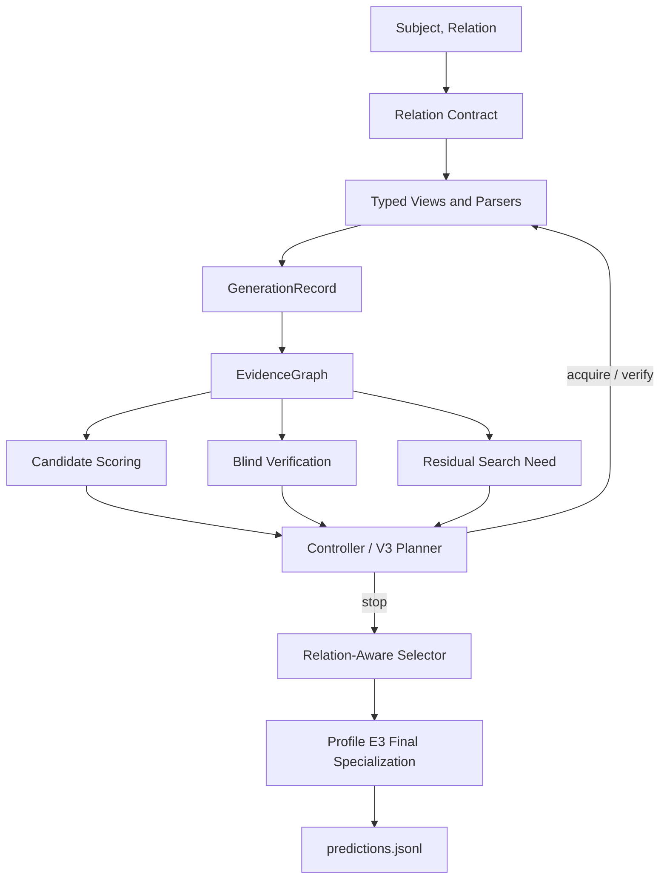

# COVER-KBC Final Methodology Forensic Review

Review date: 2026-08-14

HEAD: `9281cd251cfc3ed898c8d586a7e11b4b925fa398`

Pre-report git status observed during this review:

```text
 M configs/experiments/cover_kbc_v3_7_profile_e3_mistral_area_multiview_test.yaml
 M src/cover_kbc/leaderboard_repair/__init__.py
 M src/cover_kbc/leaderboard_repair/config.py
 M src/cover_kbc/leaderboard_repair/relations.py
 M src/cover_kbc/leaderboard_repair/stack.py
?? configs/experiments/cover_kbc_v3_8_profile_f1_stock_empty_rescue_test.yaml
?? scripts/run_stock_empty_rescue.py
?? src/cover_kbc/leaderboard_repair/stock_empty_rescue.py
```

Additional uncommitted Profile F1-related files were visible in the final
post-report status check:

```text
 M tests/test_leaderboard_repair.py
 M tests/test_profile_e3_area_multiview.py
?? docs/audits/0093-profile-f1-stock-empty-rescue-promotion.md
?? tests/test_profile_f1_stock_empty_rescue.py
```

These changes were not made by this review. They reinforce the unresolved
Profile E3 versus local Profile F1 paper-target ambiguity discussed below.

This report is read-only with respect to production code. No source, config,
prompt, test, Git history, or runtime behavior was intentionally modified by
this review. The only review artifact created is this Markdown file.

## 1. Executive Methodology Summary

COVER-KBC is a closed-book knowledge-base construction system for the AKBC /
LM-KBC 2026 Shared Task. For each query

```text
q = (subject, relation)
```

the system predicts a flat list of string object values. The six supported
relations mix small set-valued entity prediction, open set-valued entity
prediction, nullable single-entity prediction, and numeric prediction. The
repository's core methodology is not simply "ask several prompts and vote." The
implemented architecture compiles each relation into an executable contract,
runs relation-typed evidence acquisition actions, parses outputs into typed
candidate observations, stores those observations in a provenance-aware
EvidenceGraph, scores candidates from independent support and blind verifier
signals, estimates residual search need, uses a budget-aware controller to
decide whether more evidence is worth acquiring, and finalizes with
relation-aware selectors. The leaderboard profile then applies a narrow
post-pipeline specialization layer.

The committed, user-requested final baseline is Profile E3:

```text
configs/experiments/cover_kbc_v3_7_profile_e3_mistral_area_multiview_test.yaml
```

Profile E3 is:

```text
Profile D Mistral-only core
  + AwardMetadataNormalizer
  + MistralCityEmptyRescue
  + MistralDirectArea
  + MistralCapacityMultiView
  + MistralAreaMultiView
```

Its user-provided hidden TEST Macro-F1 is `0.5857`. The single neural checkpoint
is `mistralai/Mistral-Small-3.2-24B-Instruct-2506` at revision
`95a6d26c4bfb886c58daf9d3f7332c857cb27b43`, counted as `24,011,361,280`
published parameters under the `32,000,000,000` parameter limit. The same
physical Mistral runtime is reused for enumerator, verifier-role calls, and
repair calls. Qwen appears in historical configs, tests, and proposals, but is
not active in the Profile E3 pipeline.

Important worktree ambiguity: this repository currently contains uncommitted
local Profile F1 stock empty-row rescue changes. The new untracked F1 config
declares Profile F1 as a current frozen baseline with user-provided hidden TEST
overall F1 `0.5878` and stock F1 `0.7385`. However, the user request for this
review asks for Profile E3 final methodology, and the F1 files are untracked or
uncommitted. This report therefore treats Profile E3 as the canonical committed
methodology target and records F1 as a current local successor candidate that
must be confirmed before the paper changes the named final system.

At methodology level, the strongest paper story is:

1. Relation-typed inference programs: relation contracts control not only
   prompt text, but program type, eligible views, hard negatives, verifier
   policy, stopping semantics, selector, and final mutation boundary.
2. Evidence-centric inference state: model calls become typed evidence edges
   with provenance, view identity, model identity, independence group, verifier
   labels, and support/contradiction semantics.
3. Candidate confidence is separated from residual search need: a candidate can
   be individually plausible while the answer set is still under-searched, and
   the controller uses that distinction for budget-aware action selection.

Profile E3's empirically decisive final improvements are narrower: Area and
Capacity use deterministic semantic Multi-View numeric specialists with strict
parsing, 5 percent clustering, source-blind numeric judging, and explicit
fallbacks; City uses an empty-only rescue; Award applies deterministic metadata
normalization.

## 2. Repository Coverage and Inspection

Repository inventory was reconstructed with `git ls-files`, `find`, `rg`,
`sed`, `nl`, `git log`, `git diff`, `pdfinfo`, `pdftotext`, and notebook JSON
inspection.

Tracked file inventory:

| Category | Count |
|---|---:|
| tracked files | 431 |
| Python files | 266 |
| Markdown files | 105 |
| YAML files | 37 |
| JSON files | 8 |
| JSONL files | 3 |
| PDF files | 2 |
| notebooks | 2 |
| TOML files | 1 |

Important inspected areas:

| Area | Evidence |
|---|---|
| production runner | `scripts/run_cover.py` |
| targeted runners / merge utilities | `scripts/run_area_multiview.py`, `scripts/run_capacity_multiview.py`, `scripts/merge_targeted_relation_results.py`, uncommitted `scripts/run_stock_empty_rescue.py` |
| contracts and router | `src/cover_kbc/contracts/base.py`, `registry.py`, `router.py`, `relation_profile.py` |
| elicitation | `src/cover_kbc/elicitation/views.py`, `library.py`, `engine.py`, `parsing.py` |
| normalization | `src/cover_kbc/normalization/strings.py`, `numeric.py` |
| evidence state | `src/cover_kbc/evidence/graph.py`, `consensus.py`, `consensus_types.py`, `layer4.py`, `production_bridge.py` |
| verification | `src/cover_kbc/verification/blind.py`, `specialist_*`, `bidirectional_*` |
| scoring and coverage | `src/cover_kbc/scoring.py`, `src/cover_kbc/coverage.py`, `src/cover_kbc/coverage_gap/*` |
| controller and budget | `src/cover_kbc/controller.py`, `src/cover_kbc/control/*` |
| selection | `src/cover_kbc/selection.py`, `src/cover_kbc/v3_1/*` |
| final repair | `src/cover_kbc/leaderboard_repair/*` |
| model/runtime | `src/cover_kbc/models/*` |
| data/evaluation/writer | `benchmark/evaluate.py`, `src/cover_kbc/data/*`, `src/cover_kbc/evaluation/*` |
| configs/calibration | `configs/experiments/*`, `configs/calibration/*` |
| tests as spec | `tests/*.py` |
| docs/audits/history | `docs/*.md`, `docs/audits/*.md`, root PDFs |

Binary and document handling:

| File | Inspection result |
|---|---|
| `COVER_KBC_Technical_Proposal_New.pdf` | `pdfinfo` reports 26 pages; text extracted with `pdftotext -layout -`; contains M0-M21 architecture, equations, citations, and proposal assumptions. |
| `COVER_KBC_V2_ARCHITECTURE_SPEC.pdf` | `pdfinfo` reports 31 pages; treated as historical architecture specification. |
| `notebooks/COVER_KBC_Colab.ipynb` | JSON-inspected: 18 cells, 8 code, 10 markdown, mentions Profile E3, `run_cover.py`, and Qwen historical text. |
| `notebooks/COVER_KBC_PostArchitecture_RealModel_Smoke.ipynb` | JSON-inspected: 3 cells, 2 code, 1 markdown. |

Excluded from deep content traversal:

| Path / type | Reason |
|---|---|
| `.git/objects` internals | Git history was inspected through Git commands, not raw object traversal. |
| `outputs/`, `tasks.jsonl`, logs, caches, `__pycache__` | Generated/local artifacts; inventoried when visible but not treated as source of methodology truth. |
| model caches/checkpoints | Not present as tracked source and not needed for static methodology review. |

No hidden TEST inference, model loading, paid API calls, web search, or expensive
neural diagnostics were run.

## 3. Final Runtime / Profile E3

### Canonical Profile E3

Committed Profile E3 config path:

```text
configs/experiments/cover_kbc_v3_7_profile_e3_mistral_area_multiview_test.yaml
```

Key Profile E3 config evidence:

| Claim | Evidence |
|---|---|
| Profile E3 name | config lines 16-24 |
| E3 hidden overall F1 | config lines 91-94: `0.5857` |
| E3 relation scores | config lines 66-98 |
| E3 architecture list | config lines 47-55 |
| one Mistral model | config lines 180-199 |
| parameter budget | config lines 201-208 |
| core controller config | config lines 210-244 |
| V3.1 safe finalization | config lines 245-261 |
| E3 repair stack | config lines 263-298 |
| M20/M21 production | config lines 384-398 |

Profile E3 hidden TEST scores, user-provided:

| Relation | P | R | F1 |
|---|---:|---:|---:|
| `awardWonBy` | 0.3255 | 0.3707 | 0.3105 |
| `companyTradesAtStockExchange` | 0.9092 | 0.7863 | 0.7285 |
| `countryLandBordersCountry` | 0.9712 | 0.9295 | 0.9291 |
| `hasArea` | 0.6700 | 0.6700 | 0.6700 |
| `hasCapacity` | 0.2449 | 0.1633 | 0.1633 |
| `personHasCityOfDeath` | 0.9600 | 0.5900 | 0.5700 |
| **All Relations** | **0.7289** | **0.6034** | **0.5857** |

Zero-object reference:

```text
P = 0.5963
R = 0.9412
F1 = 0.7300
```

### Local Profile F1 Ambiguity

The current worktree has uncommitted modifications adding stock empty-row rescue.
Relevant files:

```text
configs/experiments/cover_kbc_v3_8_profile_f1_stock_empty_rescue_test.yaml
scripts/run_stock_empty_rescue.py
src/cover_kbc/leaderboard_repair/stock_empty_rescue.py
```

The untracked F1 config declares:

```text
Profile F1 = Profile E3 + MistralStockEmptyRescue
overall F1 = 0.5878
stock F1 = 0.7385
```

Source behavior: the working-tree repair dispatcher imports `repair_stock` and
adds `companyTradesAtStockExchange` to `REPAIR_BY_RELATION`, but Profile E3 still
sets `companyTradesAtStockExchange: 0` in `max_calls_by_relation` and does not
enable `mistral_stock_empty_rescue`. Therefore the new stock rescue is reachable
only under a config such as the untracked F1 config, not under Profile E3.

Safe paper rule: do not call F1 the final submitted system unless the user
confirms that the uncommitted F1 state is the paper target and commits/promotes
it. For this report, F1 is `UNKNOWN` / `EXPERIMENTAL-NOT-FINAL` relative to the
Profile E3 user request, despite its local config claiming a new frozen
baseline.

## 4. End-to-End Inference Pipeline

### Runner-Level Call Graph

The production run starts at:

```text
python scripts/run_cover.py --config configs/experiments/cover_kbc_v3_7_profile_e3_mistral_area_multiview_test.yaml --split test --out-dir <dir>
```

Runner flow:

```text
scripts/run_cover.py::main()
  -> yaml.safe_load(config)
  -> model_blocks(config)
  -> resolve_execution_mode(config)
  -> require_huggingface_runtime(enumerator_cfg, verifier_cfg)
  -> evaluate_production_readiness(config, split, config_path)
  -> build_runtime(enumerator_cfg)
  -> reuse enumerator runtime as verifier_runtime when blocks are equal
  -> audit_parameter_budget([spec_from_config(enumerator_cfg)])
  -> load_production_calibration(...)
  -> construct CoverPipeline(...)
  -> load_dataset(split)
  -> pipeline.run(dataset.queries())
  -> build_repair_stack(config)
  -> repair_stack.apply(core_predictions, queries, graphs)
  -> write_predictions(...)
  -> write_trace(...)
  -> write sidecars / manifest / repair accounting
```

Key evidence:

| Stage | Location |
|---|---|
| CLI and config load | `scripts/run_cover.py:442-475` |
| production/readiness gate | `scripts/run_cover.py:317-368`, `530-554` |
| model blocks and runtime construction | `scripts/run_cover.py:560-568` |
| one-runtime reuse | `scripts/run_cover.py:561-563` |
| parameter audit | `scripts/run_cover.py:567-571` |
| pipeline construction | `scripts/run_cover.py:624-751` |
| repair stack application | `scripts/run_cover.py:752-775` |
| official writer | `scripts/run_cover.py:788-790` |
| sidecars and manifest | `scripts/run_cover.py:791-889` |

### Per-Query Core Flow

For one query:

```text
q = (subject, relation, row_index)
  -> compile_query(subject, relation, row_index)
  -> get RelationContract
  -> run mandatory elicitation views
  -> parse entity/numeric/gate outputs
  -> build EvidenceGraph
  -> optional calibrated gate for city/stock
  -> active controller or fixed optional views
  -> blind verification where scheduled
  -> M16 consensus / V3 hypothesis graph
  -> V3 production loop with M20/M21 if active
  -> relation-specific selector
  -> Prediction
  -> Profile E3 leaderboard repair
  -> official JSONL row
```

Core source:

| Step | Location |
|---|---|
| pipeline construction | `src/cover_kbc/pipeline.py::CoverPipeline.__init__()` |
| per-query enumeration | `src/cover_kbc/pipeline.py::enumerate_query()` |
| adaptive discovery | `src/cover_kbc/pipeline.py::_adaptive_discovery()` |
| verification phase | `src/cover_kbc/pipeline.py::verify_graph()` |
| controlled phase | `src/cover_kbc/pipeline.py::_controlled_phase()` |
| V3 control loop | `src/cover_kbc/pipeline.py::_run_v3_control_loop()` |
| final decision | `src/cover_kbc/pipeline.py::decide_graph()` |
| full run | `src/cover_kbc/pipeline.py::run()` |

### ASCII Data Flow

```text
Dataset row
  |
  v
RelationContract + ProgramType
  |
  v
ElicitationEngine -> GenerationRecord(s)
  |
  v
Parser / Normalizer -> Candidate mention(s)
  |
  v
EvidenceGraph
  |
  +--> blind verifier -> verifier evidence
  |
  +--> scoring -> CandidateState
  |
  +--> coverage / RCSE -> residual search need
  |
  +--> controller / V3 M20-M21 -> next action or stop
  |
  v
selection.finalize()
  |
  v
LeaderboardRepairStack Profile E3
  |
  v
write_predictions() -> predictions.jsonl
```

### Mermaid Diagram



## 5. Relation-Typed Inference Programs

The type system is explicit in `src/cover_kbc/types.py`:

```text
ProgramType.SMALL_SET
ProgramType.NULL_SINGLE
ProgramType.NUMERIC
ProgramType.LARGE_OPEN_SET
```

The router maps relations to program types in
`src/cover_kbc/contracts/router.py::PROGRAM_BY_RELATION`:

| Relation | ProgramType | Output type | Core cardinality |
|---|---|---|---|
| `countryLandBordersCountry` | `SMALL_SET` | entity strings | zero or many, small |
| `companyTradesAtStockExchange` | `SMALL_SET` | entity strings | zero or many, small |
| `personHasCityOfDeath` | `NULL_SINGLE` | entity string | zero or one |
| `hasArea` | `NUMERIC` | number string | one scalar if known |
| `hasCapacity` | `NUMERIC` | integer number string | one scalar if known |
| `awardWonBy` | `LARGE_OPEN_SET` | entity strings | zero or many, open |

Contracts are architectural, not cosmetic configuration. A
`RelationContract` stores semantic definition, hard negatives, view ids,
verification policy, stopping policy, selector policy, output type, and numeric
metadata. It also maps view families to eligible independence groups through
`eligible_groups_for`.

Evidence:

| Claim | Source |
|---|---|
| contract fields | `src/cover_kbc/contracts/base.py::RelationContract` |
| view-family to independence-group mapping | `src/cover_kbc/contracts/base.py::eligible_groups_for()` |
| six relation contracts | `src/cover_kbc/contracts/registry.py` |
| typed router consistency | `src/cover_kbc/contracts/router.py::check_router_consistency()` |
| richer relation profiles | `src/cover_kbc/contracts/relation_profile.py` |

Relation contract table:

| Relation | Mandatory views | Optional views | Selector | E3 final layer |
|---|---|---|---|---|
| `countryLandBordersCountry` | `borders_direct`, `borders_compass` | land-vs-maritime, missing, description, reverse | `select_small_set` | none |
| `companyTradesAtStockExchange` | `stock_listing_gate`, `stock_exchange_direct` | parent contrast, description, reverse | `select_small_set` with stock structural validation | none in E3 |
| `personHasCityOfDeath` | `death_status_gate`, `death_city_direct` | locality granularity, description | `select_null_single` | empty-only city rescue |
| `hasArea` | `area_direct_km2`, `area_total_vs_land` | alternate unit | `select_numeric_robust` | Area Multi-View |
| `hasCapacity` | `capacity_direct`, `capacity_contrast` | configuration | `select_numeric_highest_valid` | Capacity Multi-View |
| `awardWonBy` | direct, temporal facet, recipient type facet, missingness | category, identity contrast, reverse | `select_large_open_set` | metadata normalization |

Why this is more than relation-specific prompting:

1. The relation controls the legal action family, not only template text.
2. The relation controls parsing target: entity, gate label, numeric km2,
   numeric persons.
3. The relation controls verification thresholds and null behavior.
4. The relation controls residual stop criteria.
5. The relation controls selector semantics: set, nullable singleton, robust
   numeric, highest valid numeric, or large open set.
6. The final E3 mutation layer is relation-scoped and cannot rewrite unrelated
   rows.

## 6. Evidence Representation and Independence

The core evidence state is `EvidenceGraph`, one graph per query:

```text
EvidenceGraph(
    query,
    contract,
    candidates,
    records,
    gate_negative,
    controller_log,
    pending_action,
    rcse_state,
    budget_snapshot,
    verification_calls,
)
```

Source: `src/cover_kbc/evidence/graph.py`.

Important atomic types are in `src/cover_kbc/types.py`:

| Type | Purpose |
|---|---|
| `GenerationRecord` | one model interaction or model-derived extraction record |
| `Evidence` | one signed support, contradiction, unknown, or verifier edge |
| `EvidenceGroup` | grouped supports/contradictions by independence group |
| `Candidate` | candidate node with normalized key, display, surfaces, numeric value, evidence groups, verifications, score, status |
| `Prediction` | final row-level output with accounting |

`GenerationRecord` stores prompt and provenance: query, view id, view family,
independence group, run id, model id/family, role, stage, prompt hash, raw
output, decode profile, parsed values, tokens, latency, and optional source
record/candidate pointers.

`Evidence` stores the candidate key, edge type, independence group, view id,
model id, run id, record id, edge id, model family, evidence mode, calibrated
valid/invalid/unknown probabilities, and cost.

Independence semantics:

| Question | Code-derived answer |
|---|---|
| What counts as independent? | Distinct acquisition mechanisms represented by `IndependenceGroup`, such as direct recall, structural decomposition, contrastive separation, missingness search, reverse alternate, and cross-model recall. |
| What is correlated/repeated? | Multiple runs of the same view or same group are raw support, not new independent mechanisms. |
| Does repeating the same view increase independent support? | No. It can increase raw support and diagnostics but not `independent_support`. |
| How is fake consensus prevented? | `support_term()` counts distinct eligible acquisition groups; M16 computes group support `q_g=max(...)`; gate/verifier/shown-candidate evidence is excluded from acquisition support. |
| How are positive and negative signals combined? | Support edges increase candidate support; contradiction edges enter `contradiction_term`; verifier edges enter logit and disagreement terms. UNKNOWN is neither INVALID nor a contradiction. |
| Which information survives to selection? | Candidate status, score, groups, verifications, surfaces, numeric value, facets, and graph-level gate/RCSE/budget state. |

Numeric candidate identity: the graph key is a formatted canonical numeric
value. Tolerance-aware equivalence is deliberately not the graph key; it is
applied later by numeric clustering in `selection.py` and final Multi-View
specialists. This preserves distinct observations such as `10000` and `10400`
until the numeric selector decides they are compatible.

## 7. Candidate Scoring and Verification

### Active Candidate Score

The active score formula is implemented in
`src/cover_kbc/scoring.py::score_candidate()`:

```text
S(o) = alpha F(o) + beta L(o) + gamma X(o) - delta C(o) - eta U(o)
```

Profile E3 weights from config:

```text
alpha_support = 1.0
beta_logit = 0.6
gamma_cross_model = 0.5
delta_contradiction = 1.5
eta_disagreement = 1.0
```

Terms:

| Term | Code | Meaning |
|---|---|---|
| `F(o)` | `support_term()` | independent acquisition support, `q(o)` |
| `L(o)` | `logit_term()` | latest calibrated verifier log-odds clipped and scaled to `[-1, 1]` |
| `X(o)` | `cross_model_term()` | independent cross-model recall support; inactive in E3 because enumerator and verifier are the same Mistral model |
| `C(o)` | `contradiction_term()` | distinct contradicting mechanisms divided by possible contradiction mechanisms |
| `U(o)` | `disagreement_term()` | normalized prompt/template disagreement from verifier distributions |

Independent support:

```text
m(o) = eligible acquisition groups for the relation
g(o) = subset of m(o) that support candidate o
q(o) = |g(o)| / |m(o)|
F(o) = q(o)
```

Inclusion uncertainty:

```text
H_inc(o) = -q(o) log q(o) - (1 - q(o)) log(1 - q(o))
```

This entropy is exposed to the controller state but is not itself a term in
`S(o)`.

Verifier logit term:

```text
log_odds(o) = log((p_VALID + eps) / (p_INVALID + p_UNKNOWN + eps))
L(o) = clip(log_odds(o) / logit_clip, -1, 1)
```

Profile E3 has `eps = 1e-6` and `logit_clip = 3.0`.

Acceptance/tiering parameters:

| Parameter | E3 value |
|---|---:|
| `auto_accept_support` | 3 |
| `verify_max_support` | 2 |
| `adversarial_disagreement` | 0.15 |
| `accept_score` | 0.2 |
| `min_valid_prob` | 0.40 |
| `drop_on_unknown` | true |

Contract-specific verification policies override global defaults unless
`force_global_verification_policy` is set.

### Blind Verification

The generic verifier is `src/cover_kbc/verification/blind.py`. It is blind:
the prompt receives the subject, relation definition, near-miss rules, and one
candidate; it does not receive the generator prompt, generator rationale,
support count, other candidates, or controller state.

Label space:

```text
A = VALID
B = INVALID
C = UNKNOWN
```

Contextual calibration:

```text
z'_j = z_j - b_j
p'_j = softmax(z' / T)
```

where `b_j` comes from a content-free control using the same template and
relation contract, and default `T = 1.0`.

Prompt disagreement is generalized Jensen-Shannon divergence across verifier
templates, normalized to `[0,1]`.

The final Profile E3 uses Mistral for both generator and verifier-role calls.
Historical Qwen verifier code and tests remain for provenance and compatibility
but are not active in E3.

### Specialist Verification

M17 specialist verification lives in `src/cover_kbc/verification/specialist_*`.
It declares relation-specific verifier contracts but deliberately does not
decide, rank, prune, or emit predictions. The module reuses Module 4
calibration and A/B/C label arithmetic. It is configured as `mode: shadow` in
E3, but V3 production control can request selected verification through the
production bridge when a V3 action is explicitly chosen. The safe wording for
the paper is that relation-specialized verification is implemented as typed
verifier evidence and production-gated; not every M17 catalogue item is run.

## 8. Residual Coverage and Search Need

The core residual estimator is `src/cover_kbc/coverage.py`. The code explicitly
states that RCSE is a search-need signal, not a calibrated probability of
remaining ground-truth answers and not a cardinality oracle.

Shared primitives:

| Signal | Implementation | Meaning |
|---|---|---|
| marginal yield | `RCSEState.marginal_yield()` | new trusted objects per normalized token cost window |
| saturation | `RCSEState.saturation_score()` | recent no-gain pressure |
| set stability | `RCSEState.set_stability()` | Jaccard stability of trusted sets |
| mandatory gap | `mandatory_view_gap()` | required views not yet executed |
| mechanism gap | `mechanism_gap()` | eligible acquisition mechanisms not yet tried |
| facet gap | `semantic_facet_gap()` | relation facets not covered |
| unresolved mass | `unresolved_mass()` | unresolved candidate pressure |
| verifier disagreement | `verifier_disagreement()` | verifier prompt/template disagreement |
| inclusion uncertainty | `mean_inclusion_uncertainty()` | average normalized binary entropy over candidate inclusion |
| numeric stability | `numeric_stability()` | numeric dispersion and cluster competition |
| locality competition | `locality_competition()` | competing city/locality candidates |

Residual combination:

```text
R_t = clip(max(weighted_mean(available components),
               mandatory_gap,
               blocking components), 0, 1)
```

Only available components enter the denominator; unavailable diagnostics are
not treated as zero.

Relation-specific completion semantics:

| ProgramType | Completion signal |
|---|---|
| `SMALL_SET` | stable accepted set, low unresolved mass, low inclusion uncertainty, low mechanism gap |
| `NULL_SINGLE` | confident non-null singleton or resolved null/gate state, low locality competition |
| `NUMERIC` | low numeric dispersion, low cluster competition, low mechanism gap, low verifier disagreement |
| `LARGE_OPEN_SET` | low marginal yield, low facet gap, low mechanism gap, saturation of open-set discovery |

M19, in `src/cover_kbc/coverage_gap/*`, extends this with novelty rate,
singleton ratio, facet gap, disagreement, and unresolved mass:

```text
R_t = weighted_mean(novelty_rate,
                    singleton_ratio,
                    facet_gap,
                    disagreement,
                    unresolved_mass)
```

M19 is configured as `mode: shadow`, but its coverage gap estimates are read by
the V3 production loop through `pipeline._estimate_coverage_gap()` and planner
state. It should be described as a production-gated search-need signal, not as
a gold-cardinality estimator.

## 9. Adaptive Controller and Stopping

The original active controller is `src/cover_kbc/controller.py`. It defines:

```text
ActionType.RUN_VIEW
ActionType.RUN_FACET
ActionType.VERIFY
ActionType.ADVERSARIAL_VERIFY
ActionType.REVERSE_CHECK
ActionType.CROSS_MODEL_CHECK
ActionType.RESAMPLE
ActionType.STOP
```

Action scoring:

```text
A_t(a) = alpha * expected_yield(a)
       + beta  * gap(a)
       + gamma * uncertainty(a)
       - lambda * cost(a)
       - rho    * redundancy(a)
```

Default controller weights:

```text
alpha = 1.0
beta = 1.0
gamma = 0.8
lambda = 0.15
rho = 1.0
```

The controller:

1. scores current candidates and query state,
2. estimates residual search need,
3. enumerates legal relation/actions,
4. optionally prioritizes verification when unresolved mass is high,
5. removes `STOP` if stop conditions are not met,
6. chooses deterministic argmax by score and tie-breakers,
7. charges budget before executing model-backed actions.

Source evidence:

| Claim | Source |
|---|---|
| legal actions | `src/cover_kbc/controller.py::legal_actions()` |
| action utility | `src/cover_kbc/controller.py::score_action()` |
| action choice | `src/cover_kbc/controller.py::choose_action()` |
| stopping | `src/cover_kbc/controller.py::should_stop()` |
| execution hook | `src/cover_kbc/pipeline.py::_execute_action()` |
| adaptive loop | `src/cover_kbc/pipeline.py::_adaptive_discovery()`, `_controlled_phase()` |

Stopping differs by relation type:

| ProgramType | Stop condition |
|---|---|
| `SMALL_SET` | trusted set stable and unresolved mass zero, after mandatory views |
| `NULL_SINGLE` | one accepted singleton with no unresolved alternatives, or no candidates with resolved gate/no-gain |
| `NUMERIC` | no numeric competition, no dispersion, no instability, no unresolved mass |
| `LARGE_OPEN_SET` | saturation patience reached and facet gap closed |

V3 production loop:

| Component | Role |
|---|---|
| M20 relation budget scheduler | builds calibrated budget envelope and reservation ledger |
| M21 micro-planner | selects next V3 action or STOP from legal action catalog |
| `ProductionEvidenceBridge` | applies executed specialist/structural evidence into the graph only under production integration |
| Layer6 integrator | sidecar/diagnostic integration report, not direct prediction mutation |

M21 utility, from `src/cover_kbc/control/planner_types.py` and
`micro_planner.py`:

```text
U_t(a) = alpha * G_verified(a)
       + beta  * DeltaR(a)
       + gamma * DeltaH(a)
       - delta * Cost(a)
       - eta   * Redundancy(a)
       - kappa * FP(a)
```

With optional depth-2 lookahead:

```text
value(a1) = U(a1) + sum_i p_i max_a2 U(a2 | successor_bin_i)
```

Safe paper wording: COVER-KBC has an implemented adaptive, budget-aware
test-time controller. Some M17/M18/M19 signals are shadow/catalogue until a
production-gated V3 action executes; do not imply every proposed M0-M21 action
always runs.

## 10. Relation-Specific Selection and Finalization

Core selection is in `src/cover_kbc/selection.py`.

Selector families:

| Selector | Relation(s) | Behavior |
|---|---|---|
| `select_small_set` | border, stock | emit accepted entity candidates, sorted by verifier acceptance, support, score; applies stock structural validation if enabled |
| `select_null_single` | city of death | emit at most one accepted entity or empty |
| `select_large_open_set` | award | emit accepted set-valued candidates |
| `select_numeric_robust` | area | cluster numeric candidates and choose dominant robust cluster |
| `select_numeric_highest_valid` | capacity | among non-invalid clusters, choose highest valid/trusted capacity cluster |

V3.1 safe finalization features configured in E3:

| Feature | E3 state | Source |
|---|---|---|
| `final_candidate_retention` | enabled | `src/cover_kbc/v3_1/retention.py` |
| `enumeration_label_repair` | enabled | `src/cover_kbc/v3_1/output_repair.py` |
| `stock_structural_validation` | enabled | `src/cover_kbc/v3_1/entity_finalization.py` |
| `numeric_output_canonicalization` | enabled | `src/cover_kbc/v3_1/numeric_recovery.py` |
| `stock_support_dominance` | disabled | E3 config |

Aggressive V3.1 features:

| Feature | E3 state | Methodology status |
|---|---|---|
| `capacity_definition_prompt` | false | historical/prototype |
| `city_of_death_contrast_prompt` | false | historical/prototype |
| `stock_listing_entity_prompt` | true in config | bound through `v3_1.live_prompts` for enumerator instruction; not the same as F1 stock empty rescue |
| `award_expansion_and_fp_cap` | false | historical/prototype |
| `scientific_notation_acquisition` | false | historical/prototype |

Final output goes through `src/cover_kbc/data/writer.py`, which writes exactly:

```json
{"SubjectEntity": "...", "Relation": "...", "ObjectEntities": ["..."]}
```

The writer deduplicates only by the official evaluator's normalized string
boundary and preserves dataset row order.

## 11. Profile E3 Specialization

The Profile E3 final specialization is downstream of the core. It is not the
whole COVER-KBC architecture. It receives completed `Prediction` objects and
may rewrite only final `ObjectEntities`, with row-level repair accounting and
per-relation call caps.

Entry point:

```text
src/cover_kbc/leaderboard_repair/stack.py::LeaderboardRepairStack.apply()
```

Repair dispatch:

```text
src/cover_kbc/leaderboard_repair/relations.py::REPAIR_BY_RELATION
```

### AwardMetadataNormalizer

Active in E3 for `awardWonBy`.

Implementation:

```text
src/cover_kbc/leaderboard_repair/relations.py::repair_award()
src/cover_kbc/leaderboard_repair/util.py::normalize_award_metadata()
```

Behavior:

1. deterministic only,
2. strips metadata-like wrappers and leaked facet/category labels,
3. deduplicates by strict key,
4. does not add new factual recipients,
5. no neural calls.

### MistralCityEmptyRescue

Active in E3 for `personHasCityOfDeath`.

Implementation:

```text
src/cover_kbc/leaderboard_repair/relations.py::_repair_city_mistral_empty_rescue()
```

Behavior:

1. bypasses any non-empty core city output,
2. for empty city rows, calls a life/death status prompt,
3. only `DECEASED` permits a second city recall prompt,
4. strict parser accepts one line `CITY: <city>` or `UNKNOWN`,
5. final output is either one city or empty.

Call cap in E3: two repair calls per city row.

### MistralAreaMultiView

Active in E3 for every `hasArea` row.

Implementation:

```text
src/cover_kbc/leaderboard_repair/area.py::repair_area()
src/cover_kbc/leaderboard_repair/area_multiview.py::repair_area_multiview()
```

Views:

| View | Meaning |
|---|---|
| V1 `area_multiview_v1_direct` | direct closed-book area recall |
| V2 `area_multiview_v2_entity_type` | classify semantics as country/island/lake/other before returning area |
| V3 `area_multiview_v3_infobox` | encyclopedic / infobox-style recall |
| V4 `area_multiview_v4_attribute_contrast` | attribute-contrast / step-back recall |

Parser:

```text
AREA: <positive finite decimal>
UNKNOWN
```

Aggregation:

```text
d(a,b) = |a-b| / max(|a|, |b|)
compatible iff d(a,b) <= 0.05
```

Clusters are pairwise 5 percent compatible. Support is number of views in the
cluster. If top cluster support is at least 3, the representative is accepted.
Otherwise, if observations exist, exactly one source-blind numeric judge sees
candidate labels but not view provenance. Fallback order:

```text
support>=3 cluster -> judge -> V1 -> top cluster -> []
```

The upstream Area output is ignored and is not another vote. Call complexity:
four deterministic calls per row, plus at most one judge call.

### MistralCapacityMultiView

Active in E3 for every `hasCapacity` row.

Implementation:

```text
src/cover_kbc/leaderboard_repair/capacity.py::repair_capacity()
```

Views:

| View | Meaning |
|---|---|
| V1 direct | direct highest spectator capacity recall |
| V2 encyclopedic | published / infobox recall |
| V3 configuration-aware | seated/standing/sport/concert/historical/current/temporary distinctions |
| V4 step-back | identify exact venue and capacity attribute before returning number |

Parser:

```text
CAPACITY: <positive integer>
UNKNOWN
```

Aggregation is the same 5 percent pairwise compatibility as Area. If support is
at least 3, accept the top cluster. Otherwise run one source-blind judge. Fallback:

```text
support>=3 cluster -> judge -> V1 -> top cluster -> []
```

The upstream Capacity answer is ignored and is not another vote. Call
complexity: four deterministic calls per row, plus at most one judge.

### Stock Empty Rescue in Current Dirty Worktree

E3 has no stock repair: E3 config sets `companyTradesAtStockExchange: 0` in
repair caps and does not enable `mistral_stock_empty_rescue`.

The current dirty worktree includes uncommitted Profile F1:

```text
src/cover_kbc/leaderboard_repair/stock_empty_rescue.py
configs/experiments/cover_kbc_v3_8_profile_f1_stock_empty_rescue_test.yaml
```

If Profile F1 is selected, stock empty rescue:

1. triggers only on empty stock rows,
2. runs four candidate-blind Mistral views,
3. parses strict `EXCHANGE: <exchange name>` lines or `UNKNOWN`,
4. validates exchange-like surfaces without subject lookup,
5. clusters by normalized exchange key,
6. accepts exactly one exchange only when cross-view support is at least 3,
7. otherwise leaves the row empty.

Status in this report: `UNKNOWN` / local successor candidate, not paper-final
unless user confirms.

## 12. Per-Relation Pipelines

### `awardWonBy`

```text
subject + awardWonBy
  -> LARGE_OPEN_SET contract
  -> direct / temporal / recipient-type / missingness views
  -> entity parser and strict normalization
  -> EvidenceGraph candidates
  -> blind verification when scheduled
  -> large-open-set residual signals
  -> select_large_open_set
  -> AwardMetadataNormalizer
  -> final recipient strings
```

Target semantics: entities that received the exact award. Hard negatives
include nominees, works, similarly named awards, category/time labels, and
famous people in the field who did not receive the award.

Structural challenge: high-cardinality recall and precision under open-set
candidate growth.

Current hidden E3 F1: `0.3105`.

### `companyTradesAtStockExchange`

```text
subject + companyTradesAtStockExchange
  -> SMALL_SET stock contract
  -> listing gate + direct stock exchange view
  -> optional parent/listing contrast, description, reverse path
  -> entity parser and exchange structural validation
  -> EvidenceGraph candidates
  -> blind verification/controller
  -> select_small_set
  -> no E3 repair
  -> final exchange strings
```

Target semantics: stock exchange entity/entities on which the exact company
trades. Hard negatives include ticker symbols, indexes, countries, market
segments, regulators, parent/subsidiary listings, stale listings, and plausible
market priors.

Current hidden E3 F1: `0.7285`.

Uncommitted Profile F1 would add empty-only four-view stock rescue with support
threshold 3 and user-provided hidden stock F1 `0.7385`, but that is not confirmed
as the paper-final system in this request.

### `countryLandBordersCountry`

```text
subject + countryLandBordersCountry
  -> SMALL_SET border contract
  -> direct + compass border views
  -> optional land-vs-maritime / missing / description / reverse checks
  -> entity parser
  -> EvidenceGraph
  -> blind verification/controller
  -> select_small_set
  -> no E3 repair
  -> final country strings
```

Target semantics: countries sharing a land border with the exact country. Hard
negatives include maritime borders, territories, disputed/non-country entities,
and nearby countries without direct land contact.

Current hidden E3 F1: `0.9291`.

### `personHasCityOfDeath`

```text
subject + personHasCityOfDeath
  -> NULL_SINGLE contract
  -> death status gate + death city direct view
  -> optional locality granularity and description
  -> entity parser
  -> EvidenceGraph
  -> null-single coverage/gate behavior
  -> select_null_single
  -> E3 empty-only MistralCityEmptyRescue
  -> final city or []
```

Target semantics: city where the person died, not birthplace, residence,
burial location, hospital name, country, state, or region.

Current hidden E3 F1: `0.5700`.

### `hasArea`

```text
subject + hasArea
  -> NUMERIC contract
  -> core area numeric views
  -> numeric parser / unit normalization / evidence graph
  -> numeric selector
  -> E3 MistralAreaMultiView replaces final Area output
  -> final km2 number string or []
```

Target semantics: exact entity area. Country means total area including land
and inland water; island means exact island land area; lake means exact lake
surface area; other geography means exact feature area.

Current hidden E3 F1: `0.6700`.

### `hasCapacity`

```text
subject + hasCapacity
  -> NUMERIC contract
  -> core capacity numeric views
  -> numeric parser / evidence graph
  -> numeric highest-valid selector
  -> E3 MistralCapacityMultiView replaces final Capacity output
  -> final integer capacity string or []
```

Target semantics: highest published maximum spectator capacity for exact venue.
Reject attendance, dimensions, cost, population, area, other venue capacity, and
wrong configuration when it is not the maximum spectator capacity.

Current hidden E3 F1: `0.1633`.

## 13. Models, Prompts, and Inference Configuration

Active Profile E3 model:

| Field | Value |
|---|---|
| model id | `mistralai/Mistral-Small-3.2-24B-Instruct-2506` |
| revision | `95a6d26c4bfb886c58daf9d3f7332c857cb27b43` |
| family | `mistral` |
| backend | `huggingface` |
| tokenizer backend | `mistral_common` |
| quantization | `nf4` |
| torch dtype | `bfloat16` |
| device map | `auto` |
| counted parameters | `24,011,361,280` |
| parameter limit | `32,000,000,000` |

Runtime source:

| Claim | Source |
|---|---|
| model spec construction | `src/cover_kbc/models/registry.py::spec_from_config()` |
| HF runtime build | `src/cover_kbc/models/registry.py::build_runtime()` |
| Mistral Tekken tokenizer | `src/cover_kbc/models/mistral_tokenizer.py` |
| generation | `src/cover_kbc/models/huggingface.py::generate()` |
| label scoring | `src/cover_kbc/models/huggingface.py::score_labels()` |
| budget audit | `src/cover_kbc/models/budget.py::audit_parameter_budget()` |

Decoding:

1. Core view decode profiles are declared in `elicitation/library.py` as greedy,
   short, and long profiles. Greedy views use `temperature=0.0`.
2. Repair stack calls use `RepairCaller.generate()` with `temperature=0.0`,
   `top_p=1.0`, and per-call `max_new_tokens`.
3. Area/Capacity Multi-View repair calls use `max_new_tokens=24`; judges use
   `max_new_tokens=4`.
4. City rescue uses `max_new_tokens=8` for death status and `20` for city.

No final Profile E3 code path uses:

```text
fine-tuning
LoRA
continued pretraining
learned router
learned verifier head
external RAG
web search
manual subject-answer lookup table
API model
second physical Mistral checkpoint
active Qwen runtime
```

## 14. Mathematical Formulation

Only code-supported formulas are listed here.

### Candidate Support

```text
m(o) = eligible acquisition groups for relation r
g(o) = acquisition groups that support o
q(o) = |g(o)| / |m(o)|
F(o) = q(o)
```

Source: `src/cover_kbc/scoring.py::acquisition_groups()`,
`supporting_acquisition_groups()`, `coverage_q()`, `support_term()`.

Six-page priority: high.

### Inclusion Uncertainty

```text
H_inc(o) = -q(o) log q(o) - (1 - q(o)) log(1 - q(o))
```

Source: `src/cover_kbc/scoring.py::inclusion_uncertainty()`.

Six-page priority: medium. Include only if explaining controller state.

### Verifier Calibration

```text
z'_j = z_j - b_j
p'_j = softmax(z' / T)
```

Source: `src/cover_kbc/verification/blind.py::ContextualCalibrator`.

Six-page priority: medium-high.

### Verifier Log-Odds

```text
L_raw(o) = log((p_VALID + eps) / (p_INVALID + p_UNKNOWN + eps))
L(o) = clip(L_raw(o) / logit_clip, -1, 1)
```

Source: `src/cover_kbc/types.py::VerificationResult.log_odds()`,
`src/cover_kbc/scoring.py::logit_term()`.

Six-page priority: high if scoring is included.

### Candidate Score

```text
S(o) = alpha F(o) + beta L(o) + gamma X(o) - delta C(o) - eta U(o)
```

Source: `src/cover_kbc/scoring.py::score_candidate()`.

Six-page priority: high.

### Residual Search Need

```text
R_t = clip(max(weighted_mean(available components),
               mandatory_gap,
               blocking components), 0, 1)
```

Source: `src/cover_kbc/coverage.py::estimate_residual()`.

Six-page priority: high, but call it search need, not probability of missing
gold.

### M19 Coverage Gap

```text
R_t = weighted_mean(novelty_rate,
                    singleton_ratio,
                    facet_gap,
                    disagreement,
                    unresolved_mass)
```

Source: `src/cover_kbc/coverage_gap/missingness.py`.

Six-page priority: appendix or short mention, because active status is
production-gated/shadow.

### Controller Utility

```text
A_t(a) = alpha * expected_yield(a)
       + beta  * gap(a)
       + gamma * uncertainty(a)
       - lambda * cost(a)
       - rho    * redundancy(a)
```

Source: `src/cover_kbc/controller.py::score_action()`.

Six-page priority: high.

### M21 Micro-Planner Utility

```text
U_t(a) = alpha * G_verified(a)
       + beta  * DeltaR(a)
       + gamma * DeltaH(a)
       - delta * Cost(a)
       - eta   * Redundancy(a)
       - kappa * FP(a)
```

Source: `src/cover_kbc/control/planner_types.py`,
`src/cover_kbc/control/micro_planner.py`.

Six-page priority: medium, unless the paper emphasizes V3 control.

### Numeric Compatibility

```text
d(a,b) = |a-b| / max(|a|, |b|)
compatible iff d(a,b) <= tau
```

Core numeric selectors use contract tolerance `0.025`; Profile E2/E3
Multi-View uses `0.05`.

Source: `src/cover_kbc/normalization/numeric.py::relative_distance()`,
`cluster_values()`, `leaderboard_repair/area_multiview.py`,
`leaderboard_repair/capacity.py`.

Six-page priority: high for Profile E3 specialization.

### Stock Empty-Rescue Consensus, If F1 Is Adopted

```text
support(exchange) = number of distinct stock rescue views producing its key
accept iff max_support >= 3
emit exactly one representative exchange
```

Source: untracked `src/cover_kbc/leaderboard_repair/stock_empty_rescue.py`.

Six-page priority: only if F1 is confirmed as final.

## 15. Experiment and Ablation History

Controlled positive milestones from configs/audits:

| Profile | Change | Overall F1 | Main effect |
|---|---|---:|---|
| Profile D | Mistral-only core / verifier-role consolidation | 0.4952 | one Mistral runtime replaces prior multi-model role setup |
| Integrated Profile E1 | Profile D + award cleanup + city empty rescue + direct area | 0.5752 | large Area gain and conservative final repairs |
| Profile E2 | E1 + Capacity Multi-View | 0.5836 | Capacity F1 improves to 0.1633 |
| Profile E3 | E2 + Area Multi-View | 0.5857 | Area F1 improves 0.6600 -> 0.6700 |

Negative experiments useful for Methodology:

| Experiment | Result | Lesson |
|---|---|---|
| C2 aggressive non-stock | overall 0.4012 | broad repair stacks can destroy calibrated precision |
| Direct Mistral Capacity | overall 0.5794, Capacity F1 0.1429 | direct recall helps but is weaker than semantic Multi-View |
| CHIV Capacity | overall 0.5773, Capacity F1 0.1327 | candidate harvesting / heuristic verification underperformed independent semantic views |
| NSMV / Neighborhood Stable Capacity | documented as retired negative probe where verified | local neighborhood consensus was not the winning capacity method |
| Direct Border / broad stock repairs | not adopted as final E3 | high-performing small-set relations are fragile under broad expansion |

Uncommitted local successor:

| Profile | Change | User-provided hidden evidence | Status |
|---|---|---|---|
| Profile F1 | E3 + empty-only strong-consensus stock rescue | overall F1 0.5878, stock F1 0.7385 | uncommitted / unresolved for this review |

Do not invent or recompute hidden TEST results. Values above are repository or
user-provided evidence as recorded in configs/audits.

## 16. Active vs Shadow vs Retired Architecture

| Component | Current status for Profile E3 | Prediction effect |
|---|---|---|
| M0 relation contracts | ACTIVE-PRODUCTION | defines semantics, views, policies |
| M1 typed router | ACTIVE-PRODUCTION | maps relation to ProgramType |
| M2 elicitation engine | ACTIVE-PRODUCTION | generates candidates |
| M3 EvidenceGraph | ACTIVE-PRODUCTION | stores candidate evidence |
| M4 blind verifier | ACTIVE-CONDITIONAL | runs when controller schedules verification |
| M5 scoring/state | ACTIVE-PRODUCTION | candidate score/status |
| M6 RCSE | ACTIVE-PRODUCTION | residual search need and stop signals |
| M7 controller | ACTIVE-PRODUCTION | action selection and stopping |
| M8 selector | ACTIVE-PRODUCTION | final core ObjectEntities |
| M9 risk profiler | SHADOW/DIAGNOSTIC with production consumption | informs V3 budget/planning; not final selector alone |
| M10 prompt compiler | SHADOW/DIAGNOSTIC with production consumption | generates structured program for M11/specialists |
| M11 parametric retrieval | SHADOW/DIAGNOSTIC with production consumption | closed-book pseudo-memory records, not external RAG |
| M12 numeric specialist | SHADOW/DIAGNOSTIC | signals/clusters, not direct final E3 numeric winner |
| M13 award specialist | SHADOW/DIAGNOSTIC | facet/atomic award signals |
| M14 null/temporal specialist | SHADOW/DIAGNOSTIC | null/locality signals |
| M15 small-set closure specialist | SHADOW/DIAGNOSTIC | stock/border closure signals |
| M16 atomic consensus | ACTIVE-CONDITIONAL | feeds V3 hypothesis/planner state |
| M17 specialist verifier | ACTIVE-CONDITIONAL / production-gated | selected checks can become verifier evidence through bridge |
| M18 bidirectional/counterfactual | ACTIVE-CONDITIONAL / production-gated | selected checks can become signed evidence through bridge |
| Layer4 integration | ACTIVE-CONDITIONAL / bridge-gated | applies executed M17/M18 evidence only in production mode |
| M19 coverage gap | SHADOW/DIAGNOSTIC with planner consumption | residual search signal for V3 planner; not final output directly |
| M20 relation budget scheduler | ACTIVE-PRODUCTION | budget envelopes/reservations |
| M21 micro-planner | ACTIVE-PRODUCTION | V3 action selection |
| Layer6 integration | SHADOW/DIAGNOSTIC | sidecar integration report |
| V3.1 safe finalization | ACTIVE-PRODUCTION | finalization-only safe changes |
| E3 leaderboard repair | FINAL-SPECIALIZATION | mutates selected relation outputs |
| Qwen verifier | RETIRED | historical only in E3 |
| C2 / CHIV / broad numeric repair | RETIRED | not active |
| uncommitted Profile F1 stock rescue | UNKNOWN / EXPERIMENTAL-NOT-FINAL for this request | active only if F1 config selected |

## 17. Documentation-vs-Code Reconciliation

| Claim / Module | Docs say | Code says | Final status | Safe to state? |
|---|---|---|---|---|
| Profile E3 is current | README/summary says E3 current | working tree modifies E3 metadata to previous and adds F1 config | unresolved local ambiguity | say E3 is committed/user-requested target; mention F1 if needed |
| one Mistral model | README/config/tests say one Mistral | `model_blocks` + `run_cover` reuse same runtime when blocks equal | ACTIVE | yes |
| Qwen active verifier | old proposal and historical tests mention Qwen | E3 config has no Qwen model block | RETIRED | no for final E3 |
| M9-M15 are shadow | module docs/config say shadow | their outputs can feed M16/V3 planner state, but do not directly emit final answers | SHADOW with production consumption | yes, with nuance |
| M17/M18 decide final truth | some proposal language is ambitious | code says no accept/reject/final; bridge converts selected results into evidence | production-gated evidence, not final decision | do not overclaim |
| M19 estimates missing gold probability | proposal warns against this | code says search-need signal, not cardinality oracle | search-need only | yes, with guardrail |
| Layer6 is production controller | proposal architecture suggests Layer6 | `layer6_integration.py` is sidecar; pipeline uses M20/M21 directly in V3 loop | diagnostic sidecar | no |
| Multi-View is whole system | README may foreground E3 final layer | core pipeline is contracts/evidence/scoring/control/selection before repair | final specialization only | no |
| Stock repair absent in E3 | E3 config cap 0, feature absent | dirty worktree has F1 stock repair but not active in E3 | E3 absent; F1 unresolved | yes with status |

## 18. What COVER-KBC Actually Proposes

Ranked contribution audit:

| Candidate contribution | Classification | Justification |
|---|---|---|
| Relation-Typed Active Evidence Acquisition | STRONG CORE CONTRIBUTION | Contracts drive typed program, views, verification, stopping, selector, and final policies. |
| Independence-Aware Atomic Evidence | STRONG CORE CONTRIBUTION | EvidenceGraph and M16 distinguish raw repeats from independent mechanism support and preserve provenance. |
| Candidate Confidence vs Residual Search Need | STRONG CORE CONTRIBUTION | Scoring and RCSE/M19 model different uncertainty questions and drive control. |
| Coverage-Guided Adaptive Elicitation | SUPPORTING CONTRIBUTION | M7/M20/M21 implement budget-aware action choice, but some V3 signals are production-gated. |
| Calibrated Blind Verification | SUPPORTING CONTRIBUTION | Strongly implemented; not novel alone, but important in combination. |
| Relation-Aware Finalization | SUPPORTING CONTRIBUTION | Selectors differ by relation structure and numeric semantics. |
| Mutation-Bounded Final Specialization | EMPIRICALLY IMPORTANT SPECIALIZATION | E1/E2/E3 gains come from narrow final layers with explicit mutation boundaries. |
| Semantic Numeric Multi-View | EMPIRICALLY IMPORTANT SPECIALIZATION | E2/E3 hidden improvements; not the whole architecture and not novel as generic prompting. |
| Null-Aware Selective Rescue | EMPIRICALLY IMPORTANT SPECIALIZATION | City rescue mutates only empty rows after life/death gate. |
| Closed-Book Parametric Retrieval | SUPPORTING / SHADOW | M11 implemented; not external RAG and not dominant final E3 evidence. |
| M19/M20/M21 planning extensions | SUPPORTING / PRODUCTION-GATED | Methodologically rich; claims must specify actual reachability. |
| Profile F1 stock rescue | UNKNOWN | local uncommitted successor; not final for this E3-focused report. |

What COVER-KBC genuinely proposes beyond multi-prompt ensembling:

1. A relation is compiled into an executable inference program, not just a
   prompt.
2. Model outputs become typed, provenance-bearing evidence, not raw strings.
3. Consensus counts structural independence groups, not repeated samples.
4. A blind verifier supplies calibrated evidence without seeing generator
   reasoning.
5. Candidate correctness and answer-space search need are separate state
   variables.
6. The controller chooses whether to ask, verify, reverse-check, resample, or
   stop under relation-specific budgets.
7. Final selectors encode output structure: nullable singleton, small set,
   large open set, robust numeric, and highest-valid numeric.
8. Leaderboard repairs are mutation-bounded and relation-scoped.

The 3 strongest ideas a reviewer should remember:

1. Relation-typed inference programs turn heterogeneous KB relations into
   different executable policies over one closed-book model.
2. Independence-aware evidence state prevents repeated or shown-candidate
   evidence from masquerading as independent support.
3. Residual search need lets the system reason about whether enough evidence
   has been acquired, separately from whether a particular candidate is correct.

## 19. Recommended Methodology Structure for the Paper

Recommended 4-subsection Methodology structure:

### 3.1 Relation-Typed Inference Programs

Central idea: compile each relation into a typed program with semantics, output
type, view eligibility, hard negatives, parser, verifier policy, stopping
policy, and selector.

Include:

```text
q = (s,r), C_r, ProgramType
relation -> contract -> action set -> selector
```

Omit: full list of every prompt line; put examples in appendix.

Figure/table: six-row relation contract table.

Space priority: highest.

### 3.2 Provenance-Aware Evidence and Blind Verification

Central idea: generated observations become candidate/evidence graph entries;
support is counted by independent acquisition groups; verifier evidence is
blind and calibrated.

Include:

```text
q(o)=|g(o)|/|m(o)|
S(o)=alpha F + beta L + gamma X - delta C - eta U
```

Omit: full dataclass fields except in compact table.

Figure/table: evidence node/edge diagram if space permits.

Space priority: high.

### 3.3 Residual Search Need and Budget-Aware Control

Central idea: candidate confidence is not answer-set completeness. RCSE and
V3 planning decide whether another evidence acquisition or verification action
is worth its cost.

Include:

```text
R_t = search-need signal
A_t(a) = gain + gap + uncertainty - cost - redundancy
```

Omit: every M19 component detail; emphasize relation-specific stopping.

Figure/table: one control loop box in architecture figure.

Space priority: high but concise.

### 3.4 Relation-Specific Finalization and E3 Specialization

Central idea: finalization depends on relation structure; Profile E3 adds
mutation-bounded leaderboard specialists for the relations where evidence shows
gains.

Include:

```text
Area/Capacity Multi-View 5% clustering
City empty-only rescue
Award metadata normalization
```

Omit: historical C2/CHIV internals beyond ablation table.

Numeric Multi-View should not consume its own full methodology subsection in a
six-page paper unless final results discussion needs it. Present it inside
relation-specific finalization, with a compact algorithm box.

Should Profile E3 specialization live in Methodology or Experimental Setup?
It should be in Methodology because it changes final inference. Frame it as
the final relation-specific specialization layer, not the whole framework.

Where to introduce:

| Concept | Best paper location |
|---|---|
| EvidenceGraph | 3.2 |
| candidate scoring | 3.2 |
| RCSE / residual search need | 3.3 |
| controller equation | 3.3 |
| Area/Capacity Multi-View | 3.4 |
| hidden profile lineage | Results/Ablation |
| M9-M21 detailed tables | Appendix or omitted |

## 20. Recommended Architecture Figure

One compact double-column figure should show the scientific flow, not file
names.

Recommended figure layout:

```text
                 (subject, relation)
                         |
                         v
              Relation-Typed Contract C_r
          (type, views, parser, verifier, stop, selector)
                         |
                         v
              Evidence Acquisition Actions
               /          |          \
          direct        facets       reverse/resample
                         |
                         v
        Provenance / Independence-Aware EvidenceGraph
                  /                         \
                 v                           v
       Candidate Confidence S(o)       Residual Search Need R_t
                 \                           /
                  \                         /
                   v                       v
             Budget-Aware Controller / Planner
                 | acquire / verify / stop
                 v
            Relation-Specific Selector
                 |
                 v
      Mutation-Bounded E3 Specialization
        (Award, City, Area, Capacity)
                 |
                 v
              ObjectEntities
```

Visual emphasis:

1. Relation contract controls the whole pipeline.
2. EvidenceGraph is persistent state.
3. Candidate confidence and residual search need are different branches.
4. Controller has a feedback loop.
5. E3 specialization is downstream and mutation-bounded.

Do not show:

1. Qwen as active.
2. web/RAG/external corpora.
3. every M0-M21 module as a long stack.
4. Multi-View as the only central box.
5. Profile F1 unless the user confirms it as final.

Caption draft:

```text
COVER-KBC compiles each subject-relation query into a relation-typed inference
program. Closed-book model calls produce provenance-bearing evidence, which is
scored and checked for residual search need before the controller either
acquires more evidence, verifies a candidate, or stops. Relation-specific
selectors and a mutation-bounded Profile E3 layer produce the final object set.
```

## 21. Paper-Safe Claims

Safe claims:

1. COVER-KBC is a closed-book LM-KBC system using one unique Mistral checkpoint
   in Profile E3.
2. The active Profile E3 model has 24,011,361,280 counted published parameters,
   under the 32B challenge limit.
3. Profile E3 does not use Qwen, web search, external RAG, external KB lookup,
   fine-tuning, LoRA, continued pretraining, or a learned verifier head.
4. Relation contracts determine more than prompts: they control views, parsers,
   verification policy, stopping, and selection.
5. The EvidenceGraph stores provenance and independence-group evidence rather
   than only candidate strings.
6. Repeated outputs from one view do not count as independent support.
7. The blind verifier sees one candidate and the relation contract, not the
   generator rationale.
8. Candidate score combines independent support, calibrated verifier log-odds,
   optional cross-model recall, contradiction, and prompt disagreement.
9. Residual coverage is implemented as a search-need signal, not a ground-truth
   cardinality estimate.
10. Area and Capacity Multi-View specialists use four deterministic semantic
    views, strict parsers, 5 percent clustering, one source-blind judge when
    ambiguous, and explicit fallbacks.
11. Profile E3's hidden score evidence is user-provided leaderboard evidence
    and should be marked as such.
12. Stock and Border have no active Profile E3 repair layer.

## 22. Claims to Avoid

Avoid:

1. Do not claim COVER-KBC is the first relation-aware KBC system.
2. Do not claim relation-specific prompting is novel by itself.
3. Do not claim Multi-View prompting is the main or only methodology.
4. Do not claim residual coverage is a probability that a hidden true object
   remains.
5. Do not claim M19/M20/M21 universally improve predictions without citing the
   exact ablation evidence.
6. Do not claim every M17/M18 catalogue item runs in Profile E3.
7. Do not describe Qwen as active in Profile E3.
8. Do not call M11 external retrieval or RAG; it is closed-book parametric
   elicitation.
9. Do not claim training or fine-tuning.
10. Do not claim a winning artifact SHA unless the artifact is locally present
    and verified.
11. Do not say quantization reduces challenge parameter accounting.
12. Do not silently adopt uncommitted Profile F1 as final unless confirmed.

## 23. Open Questions / Unresolved Evidence

1. Final paper target ambiguity: the user request asks for Profile E3, but the
   current worktree contains uncommitted Profile F1 stock empty-row rescue files
   and metadata declaring F1 as current. The paper writer must confirm whether
   final Methodology should end at E3 or include F1.
2. Profile E3 winning artifact SHA remains locally unresolved. The config and
   docs mark it as pending user import.
3. The untracked F1 artifact SHA is also pending user import.
4. M9-M15/M19 are not purely dead shadow modules: their signals can feed V3
   planning. The paper should explain this carefully but avoid overstating their
   direct prediction effect.
5. V3.1 `stock_listing_entity_prompt` is enabled under aggressive config in
   E3. It is distinct from the uncommitted F1 stock rescue; the exact empirical
   contribution should not be claimed without its ablation.
6. Some historical negative probe scores exist only in docs/audits, not local
   preserved winning artifacts. Mark provenance accordingly.
7. This review did not run model inference or hidden TEST validation, by design.

## 24. Source Map

Critical methodology claim to source mapping:

| Claim | Source |
|---|---|
| runner entrypoint | `scripts/run_cover.py::main()` |
| config loading | `scripts/run_cover.py:472-475` |
| production gate | `scripts/run_cover.py::resolve_production_gate()`, `evaluate_production_readiness()` |
| model runtime construction | `scripts/run_cover.py:560-568`, `src/cover_kbc/models/registry.py` |
| one-runtime reuse | `scripts/run_cover.py:561-563` |
| parameter budget | `src/cover_kbc/models/budget.py`, E3 config lines 201-208 |
| contracts | `src/cover_kbc/contracts/base.py`, `registry.py` |
| ProgramType router | `src/cover_kbc/contracts/router.py`, `src/cover_kbc/types.py` |
| relation profiles | `src/cover_kbc/contracts/relation_profile.py` |
| views and prompts | `src/cover_kbc/elicitation/library.py`, `views.py` |
| model call records | `src/cover_kbc/elicitation/engine.py::run_view()` |
| entity parser | `src/cover_kbc/elicitation/parsing.py::parse_entities()` |
| numeric parser | `src/cover_kbc/elicitation/parsing.py::parse_numeric_observations()` |
| string normalization | `src/cover_kbc/normalization/strings.py` |
| numeric normalization/clustering | `src/cover_kbc/normalization/numeric.py` |
| evidence graph | `src/cover_kbc/evidence/graph.py::EvidenceGraph` |
| evidence dataclasses | `src/cover_kbc/types.py::GenerationRecord`, `Evidence`, `Candidate` |
| blind verifier | `src/cover_kbc/verification/blind.py` |
| specialist verifier | `src/cover_kbc/verification/specialist_verifier.py`, `specialist_contracts.py`, `specialist_prompts.py` |
| bidirectional checks | `src/cover_kbc/verification/bidirectional_verifier.py`, `bidirectional_contracts.py`, `bidirectional_types.py` |
| scoring formula | `src/cover_kbc/scoring.py::score_candidate()` |
| RCSE | `src/cover_kbc/coverage.py::estimate_residual()` |
| controller action utility | `src/cover_kbc/controller.py::score_action()` |
| controller stopping | `src/cover_kbc/controller.py::should_stop()` |
| V3 hypothesis graph | `src/cover_kbc/v3_core/hypothesis.py` |
| V3 action execution | `src/cover_kbc/v3_core/execution.py`, `src/cover_kbc/pipeline.py::_execute_v3_action_record()` |
| production evidence bridge | `src/cover_kbc/evidence/production_bridge.py` |
| M16 consensus | `src/cover_kbc/evidence/consensus.py`, `consensus_types.py` |
| M19 coverage gap | `src/cover_kbc/coverage_gap/missingness.py`, `gap_types.py` |
| M20 budgets | `src/cover_kbc/control/relation_budget.py`, `budget_accounting.py` |
| M21 planner | `src/cover_kbc/control/micro_planner.py`, `planner_types.py` |
| selectors | `src/cover_kbc/selection.py` |
| V3.1 safe finalization | `src/cover_kbc/v3_1/retention.py`, `output_repair.py`, `entity_finalization.py`, `numeric_recovery.py` |
| final repair stack | `src/cover_kbc/leaderboard_repair/stack.py`, `relations.py`, `config.py` |
| Area Multi-View | `src/cover_kbc/leaderboard_repair/area_multiview.py` |
| Capacity Multi-View | `src/cover_kbc/leaderboard_repair/capacity.py` |
| City rescue | `src/cover_kbc/leaderboard_repair/relations.py::_repair_city_mistral_empty_rescue()` |
| Award normalization | `src/cover_kbc/leaderboard_repair/relations.py::repair_award()`, `util.py::normalize_award_metadata()` |
| uncommitted F1 stock rescue | `src/cover_kbc/leaderboard_repair/stock_empty_rescue.py`, `scripts/run_stock_empty_rescue.py`, F1 config |
| official evaluator | `benchmark/evaluate.py` |
| writer | `src/cover_kbc/data/writer.py` |
| schema | `src/cover_kbc/data/schema.py` |
| proposal lineage | `COVER_KBC_Technical_Proposal_New.pdf`, `COVER_KBC_V2_ARCHITECTURE_SPEC.pdf` |
| final docs | `README.md`, `docs/IMPLEMENTATION_STATUS.md`, `docs/PAPER_SYSTEM_SUMMARY.md`, `docs/PAPER_FULL_ARCHITECTURE_REVIEW.md` |
| E3 promotion evidence | `docs/audits/0091-profile-e3-area-multiview-baseline-promotion.md`, `docs/audits/0092-final-profile-e3-repository-cleanup-and-paper-summary.md` |

## Final Forensic Verdict

- Final committed/user-requested COVER-KBC system is Profile E3: a one-Mistral
  closed-book relation-typed evidence/control pipeline plus mutation-bounded
  Award, City, Area, and Capacity final specialization.
- The exact E3 config is
  `configs/experiments/cover_kbc_v3_7_profile_e3_mistral_area_multiview_test.yaml`.
- The exact active E3 model is
  `mistralai/Mistral-Small-3.2-24B-Instruct-2506` at revision
  `95a6d26c4bfb886c58daf9d3f7332c857cb27b43`.
- Profile E3 uses one physical Mistral runtime for all logical roles; Qwen is
  historical only.
- The final E3 inference loop is: relation contract -> elicitation -> parsing
  -> EvidenceGraph -> scoring / blind verification / residual search need ->
  controller/V3 planner -> selector -> E3 repair stack -> JSONL writer.
- The most important modules are contracts/router, elicitation engine,
  EvidenceGraph, blind verifier, scoring, coverage/controller, V3 planner
  bridge, selection, and leaderboard repair.
- The 3 strongest methodology contributions are relation-typed inference
  programs, independence-aware evidence state, and the separation of candidate
  confidence from residual search need.
- M12-M15, M17-M19, and Layer6 are methodologically important but should not be
  presented as unconditional final-output modules; they are shadow,
  diagnostic, or production-gated depending on the path.
- Area and Capacity Multi-View are empirically important final specialists, not
  the full COVER-KBC architecture.
- City rescue is empty-only and should be described as null-aware selective
  rescue, not broad city repair.
- Award repair is deterministic metadata normalization, not a model-backed
  award expansion layer.
- Border and Stock have no active Profile E3 repair layer.
- The dirty worktree contains an uncommitted Profile F1 stock empty-rescue
  successor; resolve this before final paper writing.
- The Methodology section should emphasize contracts, evidence/verification,
  residual search/control, and relation-specific finalization.
- The paper must avoid claiming external retrieval, training, active Qwen,
  residual cardinality estimation, or universal novelty of prompting,
  verification, or self-consistency.
