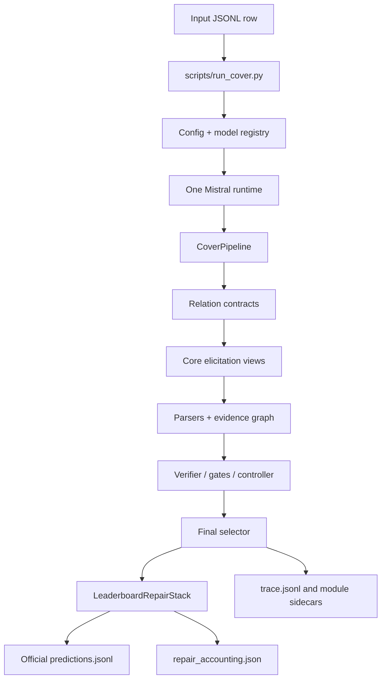

# Profile E3 Paper System Summary

This document is the paper-ready technical summary of the current best
FactElicit-AKBC / COVER-KBC system. It is self-contained for method writing,
ablation writing, and repository onboarding. Hidden TEST numbers are
user-provided leaderboard evidence; this cleanup did not run hidden TEST
inference or consult web, RAG, external factual corpora, external KBs, or manual
subject-answer tables.

-------------------------------------------------------------------------------

# 1. Executive Summary

LM-KBC 2026 asks a system to fill knowledge-base rows from a subject entity and
a relation. The output is a list of strings, possibly empty, and the six
relations mix set-valued entity prediction, nullable single-entity prediction,
and numeric attributes.

The current system is **Profile E3 - Mistral Area Multi-View**. It uses one
open-weight Mistral checkpoint as a closed-book factual elicitor, verifier-role
runtime, and relation-specific repair caller. The central architecture is not a
single prompt. It is a relation-typed pipeline: each relation has a contract,
specialized prompt views, parsers, verification/selection logic, and a final
Profile E3 relation layer.

The active neural portfolio is one checkpoint:
`mistralai/Mistral-Small-3.2-24B-Instruct-2506` at revision
`95a6d26c4bfb886c58daf9d3f7332c857cb27b43`, with 24,011,361,280 published
parameters under the 32B challenge budget.

The current user-provided hidden TEST result is overall Macro-F1 **0.5857**.
The main empirical finding is that heterogeneous KB relations benefit from
relation-specific factual elicitation and aggregation. The best system combines
a Mistral-only core with conservative deterministic final layers for exactly
the relations where hidden TEST evidence showed a gain.

-------------------------------------------------------------------------------

# 2. Challenge and Evaluation

Local repository evidence:

- `benchmark/evaluate.py` defines six relations:
  `awardWonBy`, `companyTradesAtStockExchange`,
  `countryLandBordersCountry`, `hasArea`, `hasCapacity`,
  `personHasCityOfDeath`.
- `benchmark/evaluate.py` treats `hasArea` and `hasCapacity` as numeric
  relations; all other relations are string relations.
- Numeric matching uses a tolerance of `0.05`.
- String matching normalizes case, diacritics, punctuation, and aliases, then
  uses maximum-cardinality bipartite matching.
- Evaluation computes per-subject-relation precision, recall, and F1, then
  macro-averages by relation and across all rows.
- Local TEST rows contain empty `ObjectEntities`; hidden TEST gold is not
  present locally, so hidden TEST scores cannot be recomputed from the repo.

User-provided or repository-policy context:

- Rows may have zero, one, or many correct objects.
- The system is closed-book: no web, RAG, external factual corpora, external KB
  lookup, or manually authored subject-answer tables are allowed on the
  prediction path.
- No extra training, fine-tuning, LoRA, continued pretraining, or instruction
  tuning is used.
- The parameter budget is 32,000,000,000 published neural parameters.
- Multi-step/agentic inference, deterministic parsing, normalization,
  aggregation, and non-neural repair are allowed.

-------------------------------------------------------------------------------

# 3. Model Portfolio

| Field | Value |
|---|---|
| model id | `mistralai/Mistral-Small-3.2-24B-Instruct-2506` |
| revision | `95a6d26c4bfb886c58daf9d3f7332c857cb27b43` |
| family | `mistral` |
| runtime backend | Hugging Face runtime with Mistral Tekken tokenizer adapter |
| tokenizer backend | `mistral_common` |
| configured quantization | `nf4` |
| configured dtype | `bfloat16` |
| device map | `auto` |
| published parameter count | 24,011,361,280 |
| challenge limit | 32,000,000,000 |

The config declares one `model_profile.enumerator` block. The model registry
returns that same block for both logical roles. `scripts/run_cover.py` then
constructs `verifier_runtime = runtime` when the enumerator and verifier configs
are equal. Reusing one checkpoint for multiple calls and logical roles does not
multiply the unique parameter count.

Logical roles using the same physical runtime:

- core enumerator
- verifier-role scoring/gating
- verifier-role recall calls
- City empty-row rescue
- Area Multi-View
- Capacity Multi-View

There is no active Qwen checkpoint, no second physical Mistral checkpoint, no
third neural model, and no API model in Profile E3.

-------------------------------------------------------------------------------

# 4. Final Architecture Overview

## 4.1 High-Level Description

Profile E3 has two prediction stages.

First, `CoverPipeline` performs relation-typed closed-book elicitation. It
routes each row by relation contract, runs Mistral prompt views, parses outputs,
builds an evidence graph, optionally applies calibrated gates and verifier
actions, and emits a final row through the relation-specific selector.

Second, `LeaderboardRepairStack` applies the frozen Profile E3 final layer. This
layer is relation-scoped and bounded by per-row call caps. It normalizes award
metadata, rescues only empty City rows, replaces all Area rows with Area
Multi-View decisions, replaces all Capacity rows with Capacity Multi-View
decisions, and leaves Stock/Border rows untouched after the core selector.

## 4.2 ASCII Diagram

```text
SubjectEntity + Relation
  -> YAML config loader
  -> model_blocks(config)
  -> one Mistral HuggingFaceRuntime
  -> relation contract/router
  -> core Mistral views
  -> parser + evidence graph
  -> gates/verifier/controller/V3 actions
  -> final selector
  -> Profile E3 final layer
       awardWonBy: metadata normalization
       personHasCityOfDeath: empty-only Mistral rescue
       hasArea: Area Multi-View
       hasCapacity: Capacity Multi-View
       Stock/Border: no final repair
  -> predictions.jsonl
  -> trace/accounting/manifest sidecars
```

## 4.3 Mermaid Diagram



## 4.4 Exact Runtime Flow

1. `scripts/run_cover.py` reads the YAML config.
2. `cover_kbc.models.registry.model_blocks` resolves enumerator and verifier
   configs. For E3 they are identical.
3. `cover_kbc.models.preflight.require_huggingface_runtime` checks runtime
   package compatibility before weights are built.
4. `cover_kbc.models.registry.build_runtime` constructs one Mistral runtime.
5. `CoverPipeline.from config` wires the active and shadow modules.
6. `CoverPipeline.run` emits core predictions and per-query traces.
7. `build_repair_stack` constructs `LeaderboardRepairStack`.
8. The repair stack mutates only relation-scoped final `ObjectEntities`.
9. `write_predictions` writes official JSONL rows.
10. The runner writes traces, calls, repair records, accounting, and a manifest.

Shared components:

- config loading
- model registry and parameter budget audit
- Mistral runtime and tokenizer
- typed contracts/router
- elicitation/parsing/evidence graph
- verifier/gates/controller/V3 action infrastructure
- output schema and writer

Relation-specific components:

- relation contracts and view libraries
- final selectors
- E3 final repair map for Award/City/Area/Capacity

-------------------------------------------------------------------------------

# 5. Complete Relation-by-Relation Architecture

## countryLandBordersCountry

### Target Semantics

Predict countries sharing a land border with the subject country.

### Structural Challenge

This is a small set-valued relation where precision is high but set completeness
and territory/maritime edge cases matter.

### Active Pipeline

Entry point is the core `CoverPipeline` relation contract path. There is no E3
post-pipeline Border repair because the E3 call cap for this relation is `0`.

Source locations:

- `src/cover_kbc/contracts/registry.py`
- `src/cover_kbc/elicitation/library.py`
- `src/cover_kbc/selection.py`

### Prompt Strategy

The active contract uses direct border recall, compass/structural views,
land-vs-maritime contrast, reverse checks, and missingness views. Prompts
emphasize land borders and reject maritime-only or subnational entities.

### Calls

Core calls are adaptive. The mandatory starting views are direct and compass
structural views; optional views and controller actions are bounded by the
Profile E3 core per-query budget. No repair calls are made.

### Parser

Entity-list parsing from `src/cover_kbc/elicitation/parsing.py`.

### Aggregation / Consensus

The evidence graph aggregates independent mentions and verifier judgments. The
small-set selector in `selection.py` applies precision-aware acceptance and
contract hard negatives.

### Fallback

If no candidate survives selection, the output is `[]`.

### Deterministic Post-Processing

Entity finalization, output schema validation, and relation hard-rule filters.

### Mutation Semantics

No Profile E3 mutation after the core selector.

### Current Hidden P/R/F1

P = 0.9712, R = 0.9295, F1 = 0.9291.

### Known Weaknesses

Set completeness and territory edge cases remain the likely bottlenecks.

### Historical Method Replaced

Broad border repair and directional sweep experiments are historical only; they
are not active in E3.

## personHasCityOfDeath

### Target Semantics

Predict the city where the person died, or an empty set if no city of death is
appropriate.

### Structural Challenge

This is a nullable single-entity relation. The system must avoid hallucinating
a death city for living people or people whose city is unavailable.

### Active Pipeline

Core null-single prediction runs first. Then `repair_city` runs only when the
core final row is empty and `mistral_city_empty_rescue` is enabled.

Source locations:

- `src/cover_kbc/contracts/registry.py`
- `src/cover_kbc/elicitation/library.py`
- `src/cover_kbc/leaderboard_repair/relations.py`

### Prompt Strategy

Core prompts include death status and direct city-of-death views. The rescue
uses two stricter Mistral prompts:

- life/death gate: answer exactly `DECEASED`, `LIVING`, or `UNKNOWN`
- direct city recall: answer exactly `CITY: <city>` or `UNKNOWN`

### Calls

Core calls are adaptive and bounded by the core budget. The rescue makes:

- 0 calls if the core row is non-empty
- 1 call if the row is empty and the life/death gate is not `DECEASED`
- 2 calls if the row is empty and the gate returns `DECEASED`

### Parser

The rescue parser accepts only a single strict `CITY:` line or `UNKNOWN`; it
rejects multiple lines and list separators. Core parsing uses entity-list
parsing.

### Aggregation / Consensus

Core aggregation is evidence-graph based. The rescue has no multi-view
aggregation: the second call returns at most one city.

### Fallback

If the rescue gate is not `DECEASED`, or if the strict city parser returns
unknown/invalid, the output remains `[]`.

### Deterministic Post-Processing

The final object list has at most one city string.

### Mutation Semantics

Only empty City rows may be mutated. Non-empty rows are never changed by the
rescue.

### Current Hidden P/R/F1

P = 0.9600, R = 0.5900, F1 = 0.5700.

### Known Weaknesses

Recall is limited by cautious empty-row gating and parametric memory gaps.

### Historical Method Replaced

Broader DeathCityRecall and aggressive City repair mechanisms are historical
only. The active method is the conservative empty-only E1 rescue.

## hasCapacity

### Target Semantics

Predict the highest published maximum spectator capacity of the subject venue.

### Structural Challenge

Capacity values vary by seating/standing, sport configuration, concert/event
configuration, renovation state, and historical state. Attendance and unrelated
numbers must be rejected.

### Active Pipeline

The E3 core may produce a numeric answer, but the final active method for all
Capacity rows is `MistralCapacityMultiView`.

Source location:

- `src/cover_kbc/leaderboard_repair/capacity.py`

### Prompt Strategy

Four deterministic views:

- V1 Direct
- V2 Encyclopedic
- V3 Configuration-Aware
- V4 Step-Back

All views request `CAPACITY: <integer>` or `UNKNOWN`.

### Calls

Four fixed Mistral calls per Capacity row. If the four parsed observations do
not contain a 5%-compatible cluster with support at least three, exactly one
source-blind judge call may be made. Maximum final-layer calls per row: 5.

### Parser

Strict `CAPACITY:` parser. Positive finite integer values are accepted;
comma-grouped integers and `.0` suffixes are accepted. Other decimals,
negative values, NaN, and unrelated text are rejected.

### Aggregation / Consensus

Parsed values are clustered by 5% relative compatibility. Cluster support is
the number of view observations in the cluster. A strong cluster requires
support >= 3.

### Fallback

Decision order:

1. strong cluster representative
2. valid judge choice
3. V1 value
4. top cluster representative
5. empty output

### Deterministic Post-Processing

Capacity is serialized as a canonical integer string.

### Mutation Semantics

All Capacity rows are replaced by the Multi-View decision. The upstream core
Capacity answer is recorded as ignored and does not vote.

### Current Hidden P/R/F1

P = 0.2449, R = 0.1633, F1 = 0.1633.

### Known Weaknesses

Capacity is the weakest current relation. Remaining errors likely come from
configuration ambiguity, venue name ambiguity, attendance-vs-capacity confusion,
and memory gaps.

### Historical Method Replaced

Direct Capacity, CHIV, and NSMV/Neighborhood-Stable Capacity are experiments,
not active components.

## awardWonBy

### Target Semantics

Predict recipients/entities that have won the subject award.

### Structural Challenge

This is a high-cardinality open set. The main difficulty is recall without
adding metadata wrappers or award-category labels as recipients.

### Active Pipeline

Core large-open-set award enumeration runs first. Then `repair_award` applies
deterministic metadata normalization.

Source locations:

- `src/cover_kbc/contracts/registry.py`
- `src/cover_kbc/elicitation/library.py`
- `src/cover_kbc/leaderboard_repair/relations.py`
- `src/cover_kbc/leaderboard_repair/util.py`

### Prompt Strategy

Core prompts include direct award enumeration, temporal/facet views,
recipient-type views, category/identity contrast, missingness, and reverse
checking. The active E3 repair does not call the model.

### Calls

Core calls are adaptive and bounded by the award contract/core budget. The
metadata normalizer makes zero neural calls.

### Parser

Entity-list parser for core outputs.

### Aggregation / Consensus

Evidence graph and large-open-set selector aggregate candidate support. The
normalizer deduplicates by strict normalized key after removing metadata
wrappers.

### Fallback

If no core recipient survives, the final output is `[]`.

### Deterministic Post-Processing

`AwardMetadataNormalizer` removes leading time/category/repetition wrappers and
drops explicit null markers such as `NONE` variants.

### Mutation Semantics

The normalizer may rewrite recipient strings and remove duplicates/nulls. It
does not invent new recipients and does not call a model.

### Current Hidden P/R/F1

P = 0.3255, R = 0.3707, F1 = 0.3105.

### Known Weaknesses

Recall remains low on large recipient sets.

### Historical Method Replaced

AwardRecipientWitness and AwardTimeSlicedRecall are retired. The active
post-pipeline award layer is deterministic cleanup only.

## companyTradesAtStockExchange

### Target Semantics

Predict the stock exchange(s) where the subject company trades.

### Structural Challenge

This is a small set-valued relation with null/listing ambiguity, parent vs
subsidiary ambiguity, delisting/historical ambiguity, and exchange/ticker
confusion.

### Active Pipeline

The core Stock path is active. There is no E3 post-pipeline Stock repair
because the Stock repair cap is `0`.

Source locations:

- `src/cover_kbc/contracts/registry.py`
- `src/cover_kbc/elicitation/library.py`
- `src/cover_kbc/selection.py`

### Prompt Strategy

The stock contract uses a listing gate, direct exchange recall,
parent/subsidiary contrast, description support, and reverse checks.

### Calls

Core calls are adaptive and bounded by the Profile E3 core budget. No repair
calls are made.

### Parser

Entity-list parser.

### Aggregation / Consensus

Evidence graph plus small-set selector. E3 keeps structural stock listing
validation enabled and support dominance disabled.

### Fallback

If the calibrated listing gate or selector rejects all candidates, output is
`[]`.

### Deterministic Post-Processing

Entity finalization and output schema validation.

### Mutation Semantics

No Profile E3 mutation after the core selector.

### Current Hidden P/R/F1

P = 0.9092, R = 0.7863, F1 = 0.7285.

### Known Weaknesses

Null/listing ambiguity and parent/subsidiary entity resolution.

### Historical Method Replaced

Stock repair probes and multi-listing rescue flags are inactive.

## hasArea

### Target Semantics

Predict the area in square kilometers for the exact subject geography.

### Structural Challenge

Area requires distinguishing entity type and measurement semantics: country
total area, island land area, lake surface area, and exact feature area. Common
errors include using a containing country/administrative region, an archipelago
instead of an island, a drainage basin instead of a lake surface, or an
unconverted unit.

### Active Pipeline

All Area rows are finalized by `MistralAreaMultiView`.

Source locations:

- `src/cover_kbc/leaderboard_repair/area.py`
- `src/cover_kbc/leaderboard_repair/area_multiview.py`

### Prompt Strategy

Four deterministic Mistral views:

- V1 Direct Area
- V2 Entity-Type Specialist
- V3 Encyclopedic / Infobox Recall
- V4 Attribute-Contrast / Step-Back

Each view must answer `AREA: <positive decimal>` or `UNKNOWN`.

### Calls

Four fixed Mistral calls per Area row. If the top cluster has support below
three and at least one numeric observation exists, exactly one source-blind
judge call may be made. Maximum final-layer calls per row: 5.

### Parser

Strict single-line `AREA:` parser. Positive finite decimal values are accepted;
comma thousands groups are accepted and canonicalized. `UNKNOWN` is accepted as
empty. Other text is invalid.

### Aggregation / Consensus

Parsed observations are clustered with 5% relative compatibility. A support >=
3 cluster is accepted without judge. The representative is an observed value
nearest the cluster median, with view-rank and numeric tie-breaks.

### Fallback

Decision order:

1. strong cluster representative
2. valid source-blind judge value
3. V1 value
4. top cluster representative
5. empty output

### Deterministic Post-Processing

Area is serialized as a canonical decimal string.

### Mutation Semantics

All Area rows are replaced by Area Multi-View. The upstream Area answer is
recorded but ignored and never acts as another vote.

### Current Hidden P/R/F1

P = 0.6700, R = 0.6700, F1 = 0.6700.

### Known Weaknesses

Wrong geographic entity, area-type confusion, unit confusion, and similarly
named geography remain possible.

### Historical Method Replaced

Direct Area remains only as V1 inside Area Multi-View. AreaEmptyRescue and broad
numeric repair are historical only.

-------------------------------------------------------------------------------

# 6. Area Multi-View

Area Multi-View is the E3 improvement over E2.

Let the four deterministic views produce observations
`O = {(v_i, a_i)}` for numeric outputs, with `a_i > 0`. `UNKNOWN` or invalid
outputs produce no numeric observation.

The compatibility distance between two values is:

```text
d(a, b) = |a - b| / max(|a|, |b|)
```

Two values are compatible if `d(a,b) <= 0.05`.

View definitions:

| View | Role |
|---|---|
| V1 Direct Area | Direct closed-book area recall; reuses the Direct Area prompt |
| V2 Entity-Type Specialist | First infer geography type, then answer the matching area semantic |
| V3 Encyclopedic / Infobox Recall | Recall a stable infobox-style area value |
| V4 Attribute-Contrast / Step-Back | Explicitly contrast area with population, length, elevation, basin, and container numbers |

Area semantics:

- Country: total area including land and inland water.
- Island: own land area of the exact island.
- Lake: exact lake surface area.
- Other geography: exact geographic feature area.

Rejected values include containing country, administrative region, archipelago
instead of island, one part instead of whole island, lake catchment/drainage
basin, wrong lagoon, protected area, nearby/similarly named geography,
unconverted square miles or hectares, and unrelated numeric attributes.

Aggregation:

1. Build pairwise 5%-compatible clusters.
2. Rank clusters by descending support, earliest supporting view, then numeric
   representative.
3. If top support >= 3, accept the representative.
4. Otherwise run one source-blind judge over anonymized candidate labels and
   `UNKNOWN`.
5. If the judge is invalid, fall back to V1, then top cluster, then empty.

Pseudocode:

```text
AREA_MULTI_VIEW(subject):
    obs = []
    for view in [V1, V2, V3, V4]:
        raw = MISTRAL(view.prompt(subject), temperature=0)
        value = parse_strict_area(raw)
        if value is numeric:
            obs.append((view, value))

    if obs is empty:
        return []

    clusters = cluster(obs, compatible=lambda a,b: d(a,b) <= 0.05)
    top = best_cluster(clusters)
    if top.support >= 3:
        return [top.observed_representative]

    judge = MISTRAL(source_blind_judge(subject, clusters), temperature=0)
    if parse_strict_area(judge) is numeric:
        return [judge.value]
    if V1 has a numeric value:
        return [V1.value]
    return [top.observed_representative]
```

Call complexity per row: exactly 4 view calls plus at most 1 judge call.

The upstream core Area answer is ignored because E3 is a controlled replacement
layer. Treating the upstream answer as a fifth vote would change the submitted
method and was not the verified E3 behavior.

Score delta:

| Metric | Profile E2 | Profile E3 |
|---|---:|---:|
| `hasArea` F1 | 0.6600 | 0.6700 |
| overall F1 | 0.5836 | 0.5857 |

-------------------------------------------------------------------------------

# 7. Capacity Multi-View

Capacity Multi-View is the E2 improvement retained unchanged in E3.

Target: highest published maximum spectator capacity.

The four views are:

| View | Role |
|---|---|
| V1 Direct | Direct venue capacity recall |
| V2 Encyclopedic | Stable encyclopedic/infobox-style capacity |
| V3 Configuration-Aware | Distinguish seated, standing, sport, concert/event, historical, renovation, and temporary configurations |
| V4 Step-Back | First identify venue/entity and capacity type, then answer |

The strict parser accepts only `CAPACITY: <integer>` or `UNKNOWN`. It rejects
attendance, area, cost, dates, dimensions, negative values, and non-integral
decimals.

Aggregation is the same 5% compatibility structure as Area:

```text
d(a, b) = |a - b| / max(|a|, |b|)
```

Support >= 3 accepts the top cluster. Otherwise one source-blind judge chooses
among anonymized numeric candidates and `UNKNOWN`. Fallback order is judge,
V1, top cluster, empty.

Pseudocode:

```text
CAPACITY_MULTI_VIEW(subject):
    obs = []
    for view in [V1, V2, V3, V4]:
        raw = MISTRAL(view.prompt(subject), temperature=0)
        value = parse_strict_capacity(raw)
        if value is integer:
            obs.append((view, value))

    if obs is empty:
        return []

    top = best_5_percent_cluster(obs)
    if top.support >= 3:
        return [top.observed_representative]

    judge = MISTRAL(source_blind_capacity_judge(subject, obs), temperature=0)
    if parse_strict_capacity(judge) is integer:
        return [judge.value]
    if V1 has an integer:
        return [V1.value]
    return [top.observed_representative]
```

Call complexity per row: exactly 4 view calls plus at most 1 judge call.

Historical Capacity sequence:

| Method | Status | Hidden evidence |
|---|---|---:|
| old baseline Capacity | historical | 0.1224 |
| Direct Capacity probe | experiment, not active | 0.1429 |
| CHIV | experiment, not active | 0.1327 |
| NSMV / Neighborhood-Stable | experiment, not active where verified | 0.1429 |
| 4-view Capacity Multi-View | active final layer | 0.1633 |

-------------------------------------------------------------------------------

# 8. City Rescue

Empty City rows are difficult because an empty answer can mean either the person
is alive, the city is not known to the model, the model found only a country or
region, or the core gate was too conservative.

Active rescue trigger:

- relation is `personHasCityOfDeath`
- `mistral_city_empty_rescue` is enabled
- core final `ObjectEntities` is empty

Rescue semantics:

1. Ask a life/death gate for exactly `DECEASED`, `LIVING`, or `UNKNOWN`.
2. Only if the answer is `DECEASED`, ask directly for `CITY: <city>` or
   `UNKNOWN`.
3. Accept only one strict city output.
4. Otherwise keep `[]`.

Mutation boundary:

- non-empty City rows are not changed
- empty City rows may become exactly one city
- no other relation is changed by City rescue

Precision/recall tradeoff:

The method is deliberately conservative. It raises recall on some empty rows
without opening broad city hallucination. Current hidden City F1 is 0.5700 with
high precision, P = 0.9600.

-------------------------------------------------------------------------------

# 9. Set-Valued Relations

Award, Stock, and Border have completeness-vs-precision tension.

Award is high-cardinality. Profile E3 keeps model-backed enumeration in the
core and adds only deterministic metadata cleanup. The final repair does not
make model calls and does not add recipients.

Stock is small-set but null-sensitive. The active method is the core stock path:
listing gate, direct exchange recall, parent/subsidiary contrast, verifier
support, structural validation, and precision-first selection. No final Stock
repair is active.

Border is small-set with high current performance. The active method is the
core border path with direct/compass/maritime contrast evidence and
precision-aware final selection. No final Border repair is active.

-------------------------------------------------------------------------------

# 10. Final Hidden-Test Results

User-provided hidden TEST Profile E3 table:

| Relation | P | R | F1 |
|---|---:|---:|---:|
| `awardWonBy` | 0.3255 | 0.3707 | 0.3105 |
| `companyTradesAtStockExchange` | 0.9092 | 0.7863 | 0.7285 |
| `countryLandBordersCountry` | 0.9712 | 0.9295 | 0.9291 |
| `hasArea` | 0.6700 | 0.6700 | 0.6700 |
| `hasCapacity` | 0.2449 | 0.1633 | 0.1633 |
| `personHasCityOfDeath` | 0.9600 | 0.5900 | 0.5700 |
| **All Relations** | **0.7289** | **0.6034** | **0.5857** |

Zero-object reference, user-provided:

| Slice | P | R | F1 |
|---|---:|---:|---:|
| Zero-object reference | 0.5963 | 0.9412 | 0.7300 |

The zero-object row is treated here as reference evidence, not as a separately
recomputed local metric.

-------------------------------------------------------------------------------

# 11. Ablation / Profile History

Positive controlled milestones:

| Profile | Definition | Overall F1 | Responsible changes |
|---|---|---:|---|
| Profile D | Mistral-only core / verifier-role consolidation | 0.4952 | one Mistral runtime replaces Mistral+Qwen verifier role |
| Integrated Profile E1 | Profile D + AwardMetadataNormalizer + MistralCityEmptyRescue + MistralDirectArea | 0.5752 | award cleanup, conservative city rescue, direct area replacement |
| Profile E2 | Integrated E1 + MistralCapacityMultiView | 0.5836 | Capacity improves to F1 0.1633 |
| Profile E3 | E2 + MistralAreaMultiView | 0.5857 | Area improves from 0.6600 to 0.6700 |

Do not interpret this as a full factorial ablation. The table records the
cleanest available controlled promotion sequence in the repository.

-------------------------------------------------------------------------------

# 12. Negative Experiments

Scientifically useful rejected probes:

| Experiment | Result | What it taught |
|---|---:|---|
| C2 aggressive non-Stock repair | overall F1 0.4012 | broad repair can destroy precision and should not be folded into the active system |
| Capacity Direct | hasCapacity F1 0.1429 | a single direct recall prompt helps over the old baseline but is weaker than multi-view consensus |
| CHIV | hasCapacity F1 0.1327 | capacity-specific heuristics did not beat simpler direct recall |
| NSMV / Neighborhood-Stable Capacity | hasCapacity F1 0.1429 where recorded | neighborhood stability did not improve over direct recall |
| Direct Border | no verified score established in this cleanup | direct border expansion was not adopted as final architecture |

These are documentation/provenance only. No retired executable repair branch is
needed merely to support this section.

-------------------------------------------------------------------------------

# 13. Key Empirical Findings

- One larger Mistral-only runtime beat the prior Mistral+Qwen verifier setup in
  the verified Profile D lineage.
- Relation specialization matters: numeric attributes, nullable single-city
  prediction, open award sets, and small-set relations needed different
  inference strategies.
- Direct Area produced the large E1 Area gain; Area Multi-View then produced a
  smaller positive refinement.
- Semantic Multi-View was useful for Capacity, which is highly ambiguous under
  one direct prompt.
- Candidate generation plus self-verification can underperform independent
  semantic elicitation when the relation has numeric/configuration ambiguity.
- Broad repair stacks were risky; successful components were narrow,
  relation-scoped, and had explicit mutation boundaries.

-------------------------------------------------------------------------------

# 14. Failure Modes

Area:

- wrong geographic entity
- containing administrative/country area instead of subject area
- island vs archipelago
- lake surface vs basin/catchment
- unit conversion errors
- unrelated numeric attributes

Capacity:

- seated vs total vs standing
- sport vs concert/event configuration
- historical/renovation state
- attendance mistaken for capacity
- venue/entity ambiguity

City:

- living/deceased uncertainty
- city unavailable in parametric memory
- country/region instead of city

Award:

- high-cardinality recall
- category/year wrappers emitted as recipients
- duplicate aliases or repeated recipients

Border:

- set completeness
- territory or maritime-only edge cases

Stock:

- null/listing ambiguity
- parent/subsidiary ambiguity
- ticker/exchange/name confusion

-------------------------------------------------------------------------------

# 15. Computational / Call Complexity

All calls reuse one physical Mistral runtime.

| Relation | Expected calls per row | Maximum calls per row | Adaptive? |
|---|---:|---:|---|
| `countryLandBordersCountry` | core direct/structural calls plus controller as needed | Profile core max, no repair | yes |
| `personHasCityOfDeath` | core calls plus 0-2 rescue calls if final row empty | core max + 2 | yes |
| `hasCapacity` | 4 final-layer calls | 5 final-layer calls | judge only |
| `awardWonBy` | core large-set calls | award/core budget, no repair calls | yes |
| `companyTradesAtStockExchange` | core gate/direct/contrast calls | Profile core max, no repair | yes |
| `hasArea` | 4 final-layer calls | 5 final-layer calls | judge only |

The Profile E3 config sets a core `max_calls_per_query` budget and repair caps:
Area 5, Capacity 5, City 2, Award 1, Stock 0, Border 0. Award's repair cap is
non-neural because metadata normalization makes no model call.

No runtime timing is claimed here.

-------------------------------------------------------------------------------

# 16. Repository Architecture After Cleanup

Important current files:

| File | Purpose | Current role |
|---|---|---|
| `README.md` | current-first repository overview | active documentation |
| `docs/IMPLEMENTATION_STATUS.md` | engineering source of truth | active documentation |
| `docs/PAPER_SYSTEM_SUMMARY.md` | paper-ready system summary | active documentation |
| `configs/experiments/cover_kbc_v3_7_profile_e3_mistral_area_multiview_test.yaml` | canonical current config | active production config |
| `scripts/run_cover.py` | canonical end-to-end runner | active production entrypoint |
| `scripts/audit_model_budget.py` | zero-model parameter audit | active utility |
| `scripts/run_area_multiview.py` | targeted Area utility and dry run | active utility |
| `scripts/run_capacity_multiview.py` | targeted Capacity utility | active utility |
| `scripts/merge_targeted_relation_results.py` | relation-scoped merge utility | active utility |
| `src/cover_kbc/pipeline.py` | core orchestrator | active production |
| `src/cover_kbc/models/` | runtime, tokenizer, budget, preflight | active production |
| `src/cover_kbc/contracts/` | relation contracts/router | active production |
| `src/cover_kbc/elicitation/` | core prompt views and parsers | active production |
| `src/cover_kbc/evidence/` | graph, consensus, integration | active production/shadow |
| `src/cover_kbc/verification/` and `src/cover_kbc/verification.py` | verifier infrastructure | active production/shadow |
| `src/cover_kbc/control/` and `src/cover_kbc/v3_core/` | controller and V3 action layer | active production |
| `src/cover_kbc/leaderboard_repair/` | Profile E3 final layer | active production |
| `tests/test_profile_e3_area_multiview.py` | E3 behavior/config tests | active tests |
| `tests/test_profile_e2_capacity_multiview.py` | retained Capacity MV invariants | active tests |
| `tests/test_profile_e1_mistral_city_rescue.py` | retained City rescue invariants | active tests |
| `tests/test_profile_e1_direct_area_baseline.py` | Direct Area history and parser invariants | historical invariant tests |
| `tests/test_profile_d_mistral_role_swap.py` | one-model lineage and no-Qwen proof | historical invariant tests |

Historical configs and audits remain under `configs/experiments/` and
`docs/audits/`; they are explicitly marked as superseded, retired, or archival
where applicable.

-------------------------------------------------------------------------------

# 17. Reproduction

Environment:

```bash
pip install -e '.[dev]'
pip install -e '.[hf]'
```

Current Profile E3 run:

```bash
python scripts/run_cover.py \
  --config configs/experiments/cover_kbc_v3_7_profile_e3_mistral_area_multiview_test.yaml \
  --split test \
  --no-eval
```

Targeted Area dry run:

```bash
python scripts/run_area_multiview.py \
  --config configs/experiments/cover_kbc_v3_7_profile_e3_mistral_area_multiview_test.yaml \
  --split test \
  --output-dir outputs/e3_area_multiview_dry_run \
  --dry-run
```

Targeted Area neural run:

```bash
python scripts/run_area_multiview.py \
  --config configs/experiments/cover_kbc_v3_7_profile_e3_mistral_area_multiview_test.yaml \
  --split test \
  --output-dir outputs/e3_area_multiview
```

Targeted Capacity neural run:

```bash
python scripts/run_capacity_multiview.py \
  --config configs/experiments/cover_kbc_v3_7_profile_e3_mistral_area_multiview_test.yaml \
  --split test \
  --output-dir outputs/e3_capacity_multiview
```

Merge targeted relation artifact:

```bash
python scripts/merge_targeted_relation_results.py \
  --baseline-predictions outputs/<baseline>/predictions.jsonl \
  --targeted-results outputs/e3_area_multiview/area_multiview_results.jsonl \
  --relation hasArea \
  --expected-targeted-rows 100 \
  --output outputs/<merged>/predictions.jsonl
```

Validation:

```bash
python scripts/audit_model_budget.py configs/experiments/cover_kbc_v3_7_profile_e3_mistral_area_multiview_test.yaml
python -m pyflakes src/ tests/ scripts/
python -m pytest tests/ -q -p no:randomly
python -m pytest tests/ -q
git diff --check
```

Do not run hidden TEST neural inference during repository cleanup.

-------------------------------------------------------------------------------

# 18. Benchmark Integrity and Rule Compliance

Profile E3 complies with the documented constraints:

- closed-book inference
- no web search
- no RAG
- no external factual corpus
- no external KB lookup
- no training or fine-tuning
- no hardcoded TEST answers
- no manual subject-answer lookup table
- one open-weight neural checkpoint
- 24,011,361,280 unique published parameters under the 32B limit
- quantization used only for runtime memory, not for reducing parameter count

Generated predictions and local caches are ignored by `.gitignore`.

-------------------------------------------------------------------------------

# 19. Artifact / Provenance Status

Known:

- Profile E3 hidden TEST score is user-provided leaderboard evidence.
- Profile E3 canonical config is local and tracked.
- Profile E3 winning artifact SHA256 is not established from local files.
- E2 winning artifact SHA256 is not established from local files.
- Integrated E1 historical local artifact SHA256 is recorded as
  `67bd1bc8af01de177520d93f9b5b9fc30839d56f36ceeeb6263813662e52d8a6`.

Local generated directories such as `outputs/`, `.pytest_cache/`, `__pycache__/`,
logs, checkpoints, and model caches are ignored.

Do not fabricate or publish a winning SHA.

-------------------------------------------------------------------------------

# 20. Paper Positioning

Suggested central thesis:

Heterogeneous KB relations benefit from relation-specific factual elicitation
and aggregation rather than one uniform prompting strategy.

Three paper contributions:

1. A relation-typed closed-book elicitation architecture for mixed entity,
   nullable, set-valued, and numeric KB relations.
2. Deterministic numeric Multi-View aggregation for area and capacity with
   strict parsers, 5% clustering, source-blind judging, and explicit fallbacks.
3. A narrow, auditable final-layer repair philosophy that improves specific
   relations while preserving mutation boundaries and model-budget compliance.

Three strongest empirical findings:

1. Profile D showed the one-Mistral runtime can outperform the earlier
   Mistral+Qwen verifier portfolio.
2. Profile E2 showed semantic Capacity Multi-View improves a difficult numeric
   relation.
3. Profile E3 showed Area Multi-View gives a smaller controlled gain over
   Direct Area.

Three main limitations:

1. Capacity remains low despite Multi-View.
2. Award remains recall-limited on high-cardinality sets.
3. Hidden TEST numbers are leaderboard evidence, not locally recomputable.

Likely Methodology subsections:

- Task and relation contracts
- Model portfolio and budget compliance
- Core COVER-KBC pipeline
- Numeric Multi-View modules
- City rescue and set-valued finalization
- Artifact and benchmark integrity

Likely Results/Ablation tables:

- final hidden TEST per relation
- positive profile history D/E1/E2/E3
- negative probes
- relation-to-strategy map
- model budget

Figures worth creating:

- overall architecture diagram
- Area/Capacity Multi-View flowchart
- relation taxonomy figure

-------------------------------------------------------------------------------

# 21. Paper-Ready Tables

## A. Dataset / Relation Characteristics

| Relation | Type | Cardinality | Main challenge |
|---|---|---|---|
| `awardWonBy` | string/entity | many | high-cardinality recall |
| `companyTradesAtStockExchange` | string/entity | zero or many | listing/null and parent/subsidiary ambiguity |
| `countryLandBordersCountry` | string/entity | zero or many | complete land-border set |
| `hasArea` | numeric | one | exact area semantics and unit/entity ambiguity |
| `hasCapacity` | numeric | one | maximum spectator capacity configuration |
| `personHasCityOfDeath` | string/entity | zero or one | living/deceased and city granularity |

## B. Final Results

| Relation | P | R | F1 |
|---|---:|---:|---:|
| `awardWonBy` | 0.3255 | 0.3707 | 0.3105 |
| `companyTradesAtStockExchange` | 0.9092 | 0.7863 | 0.7285 |
| `countryLandBordersCountry` | 0.9712 | 0.9295 | 0.9291 |
| `hasArea` | 0.6700 | 0.6700 | 0.6700 |
| `hasCapacity` | 0.2449 | 0.1633 | 0.1633 |
| `personHasCityOfDeath` | 0.9600 | 0.5900 | 0.5700 |
| **All Relations** | **0.7289** | **0.6034** | **0.5857** |

## C. Profile Ablation

| Profile | Added component(s) | Overall F1 |
|---|---|---:|
| D | Mistral-only core | 0.4952 |
| E1 | AwardMetadataNormalizer, City rescue, Direct Area | 0.5752 |
| E2 | Capacity Multi-View | 0.5836 |
| E3 | Area Multi-View | 0.5857 |

## D. Relation -> Inference Strategy

| Relation | Strategy |
|---|---|
| `awardWonBy` | core large-set enumeration + deterministic metadata normalization |
| `companyTradesAtStockExchange` | core stock listing path, no repair |
| `countryLandBordersCountry` | core border small-set path, no repair |
| `hasArea` | Area Multi-View final replacement |
| `hasCapacity` | Capacity Multi-View final replacement |
| `personHasCityOfDeath` | empty-only Mistral city rescue |

## E. Model Budget

| Component | Unique? | Parameters |
|---|---:|---:|
| Mistral-Small-3.2-24B-Instruct-2506 | yes | 24,011,361,280 |
| reused verifier/logical roles | no | 0 additional |
| **Total** | | **24,011,361,280** |
| **Limit** | | **32,000,000,000** |

## F. Negative Probes

| Probe | Active? | Result |
|---|---|---:|
| C2 aggressive non-Stock | no | overall F1 0.4012 |
| Capacity Direct | no | hasCapacity F1 0.1429 |
| CHIV | no | hasCapacity F1 0.1327 |
| NSMV / Neighborhood-Stable Capacity | no | hasCapacity F1 0.1429 where verified |
| Direct Border | no | no verified score established in this cleanup |

-------------------------------------------------------------------------------

# 22. Paper-Ready Architecture Pseudocode

Overall router:

```text
for row in dataset:
    contract = CONTRACTS[row.Relation]
    graph = core_elicit_and_verify(row, contract, mistral_runtime)
    pred = final_selector(graph, contract)

repair_stack = build_profile_e3_stack(config, mistral_runtime)
predictions = repair_stack.apply(predictions, queries)
write_official_jsonl(predictions)
```

Area Multi-View:

```text
views = [direct, entity_type, infobox, attribute_contrast]
obs = parse AREA outputs from deterministic Mistral calls
if no obs: return []
clusters = 5_percent_clusters(obs)
if best(clusters).support >= 3: return representative(best)
judge = source_blind_judge(clusters + UNKNOWN)
if judge valid: return judge
if V1 valid: return V1
return representative(best)
```

Capacity Multi-View:

```text
views = [direct, encyclopedic, configuration_aware, step_back]
obs = parse CAPACITY outputs from deterministic Mistral calls
if no obs: return []
clusters = 5_percent_clusters(obs)
if best(clusters).support >= 3: return representative(best)
judge = source_blind_judge(clusters + UNKNOWN)
if judge valid: return judge
if V1 valid: return V1
return representative(best)
```

City rescue:

```text
if relation != personHasCityOfDeath: return current
if current.ObjectEntities is not empty: return current
status = MISTRAL(life_death_gate)
if status != DECEASED: return []
city = parse CITY from MISTRAL(city_recall)
return [city] if valid else []
```

Set-valued finalization:

```text
if relation == awardWonBy:
    return normalize_metadata_and_dedupe(core_objects)
if relation in {companyTradesAtStockExchange, countryLandBordersCountry}:
    return core_selector_objects
```

-------------------------------------------------------------------------------

# 23. Claims We CAN Make

- The current best repository profile is Profile E3.
- Profile E3 uses exactly one unique neural checkpoint.
- The active checkpoint is Mistral-Small-3.2-24B-Instruct-2506 at the recorded
  revision.
- The unique published parameter count is 24,011,361,280, under the 32B limit.
- Qwen is not active in Profile E3.
- Area Multi-View improved hidden TEST `hasArea` F1 from 0.6600 to 0.6700 and
  overall F1 from 0.5836 to 0.5857 in the user-provided controlled submission.
- Capacity Multi-View is the active Capacity final layer retained from E2.
- City rescue mutates only empty City rows.
- Award normalization is deterministic and model-free.
- Stock and Border have no active Profile E3 repair layer.

-------------------------------------------------------------------------------

# 24. Claims We MUST NOT Make

- Do not claim Area or Capacity Multi-View universally improves factuality.
- Do not claim hidden TEST is independent validation after repeated probing.
- Do not claim a winning Profile E3 artifact SHA unless proven.
- Do not claim training, fine-tuning, LoRA, continued pretraining, or
  instruction tuning.
- Do not claim web, RAG, external KB, or external corpus usage.
- Do not call the system a newly trained model.
- Do not describe Qwen, CHIV, C2, NSMV, broad numeric repair, or direct border
  sweep as active Profile E3 implementation.
- Do not say quantization lowers the parameter count.
- Do not report undocumented leaderboard scores.

-------------------------------------------------------------------------------

# 25. Open Questions / Next Experiments

- Capacity remains the largest bottleneck; next work should target configuration
  ambiguity while preserving closed-book constraints.
- Award recall remains low; next work should improve high-cardinality recall
  without adding external lookup tables or uncontrolled repair.
- City recall could improve, but any expansion must preserve the empty-only
  precision boundary.
- Area is relatively strong but still vulnerable to entity/area-type confusions;
  future work could improve judge calibration or entity-type discrimination.
- Stock and Border are strong enough that broad repair risk may outweigh gains;
  future experiments should be narrowly scoped and relation-bound.
